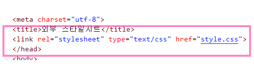

### 목차 <!-- omit in toc -->
- [1. CSS 개요](#1-css-개요)
- [2. 주요 선택자 요약](#2-주요-선택자-요약)
- [3. CSS 기본문법과 적용하기](#3-css-기본문법과-적용하기)
	- [3.1. 내부스타일시트 (Internal)](#31-내부스타일시트-internal)
		- [3.1.1. ex](#311-ex)
	- [3.2. 외부스타일시트 (external)](#32-외부스타일시트-external)
		- [3.2.1. ex](#321-ex)
	- [3.3. 인라인 (inline)](#33-인라인-inline)
		- [3.3.1. ex](#331-ex)
	- [3.4. @import](#34-import)
		- [3.4.1. ex](#341-ex)
- [4. 선택자](#4-선택자)
	- [4.1. 태그선택자](#41-태그선택자)
	- [4.2. 아이디선택자](#42-아이디선택자)
	- [4.3. 클래스선택자](#43-클래스선택자)
	- [4.4. 전체선택자](#44-전체선택자)
	- [4.5. 하위선택자](#45-하위선택자)
	- [4.6. 자식선택자](#46-자식선택자)
	- [4.7. 인접선택자](#47-인접선택자)
	- [4.8. 형제선택자](#48-형제선택자)
	- [4.9. 그룹선택자](#49-그룹선택자)
	- [4.10. 형성퀴즈 1](#410-형성퀴즈-1)
		- [4.10.1. 망고네-공유\\공용파일 본인이름의 폴더에 완성파일넣기](#4101-망고네-공유공용파일-본인이름의-폴더에-완성파일넣기)
	- [4.11. 형성퀴즈 2](#411-형성퀴즈-2)
	- [4.12. 속성선택자](#412-속성선택자)
	- [4.13. 가상선택자](#413-가상선택자)
	- [4.14. 가상요소선택자](#414-가상요소선택자)
	- [4.15. 16-1. :nth-of-type](#415-16-1-nth-of-type)
	- [4.16. 우선순위](#416-우선순위)
	- [4.17. 상속관계](#417-상속관계)
	- [4.18. 형성 퀴즈3](#418-형성-퀴즈3)
	- [4.19. 형성 퀴즈4](#419-형성-퀴즈4)
	- [4.20. 형성 퀴즈5](#420-형성-퀴즈5)
		- [4.20.1. \&](#4201-)
		- [4.20.2. 예제](#4202-예제)


# Chap1. 기본문법과 선택자 <!-- omit in toc -->

:::box
요소선택 단축키: ctrl+shift+c
:::
## 1. CSS 개요
[!embed](./images/css.pdf)

## 2. 주요 선택자 요약
:[!button variant='dark' icon='link' text='MDN레퍼런스' target='blank'](https://developer.mozilla.org/ko/docs/Learn/Getting_started_with_the_web/CSS_basics#%EC%84%A0%ED%83%9D%EC%9E%90%EC%9D%98_%EC%97%AC%EB%9F%AC_%EC%A2%85%EB%A5%98)
[!embed](./images/css선택자.pdf)

## 3. CSS 기본문법과 적용하기
>
> 
>
### 3.1. 내부스타일시트 (Internal)

> `head` 태그 사이에 `style` 태그로 작성하는 방식
> 


#### 3.1.1. ex
[!button variant='primary' icon='play' text='실행화면' target='blank'](https://qwerewqwerew.github.io/source/css/1-selector/01.html)

==- Step 1
```html #
우리를 기쁘게 하는 것들.
```
==- Step 2
```html #8-10 css/01.html
<!DOCTYPE html>
<html lang="ko">
<head>
	<meta charset="UTF-8" />
	<meta http-equiv="X-UA-Compatible" content="IE=edge" />
	<meta name="viewport" content="width=device-width, initial-scale=1.0" />
	<title>내부스타일시트</title>
	<style>
		p {
			color: red;
		}
	</style>
</head>
<body>
	<p>우리를 기쁘게 하는 것들.</p>
</body>
</html>
```
===


### 3.2. 외부스타일시트 (external)

> `head` 태그 사이에 `link` 태그에 `css` 문서의 주소를 링크하는 방식
> 


#### 3.2.1. ex
[!button variant='primary' icon='play' text='실행화면' target='blank'](https://qwerewqwerew.github.io/source/css/1-selector/02.html)

==- Step 1
```html #
우리를 기쁘게 하는 것들.
```
==- Step 2
```html #8-10 css/02.html
<!DOCTYPE html>
<html lang="ko">
	<head>
		<meta charset="UTF-8" />
		<meta http-equiv="X-UA-Compatible" content="IE=edge" />
		<meta name="viewport" content="width=device-width, initial-scale=1.0" />
		<title>외부스타일시트</title>
		<link rel="stylesheet" href="external.css">
	</head>
	<body>
		<p>우리를 기쁘게 하는 것들.</p>
	</body>
</html>

```

```css # css/external.css
p {
	color: red;
}

```
===

### 3.3. 인라인 (inline)


> `html` 태그안에 작성
>

[!button variant='primary' icon='play' text='실행화면' target='blank'](https://qwerewqwerew.github.io/source/css/1-selector/03.html)

#### 3.3.1. ex
==- Step 1
```txt #
우리를 기쁘게 하는 것들.

menu1
menu2
menu3
menu4
```
==- Step 2
```html # css/03.html
<!DOCTYPE html>
<html lang="ko">
  <head>
    <meta charset="UTF-8" />
    <meta http-equiv="X-UA-Compatible" content="IE=edge" />
    <meta name="viewport" content="width=device-width, initial-scale=1.0" />
    <title>인라인</title>
  </head>
  <body>
    <p style="color:red;">우리를 기쁘게 하는 것들.</p>
    <ul style="background-color: yellow;">
      <li>menu1</li>
      <li>menu2</li>
      <li>menu3</li>
      <li>menu4</li>
    </ul>
  </body>
</html>

```

===


### 3.4. @import

> css 문서에 다른 css 문서를 넣는 방식
>
> 

[!button variant='primary' icon='play' text='실행화면' target='blank'](https://qwerewqwerew.github.io/source/css/1-selector/04.html)

#### 3.4.1. ex
==- Step 1
```txt #
우리를 기쁘게 하는 것들.
box1
```
==- Step 2
```html # css/04.html
<!DOCTYPE html>
<html lang="ko">
	<head>
		<meta charset="UTF-8" />
		<meta http-equiv="X-UA-Compatible" content="IE=edge" />
		<meta name="viewport" content="width=device-width, initial-scale=1.0" />
		<title>@import</title>
		<style>
				@import url("import.css");
		</style>
	</head>
	<body>
		<p>우리를 기쁘게 하는 것들. </p>
		<div>box1</div>
	</body>
</html>
```
---

```css # css/import.css
/* css의 문자세트 지정 */
@charset "UTF-8";
@import url('./reset.css');
body {
	background: red;
}
```
---

```css # css/reset.css
/* http://meyerweb.com/eric/tools/css/reset/
 v2.0 | 20110126
 License: none (public domain)
*/

html,
body,
div,
span,
applet,
object,
iframe,
h1,
h2,
h3,
h4,
h5,
h6,
p,
blockquote,
pre,
a,
abbr,
acronym,
address,
big,
cite,
code,
del,
dfn,
em,
img,
ins,
kbd,
q,
s,
samp,
small,
strike,
strong,
sub,
sup,
tt,
var,
b,
u,
i,
center,
dl,
dt,
dd,
ol,
ul,
li,
fieldset,
form,
label,
legend,
table,
caption,
tbody,
tfoot,
thead,
tr,
th,
td,
article,
aside,
canvas,
details,
embed,
figure,
figcaption,
footer,
header,
hgroup,
menu,
nav,
output,
ruby,
section,
summary,
time,
mark,
audio,
video {margin: 0;padding: 0;border: 0;font-size: 100%;font: inherit;vertical-align: baseline; }
/* HTML5 display-role reset for older browsers */
article,
aside,
details,
figcaption,
figure,
footer,
header,
hgroup,
menu,
nav,
section {display: block; }
body {line-height: 1; }
ol,
ul {list-style: none; }
blockquote,
q {quotes: none; }
blockquote:before,
blockquote:after,
q:before,
q:after {content: '';content: none; }
table {border-collapse: collapse;border-spacing: 0; }

```
===

## 4. 선택자

### 4.1. 태그선택자

<aside>
👁️‍🗨️ 태그의 이름을 선택한다

**태그**{ }

</aside>


- ex2-5.html

    ```html
    머리가 좋아지는 음식
    ```

- 💌 ex2-5.html

    ```html
    <!DOCTYPE html>
    <html lang="ko">
    <head>
        <meta charset="UTF-8">
        <meta http-equiv="X-UA-Compatible" content="IE=edge">
        <meta name="viewport" content="width=device-width, initial-scale=1.0">
        <title>type,tag선택자</title>
        <style>
            body{background: red;}
            p{color:aliceblue;}
        </style>
    </head>
    <body>
        <p>머리가 좋아지는 음식</p>
    </body>
    </html>
    ```


---

### 4.2. 아이디선택자

<aside>
👁️‍🗨️ 태그에 아이디를 부여하고 선택

**#아이디**{ }

</aside>


- ex2-6.html

    ```html
    우리를 기쁘게 하는 것들

    건강에 좋은 차

    머리가 좋아지는 음식
    ```

- 💌 ex2-6.html

    ```html
    <!DOCTYPE html>
    <html lang="ko">
    <head>
        <meta charset="UTF-8">
        <meta http-equiv="X-UA-Compatible" content="IE=edge">
        <meta name="viewport" content="width=device-width, initial-scale=1.0">
        <title>ID선택자</title>
        <style>
            p{color:red;}
            #health{color:blue;}
            #brain{color:green;}
        </style>
    </head>
    <body>
        <p>우리를 기쁘게 하는 것들</p>
        <!--
            반드시 영문으로 시작
            특수문자는-,_만 허용
            영문,-,_,숫자
            아이디는 중복불가
         -->
        <p id="health">건강에 좋은 차</p>
        <p id="brain">머리가 좋아지는 음식</p>

    </body>
    </html>
    ```


---

### 4.3. 클래스선택자

<aside>
👁️‍🗨️ 태그에 클래스를 부여하고 선택

**.클래스**{ }

</aside>


- ex2-7.html

    ```html
    우리를 기쁘게 하는 것들

    건강에 좋은 차

    머리가 좋아지는 음식
    ```

- 💌 ex2-7.html

    ```html
    <!DOCTYPE html>
    <html lang="ko">
    <head>
        <meta charset="UTF-8">
        <meta http-equiv="X-UA-Compatible" content="IE=edge">
        <meta name="viewport" content="width=device-width, initial-scale=1.0">
        <title>CLASS선택자</title>
        <style>
            .happy{color:red; background: gray;}
            .health{color:blue;}
            .brain{color:green;}
            .t_center{text-align: center;}
            .t_color{color:yellow;}
            .bg_black{background-color: black;}
        </style>
    </head>
    <body>
        <!--
            반드시 영문으로 시작
            특수문자는-,_만 허용
            영문,-,_,숫자
            아이디는 중복불가
            클래스는 중복가능
            대소문자
         -->
        <p class="happy">우리를 기쁘게 하는 것들</p>
        <p class="health t_center bg_black">건강에 좋은 차</p>
        <p class="brain bg_black t_center">머리가 <span class="t_color">좋아지는</span> 음식</p>

    </body>
    </html>
    ```


[BEM.pdf](01-%E1%84%80%E1%85%B5%E1%84%87%E1%85%A9%E1%86%AB%E1%84%86%E1%85%AE%E1%86%AB%E1%84%87%E1%85%A5%E1%86%B8%E1%84%80%E1%85%AA%20%E1%84%89%E1%85%A5%E1%86%AB%E1%84%90%E1%85%A2%E1%86%A8%E1%84%8C%E1%85%A1%20fd4f32683abb470892b0c68da5a2977e/BEM.pdf)

---

### 4.4. 전체선택자

<aside>
👁️‍🗨️ 모든 요소를 선택

*****{ }

</aside>


- ex2-8.html

    ```html
    입고신고쓰고끼는 것들..
    옷
    신발
    안경
    장갑
    발이 편한 신발과 눈이 편한 안경은 필수이다.
    ```

- 💌 ex2-8.html

    ```html
    <!DOCTYPE html>
    <html lang="ko">
      <head>
        <meta charset="UTF-8" />
        <meta http-equiv="X-UA-Compatible" content="IE=edge" />
        <meta name="viewport" content="width=device-width, initial-scale=1.0" />
        <title>전체선택자</title>
        <style>
            /* 웹브라우저가 갖고있는 기본스타일 속성을 초기화 할때 주로 사용 */
          * {
            margin: 0px;
            padding: 0px;
            color: #0000ff;
          }
        </style>
      </head>
      <body>
        <h2>입고신고쓰고끼는 것들..</h2>
        <ul>
          <li>옷</li>
          <li>신발</li>
          <li>안경</li>
          <li>장갑</li>
        </ul>

        <p>발이 편한 신발과 눈이 편한 안경은 필수이다.</p>
      </body>
    </html>
    ```


---

### 4.5. 하위선택자

<aside>
👁️‍🗨️ 자손 태그를 선택

**요소 요소**{ }

</aside>


- ex2-9.html

    ```
    7월의 여행지

    8월의 여행지

    1주차 여행지

    2주차 여행지

    내년의 여행지
    ```

- 💌 ex2-9.html

    ```html
    <!DOCTYPE html>
    <html lang="ko">
      <head>
        <meta charset="UTF-8" />
        <meta http-equiv="X-UA-Compatible" content="IE=edge" />
        <meta name="viewport" content="width=device-width, initial-scale=1.0" />
        <title>하위선택자</title>
        <style>
            /* 하위의 모든 요소선택 */
            div p{color:blue;}
            li p{background: gray;}
        </style>
      </head>
      <body>
        <div class="abox">
          <p>7월의 여행지</p>
          <p>8월의 여행지</p>
          <ul>
            <li>
              <p>1주차 여행지</p>
            </li>
            <li>
              <p>2주차 여행지</p>
            </li>
          </ul>
        </div>
        <p>내년의 여행지</p>
      </body>
    </html>
    ```


---

### 4.6. 자식선택자

<aside>
👁️‍🗨️ 자식요소 선택

**요소>요소**{ }

</aside>


- ex2-10.html

    ```html
    7월의 여행지

    8월의 여행지

    1주차 여행지

    2주차 여행지

    내년의 여행지
    ```

- 💌 ex2-10.html

    ```html
    <!DOCTYPE html>
    <html lang="ko">
      <head>
        <meta charset="UTF-8" />
        <meta http-equiv="X-UA-Compatible" content="IE=edge" />
        <meta name="viewport" content="width=device-width, initial-scale=1.0" />
        <title>하위선택자</title>
        <style>
          /* 하위의 자식 요소선택 */

          div > * {
            color: blue;
          }
          li p {
            background: gray;
          }
        </style>
      </head>
      <body>
        <div class="abox">
          <p>7월의 여행지</p>
          <p>8월의 여행지</p>
          <ul>
            <li>
              <p>1주차 여행지</p>
            </li>
            <li>
              <p>2주차 여행지</p>
            </li>
          </ul>
        </div>
        <p>내년의 여행지</p>
      </body>
    </html>
    ```


---

### 4.7. 인접선택자

<aside>
👁️‍🗨️ 동위관계의 요소 하나만 선택

**요소+요소**{ }

</aside>


- ex2-11.html

    ```html
    엑스포 안내
    책자를 배부하고 있습니다.

    안내데스크를 활용하시기 바랍니다.
    ```

- 💌 ex2-11.html

    ```html
    <!DOCTYPE html>
    <html lang="ko">
      <head>
        <meta charset="UTF-8" />
        <meta http-equiv="X-UA-Compatible" content="IE=edge" />
        <meta name="viewport" content="width=device-width, initial-scale=1.0" />
        <title>인접선택자</title>
        <style>
          .title + p {
            color: red;
          }
        </style>
      </head>
      <body>
        <div class="abox">
          <p class="title">7월의 여행지</p>
          <p>8월의 여행지</p>
          <p>9월의 여행지</p>
          <p>10월의 여행지</p>
          <p>11월의 여행지</p>
          <ul>
            <li>
              <p>1주차 여행지</p>
            </li>
            <li>
              <p>2주차 여행지</p>
            </li>
          </ul>
        </div>
        <p>내년의 여행지</p>
      </body>
    </html>
    ```


---

### 4.8. 형제선택자

<aside>
👁️‍🗨️ 모든 동위요소 선택

**요소~요소**{ }

</aside>


- ex2-12.html

    ```html
    엑스포 안내
    책자를 배부하고 있습니다.

    안내데스크를 활용하시기 바랍니다.

    주중에는 정오 이벤트가 있습니다

    주말에는 자정 이벤트가 있습니다

    9월에는 가을 이벤트가 시작됩니다
    ```

- 💌 ex2-12.html

    ```html
    <!DOCTYPE html>
    <html lang="ko">
      <head>
        <meta charset="UTF-8" />
        <meta http-equiv="X-UA-Compatible" content="IE=edge" />
        <meta name="viewport" content="width=device-width, initial-scale=1.0" />
        <title>형제선택자</title>
        <style>
          .title ~ p {
            color: red;
          }
          .abox ~ p {
            color: aqua;
          }
          ul p {
            color: purple;
          }
          li + li > p {
            color: white;
            background: black;
          }
        </style>
      </head>
      <body>
        <div class="abox">
          <p class="title">7월의 여행지</p>
          <p>8월의 여행지</p>
          <p>9월의 여행지</p>
          <p>10월의 여행지</p>
          <p>11월의 여행지</p>
          <ul>
            <li>
              <p>1주차 여행지</p>
            </li>
            <li>
              <p>2주차 여행지</p>
            </li>
          </ul>
        </div>
        <p>내년의 여행지</p>

      </body>
    </html>
    ```


---

### 4.9. 그룹선택자

<aside>
👁️‍🗨️ 여러 요소에 같은 속성적용

**태그,선택자**{ }

</aside>


- ex2-13.html

    ```html
    웹 표준 퍼블리싱
    웹디자인의 한 분야로 원래 용어는 웹 콘텐츠 UI 디자인이다.

    퍼블리싱에서 요구하는 것들
    ```


---

### 4.10. 형성퀴즈 1

#### 4.10.1. 망고네-공유\공용파일 본인이름의 폴더에 완성파일넣기

- 아래의 선택자를 모두 사용해서 만드세요
    - 전체선택자
    - 그룹선택자
    - 태그선택자
    - 아이디선택자
    - 클래스선택자
    - 하위선택자
    - 자식선택자
    - 형제선택자
    - 인접선택자


```html
<!DOCTYPE html>
<html lang="ko">
  <head>
    <meta charset="UTF-8" />
    <meta name="viewport" content="width=device-width, initial-scale=1.0" />
    <title>Document</title>
  </head>
  <body>
    <h1>건강한 하루</h1>
    <div id="container">
      <h2>건강해지는 차</h2>
      <p>
        머리와 피부에 좋은 차는 어떤 것들일까. <span>차의 종류</span>에 대해
        알아보도록 합니다
      </p>
      <ul>
        <li class="tea1">
          <h3>대나무차<span>15,000원</span></h3>
          <p>얼굴에 물을 주는 효과가 있다.</p>
        </li>
        <li class="tea2">
          <h3>감잎차<span>14,000원</span></h3>
          <p>빈혈있는 사람에게 효과가 있다.</p>
        </li>
        <li class="tea3">
          <h3>결명자차<span>20,000원</span></h3>
          <p>
            눈을 밝혀주는 효과가 있다. 보리차와 비슷하나 맛이 더 은은하고
            구수하다.
          </p>
        </li>
      </ul>
    </div>
  </body>
</html>
```

### 4.11. 형성퀴즈 2

- css

    


<aside>
👁️‍🗨️ ex1-18-2.html 을 아래와 같이 수정하시오

</aside>


---

### 4.12. 속성선택자

<aside>
👁️‍🗨️ 속성을 선택해서 스타일 지정

**태그[속성]{ }**

| 속성             | 의미 | 예문           |                           |
|------------------|------|----------------|---------------------------|
| ^ (캐럿)         | 시작 | [속성^=”망고”] | 속성의 값이 “망고”로 시작 |
| $ (달러)         | 끝   | [속성$=”망고”] | 속성의 값이 “망고”로 끝남 |
| * (애스터리스크) | 포함 | [속성*=”망고”] | 속성의 값에 “망고”가 포함 |
| = (이퀄)         | 일치 | [속성=”망고”]  | 속성의 값이 “망고”와 일치 |
</aside>


- ex2-14-복습용.html

    ```html
    <h3 class="logo">서울특별시</h3>
    <h3>경기도</h3>
    <p class="address">주소록을 작성합니다.</p>
    <p class="phone">전화번호부를 작성합니다.</p>
    <p class="health">건강기록부를 작성합니다.</p>
    <p class="I am U">금전출납부를 작성합니다.</p>
    <p class="profit-1">손익계산서를 작성합니다.</p>
    ```


😺 **속성을 지정하기**


- ex2-14-1.html

    ```html
    속성 선택자 사용하기

    조리학부 자격증
    복어조리기능사
    양식조리기능사
    일식조리기능사
    제과기능장
    제과기능사
    제빵기능사
    조리기능장
    조리산업기사(복어조리)
    조리산업기사(양식)
    조리산업기사(일식)
    조리산업기사(중식)
    조리산업기사(한식)
    조주기능사
    중식조리기능사
    한식조리기능사
    ```

    ```html
    <!DOCTYPE html>
    <html lang="ko">
    <head>
        <meta charset="UTF-8">
        <meta http-equiv="X-UA-Compatible" content="IE=edge">
        <meta name="viewport" content="width=device-width, initial-scale=1.0">
        <title>속성선택자</title>

    </head>
    <body>
        <h1>속성 선택자 사용하기</h1>
        <hr>
        <h2>조리학부 자격증</h2>
        <ul>
            <li><a href="http://www.q-net.or.kr">복어조리기능사</a></li>
            <li><a href="http://www.q-net.or.kr" target="_blank">양식조리기능사</a></li>
            <li><a href="http://www.q-net.or.kr" target="_blank">일식조리기능사</a></li>
            <li><a href="http://www.q-net.or.kr">제과기능장</a></li>
            <li><a href="http://www.q-net.or.kr" target="_blank">제과기능사</a></li>
            <li><a href="http://www.q-net.or.kr" target="_blank">제빵기능사</a></li>
            <li><a href="http://www.q-net.or.kr">조리기능장</a></li>
            <li><a href="http://www.q-net.or.kr">조리산업기사(복어조리)</a></li>
            <li><a href="http://www.q-net.or.kr" target="_blank" title="조리산업기사(양식)">조리산업기사(양식)</a></li>
            <li><a href="http://www.q-net.or.kr" target="_blank" title="조리산업기사(일식)">조리산업기사(일식)</a></li>
            <li><a href="http://www.q-net.or.kr" target="_blank" title="조리산업기사(중식)">조리산업기사(중식)</a></li>
            <li><a href="http://www.q-net.or.kr" target="_blank" title="조리산업기사(한식)">조리산업기사(한식)</a></li>
            <li><a href="http://www.q-net.or.kr">조주기능사</a></li>
            <li><a href="http://www.q-net.or.kr" title="중식조리기능사">중식조리기능사</a></li>
            <li><a href="http://www.q-net.or.kr" title="한식조리기능사">한식조리기능사</a></li>
        </ul>
    </body>
    </html>
    ```


😺 **속성을 특정하기**


- ex2-14-2.html

    html

    ```html
    <ul>
    		<li><a href="http://www.q-net.or.kr" title="복어조리기능사">복어조리기능사</a></li>
    		<li><a href="http://www.q-net.or.kr" title="조리기능사">조리기능사</a></li>
    		<li><a href="http://www.q-net.or.kr" title="일식조리기능사">일식조리기능사</a></li>
    		<li><a href="http://www.q-net.or.kr" title="제과기능장">제과기능장</a></li>
    		<li><a href="http://www.q-net.or.kr" title="제과기능사">제과기능사</a></li>
    		<li><a href="http://www.q-net.or.kr" title="제빵기능사">제빵기능사</a></li>
    		<li><a href="http://www.q-net.or.kr" title="조리기능장">조리기능장</a></li>
    		<li><a href="http://www.q-net.or.kr" title="조리산업기사(복어조리)">조리산업기사(복어조리)</a></li>
    		<li><a href="http://www.q-net.or.kr" title="조리산업기사(양식)">조리산업기사(양식)</a></li>
    		<li><a href="http://www.q-net.or.kr" title="조리산업기사(일식)">조리산업기사(일식)</a></li>
    		<li><a href="http://www.q-net.or.kr" title="조리산업기사(중식)">조리산업기사(중식)</a></li>
    		<li><a href="http://www.q-net.or.kr" title="조리산업기사(한식)">조리산업기사(한식)</a></li>
    		<li><a href="http://www.q-net.or.kr" title="조주기능사">조주기능사</a></li>
    		<li><a href="http://www.q-net.or.kr" title="중식조리기능사">중식조리기능사</a></li>
    		<li><a href="http://www.q-net.or.kr" title="한식조리기능사">한식조리기능사</a></li>
    	</ul>
    ```

    css

    ```css
    a[title="조주기능사"]{
                background: #ff9;
                background: #ffff99;
                font-weight: bold;
            }
            a[title^="제과"]{
                background: #48483b;
                color:#ffff99
            }
            a[title$="기능장"]{
                background:#00b627;
                color:#ffffff;
                font-size:24px;
            }
            a[title$="기능사"]{
                background:#2400b6;
                color:#dbfb0b;
                font-size:24px;
                font-weight: bold;
            }
            a[title*="조리"]{
                color:#ff0000;
                text-decoration:none;
                background-color: #dff112;
            }
            a[title^="복"]{
                color:#000000;
                font-size: 36px;
                background-color: #6aff65;
            }
    ```


---

### 4.13. 가상선택자

<aside>
👁️‍🗨️ 하이퍼링크에 스타일 부여

둘이상 사용시 순서중요

1. :link
2. :visted
3. :hover
4. :active
</aside>


- ex2-15.html

    ```html
    COMPANY
    PRODUCT
    SERVICE
    CUSTOMER
    COMMUNITY
    ```


- ex2-15-1.html

    ```html
    동적 관련 가상 클래스 선택자
    로그인

    아이디

    비밀번호
    login
    ```


[탭인덱스](https://www.notion.so/tabindex-88e74e0c2bfb4c039ae5b4cae56539bc?pvs=21)

---

### 4.14. 가상요소선택자

<aside>
👁️‍🗨️ 선택자 없이 선택할수 있음

</aside>


- ex2-16.html

    ```html
    COMPANY
    PRODUCT
    SERVICE
    COMMUNITY
    ```


---

### 4.15. 16-1. :nth-of-type

<aside>
👁️‍🗨️ **nth-child VS nth-of-type**

| :nth-child(n)                 | :nth-of-type(n)                 |
|-------------------------------|---------------------------------|
| 부모의 모든 자식요소 중 n번째 | 부모의 자식 중 특정요소의 n번째 |
|                               |                                 |
</aside>


- ex2-16-1.html

    ```html
    1. p태그1

    2. span태그1
    3. p태그2

    4. span태그2
    5. p태그3
    ```


---

### 4.16. 우선순위


[🔗PPT 참조](https://www.notion.so/01-fd4f32683abb470892b0c68da5a2977e?pvs=21)

- ex2-17.html

    ```html
    한국인은 비타민 D가 부족한 사람이 많다.

    비타민D는 햇빛에 있다.
    ```

- ex2-17-2.html

    ```html
    <body id="bgPage1" class="bgPage2">
    	<h1>선택자간의 우선 순위 알아보기</h1>
    	<hr />
    	<div>
    		<h2>굴 이야기</h2>
    		<p class="bgPage2">
    			일명 <span class="blueText">석화</span>라고도 하는데 멀리서 보면 따낸 굴조개 껍질이 바위면에 하얗게 붙어있어서 마치 <span class="blueText">꽃무더기</span>를 연상하게 한다. 굴은 <span class="blueText">3대 영양소</span>는 물론 비타민, 미네랄에 이르기까지 풍부한 영양분을 함유하고 있어서 완전식품인 우유와 별로 다를 바가 없다.
    		</p>
    	</div>
    </body>
    ```


---

### 4.17. 상속관계


- ex2-17-1.html

    ```html
    속성 값의 상속 관계 알아보기
    굴 이야기
    일명 석화라고도 하는데 멀리서 보면 따낸 굴조개 껍질이 바위면에 하얗게 붙어있어서 마치 꽃무더기를 연상하게 한다. 굴은 3대 영양소는 물론 비타민, 미네랄에 이르기까지 풍부한 영양분을 함유하고 있어서 완전식품인 우유와 별로 다를 바가 없다.
    ```


---

### 4.18. 형성 퀴즈3

<aside>
👁️‍🗨️ 컨테이너의 폭은 800px 이며 중앙정렬은 무시해도 됨

주어진 리소스 파일을 사용해서 아래의 pdf 문서와 같은 html 을 작성하시오

[product.pdf](01-%E1%84%80%E1%85%B5%E1%84%87%E1%85%A9%E1%86%AB%E1%84%86%E1%85%AE%E1%86%AB%E1%84%87%E1%85%A5%E1%86%B8%E1%84%80%E1%85%AA%20%E1%84%89%E1%85%A5%E1%86%AB%E1%84%90%E1%85%A2%E1%86%A8%E1%84%8C%E1%85%A1%20fd4f32683abb470892b0c68da5a2977e/product.pdf)

</aside>

- 리소스파일

    

    ```html
    레드향
    껍질에 붉은 빛이 돌아 레드향이라 불린다.

    레드향은 한라봉과 귤을 교배한 것으로
    일반 귤보다 2~3배 크고, 과육이 붉고 통통하다.

    비타민 C와 비타민 P가 풍부해
    혈액순환, 감기예방 등에 좋은 것으로 알려져 있다.

    레드향 샐러드 레시피
    상품 구성
    ```


### 4.19. 형성 퀴즈4

<aside>
👁️‍🗨️ 메뉴의 폭은 150px , 테두리 5px

</aside>

- 리소스파일

    

    

    ```html
    밥/죽/면
    매일 반찬
    국/찌게/전골
    가족/초대요리
    소스/양념장
    간식/음료
    기타
    게시판
    자유 게시판
    회원 장터
    나만의 레시피
    불후의 레시피
    ```


### 4.20. 형성 퀴즈5

<aside>
👁️‍🗨️ 형성퀴즈4의 완성파일을 다른이름으로 저장하여 구현

</aside>


#### 4.20.1. &

> 특정선택자에 중첩해서 사용한다.
> scss 의 용례과 같다

#### 4.20.2. 예제

[!ref target='blank' text=':icon-play:미리보기'](https://qwerewqwerew.github.io/source/css/1-selector/01.html)

||| :icon-code: html

```html #
<div>
	<p>My paragraph here.</p>
	<ul>
		<li>List Item 1</li>
		<li>List Item 2</li>
	</ul>
	<ul>
		<li>List Item 3</li>
		<li>List Item 4</li>
	</ul>
</div>
```

||| :icon-code: css

```css #
html body div ul {
	list-style: none;
	& li:hover {
		color: red;
	}
}
/* div p 를 중첩해서 선택할수 있다. */
div {
	width: 500px;
	margin: auto;
   /* div요소에 반응형 적용 */
	@media screen and (min-width: 900px) {
		width: 800px;
		background-color: red;
	}
	p {
		font-size: 30px;
	}
	ul:nth-of-type(2) li {
		color: pink;
	}
}
```

|||
