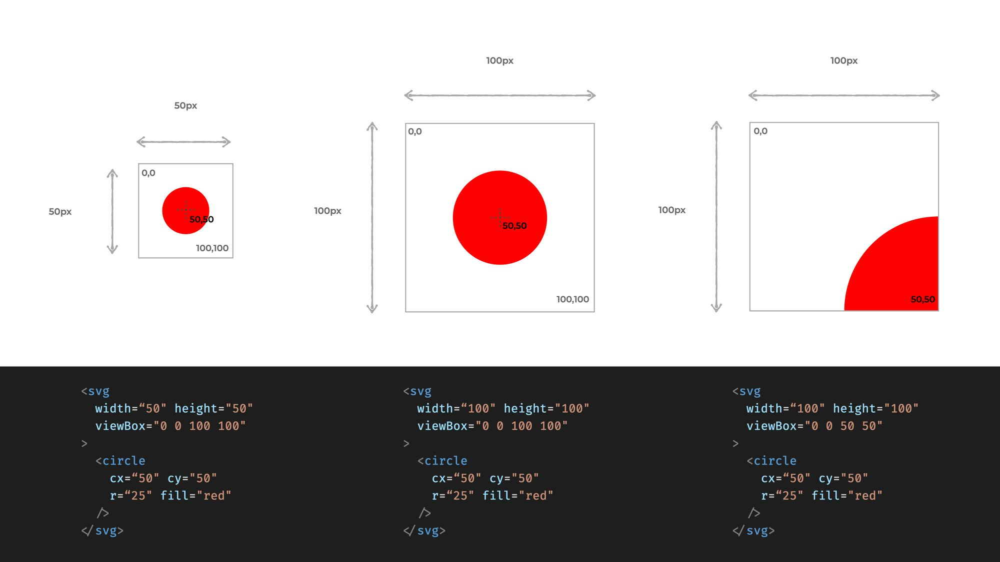

### 목차 <!-- omit in toc -->

## 1. 개요

[!ref target='blank' text=':icon-play:SVG 예제사이트'](https://svg-tutorial.com/)

> SVG(Scalable Vector Graphics) 는 웹용 벡터방식 이미지 포멧입니다.
>
> 다양한 해상도에 대응하는 웹서비스 제작시 용이하게 사용할수 있습니다.

## 2. 예제

### 2.1. viewbox

:::box

`viebox` 는 일러스트레이터의 아트보드와 유사합니다

:::


[!ref target='blank' text=':icon-play:미리보기'](https://qwerewqwerew.github.io/source/css/10-svg/1.html)

```html
<svg width="50" height="50" viewBox="0 0 100 100">
	<circle cx="50" cy="50" r="25" fill="red" />
</svg>
<svg width="100" height="100" viewBox="0 0 100 100">
	<circle cx="50" cy="50" r="25" fill="red" />
</svg>
<svg width="100" height="100" viewBox="0 0 50 50">
	<circle cx="50" cy="50" r="25" fill="red" />
</svg>
```

1. width , height 는 svg 요소의 크기입니다
2. viewbox 는 svg 요소의 프레임이며 속성값은 프레임의 좌표를 의미합니다.
3. 같은 크기의 svg 이미지라도 프레임의 크기에 따라 다르게 보이기도 합니다.

### 2.2. svg 삽입하기
<details markdown='block'>
  <summary>
 🐨  이미지다운로드
  </summary>

  {: .text-delta }
</details>

[!ref target='blank' text=':icon-play:미리보기'](https://qwerewqwerew.github.io/source/css/10-svg/2.html)

> svg이미지를 html 에 삽입하는 3가지 방법을 알아봅시다.

```html

<div class="svg"></div>
<object type="image/svg+xml" data="images/twitter_logo_original.svg"></object>
```

```css
.svg {
	width: 300px;
	height: 300px;
	background: url(images/twitter_logo_original.svg) no-repeat;
}
```
