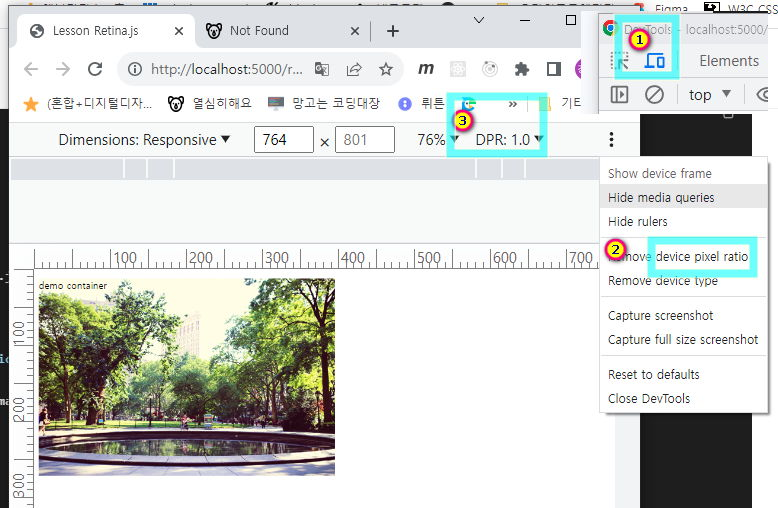

# 7. retina <!-- omit in toc -->

### 목차 <!-- omit in toc -->

# 1. 해상도별 이미지 출력 준비

## 1.1. 개요

> 해상도별로 이미지를 출력하는 기술은 다양한 장치와 환경에서 웹 페이지의 사용자 경험을 향상시키기 위해 중요합니다
> 현재는 다양한 종류의 디바이스(데스크탑, 노트북, 스마트폰, 태블릿 등)와 화면 크기가 존재합니다.
> 각 디바이스와 환경에 맞는 이미지를 제공하여 사용자가 최적화된 경험을 얻을 수 있도록 해야 합니다
> 또한 고해상도 이미지를 모든 디바이스에 동일하게 제공하면 로딩 시간과 대역폭 사용량이 증가할 수 있습니다.
> 해상도별로 최적화된 이미지를 제공하면 사용자들은 빠른 로딩 속도를 경험할 수 있으며, 모바일 > 네트워크나 저속 연결에서의 성능 문제를 완화할 수 있습니다.

## 1.2. 해상도 확인 하기

> 모든 해상도를 전부 고려할수는 없습니다.
> 서비스 주 타겟층의 해상도를 분석하여 구현하는 것도 좋은 방법입니다.
>
> :icon-square-fill: 해상도 점유율 통계자료 제공 사이트
> [!ref target='blank' text=':icon-link: statcounter'](https://gs.statcounter.com/)

> 기술은 빠르게 변하고 있습니다.
> 최신 기종의 해상도를 파악 하고 있어야 트렌드에 대응할수 있습니다.
>
> :icon-square-fill: 기기별 해상도 제공 사이트
> [!ref target='blank' text=':icon-link: screensiz'](https://screensiz.es/)

## 1.3. 브라우저에서 해상도 확인하기

==- Step 1 : 이미지 다운로드
[!badge variant='primary' size='xl' text='이미지파일 다운로드' icon='download'](./retina/images.zip)
==- Step 2 : 코딩

```html # :icon-file: retina.html
... 생략
<head>
	<meta charset="utf-8" />
	<title>Lesson Retina.js</title>
	<style>
		.demo-container,
		.jq,
		.js {
			width: 500px;
			height: 333px;
			background: url(./images/image.jpg) no-repeat;
			background-size: 100% 100%;
		}

		@media screen and (-webkit-min-device-pixel-ratio: 2) {
			.demo-container {
				background: url(./images/image2x.jpg) no-repeat;
			}
		}
	</style>
</head>

<body>
	<div class="demo-container">
		<p>demo container</p>
	</div>
</body>
...생략
```

==- Step 3 : 브라우저 환경세팅

1. Step2 에서 작성한 웹문서를 vscode 라이브서버로 실행합니다.
2. 크롬 브라우저에서 `ctrl+shift+c` 를 누른후 아래 이미지의 번호 순서대로 클릭하여 해상도 설정을 변경해봅니다.
   

==- Step 4
[!badge icon='play' iconAlign='left' variant='info' size='xl' corners='round' text='해상도확인하기' target='blank'](./retina/index.html)

===

# 2. 해상도별 출력 구현

## 2.1. css를 활용

1. css에 작성합니다.

```css #1
@media screen and (-webkit-min-device-pixel-ratio: 2) {
	.demo-container {
		background: url(./images/image2x.jpg) no-repeat;
	}
}
```

css의 조건문을 사용하여 해상도를 분기할수 있습니다.

## 2.2. js를 활용

1.html 에 .js 를 추가합니다

```html
<div class="js">
	<p>js</p>
</div>
```

2. 스크립트를 작성합니다.

```js
const dpr = window.devicePixelRatio;
if (dpr >= 2) {
	//alert("d")
	document.querySelector('.js').style.background = 'url("./images/image2x.jpg")';
}
```

devicePixelRatio 속성은 해상도를 읽어옵니다.

## 2.3. jq를 활용

[!badge variant='primary' size='xl' text='retina.min 다운로드' icon='download'](./retina/retina.min.js.zip)

```html #

<script src="https://code.jquery.com/jquery-3.7.1.slim.min.js"></script>
<script src="./retina.min.js"></script>
```

[!ref target='blank' text=':icon-link:retinajs 공식사이트'](https://imulus.github.io/retinajs/)
