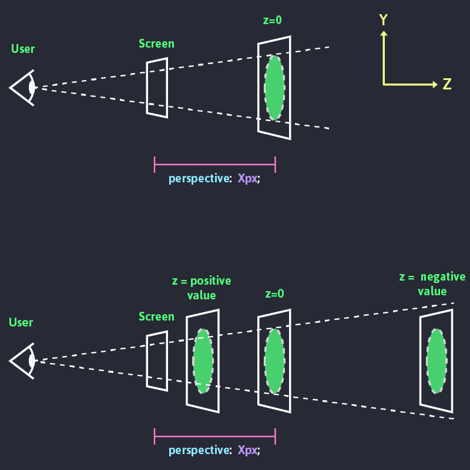
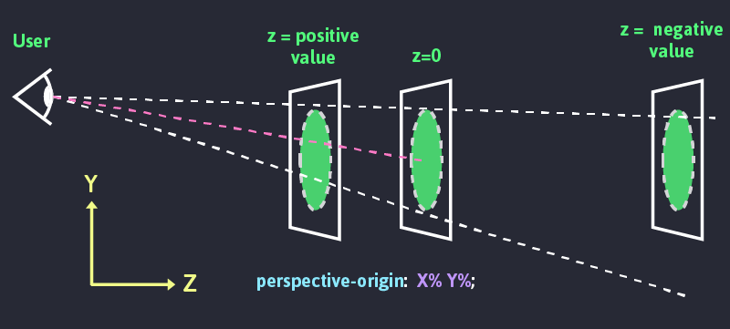
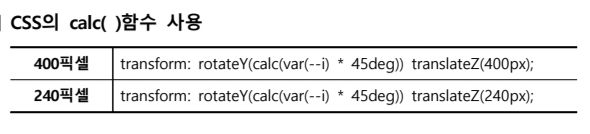

### 목차 <!-- omit in toc -->

- [1. 개요](#1-개요)
- [2. 기본문법](#2-기본문법)
	- [2.1. 2D](#21-2d)
	- [2.2. 3D](#22-3d)
		- [2.2.1. perspective](#221-perspective)
		- [2.2.2. perspective-origin](#222-perspective-origin)
- [3. 응용예제](#3-응용예제)
	- [3.1. 다양한 transform](#31-다양한-transform)
		- [3.1.1. 예제3](#311-예제3)
		- [3.1.2. 예제4](#312-예제4)
	- [3.2. hover시 커지는 이미지](#32-hover시-커지는-이미지)
	- [3.3. 마우스위치에 대응하는 애니메이션](#33-마우스위치에-대응하는-애니메이션)
	- [3.4. 3차원 공간에서 회전하는 이미지](#34-3차원-공간에서-회전하는-이미지)
		- [3.4.1. css 버전](#341-css-버전)
		- [3.4.2. js 버전](#342-js-버전)
	- [3.5. 추가예제](#35-추가예제)

## 1. 개요

[!ref target='blank' text=':icon-link:MDN'](https://developer.mozilla.org/ko/docs/Web/CSS/transform)

> CSS의 transform 속성은 요소의 2D 또는 3D 변환을 적용합니다. 이 변환은 요소의 크기, 위치, 회전 등을 변경할 수 있습니다.

[!ref target='blank' text=':icon-file:trnansform 속성정리표'](https://drive.google.com/file/d/1XLbC1IKHRrMrjq762KRaz0cv1Zmyw8Zv/view)

## 2. 기본문법

### 2.1. 2D

| 함수                     | 설명                                                                                                                        |
| ------------------------ | --------------------------------------------------------------------------------------------------------------------------- |
| `translate(x, y) `       | 요소를 x축과 y축을 따라 이동시킵니다.                                                                                       |
| `rotate(angle) `         | 요소를 주어진 각도만큼 회전시킵니다.                                                                                        |
| `scale(x, y) `           | 요소의 크기를 조정합니다.                                                                                                   |
| `skew(x-angle, y-angle)` | 요소를 기울입니다.                                                                                                          |
| `matrix(n,n,n,n,n,n) `   | 2D 변환을 위한 행렬입니다. translate, scale, rotate 등을 한 번에 적용할 수 있습니다.                                        |
| `transform-origin`       | 변환 요소의 기준점을 설정합니다. `transform-origin: x y z;` 형태로 사용하며, x, y는 좌표를 지정하고, z는 깊이를 지정합니다. |

### 2.2. 3D

[!ref target='blank' text=':icon-link:css-3d-test'](https://westciv.com/tools/3Dtransforms/)

| 속성/함수                                   | 설명                                                                                                                                           |
| ------------------------------------------- | ---------------------------------------------------------------------------------------------------------------------------------------------- |
| `translate3d(x, y, z)`                      | 요소를 x, y, z축을 따라 이동시킵니다.                                                                                                          |
| `rotate3d(x, y, z, angle)`                  | 3차원 공간에서 요소를 회전시킵니다. x, y, z는 회전축을 정의하고, angle은 회전 각도를 정의합니다.                                               |
| `scale3d(x, y, z)`                          | 요소의 크기를 3차원 공간에서 조정합니다. (다른 3차원 트랜스폼이 없는 경우 특별히 스케일링할 것이 없기 때문에 가시적인 효과를 얻을수 없습니다.) |
| `perspective(n)`                            | 요소에 원근법 변환을 적용합니다. n 값은 시점의 거리를 정의하며, 작은 값일수록 더 강한 원근 효과를 나타냅니다.                                  |
| `matrix3d(n,n,n,n,n,n,n,n,n,n,n,n,n,n,n,n)` | 3D 변환을 위한 4x4 행렬입니다. translate3d, scale3d, rotate3d 등을 한 번에 적용할 수 있습니다.                                                 |
| `transform-origin`                          | 변환 요소의 기준점을 설정합니다. `transform-origin: x y z;` 형태로 사용하며, x, y는 좌표를 지정하고, z는 깊이를 지정합니다.                    |
| `perspective-origin`                        | 원근법 변환의 시점을 설정합니다. `perspective-origin: x y;` 형태로 사용하며, x, y는 좌표를 지정합니다.                                         |

#### 2.2.1. perspective

> - **Perspective** 값이 크면 멀어서 작게, 작으면 가까워서 크게보임. (값은 0보다 커야함)
>
> - 사람의 시지각은 멀리 떨어진 사물은 작게, 가까이 있는 사물은 크게 보인다.
>
> 

#### 2.2.2. perspective-origin

> 사용자의 시선 위치를 조정하여 소실점적용
>
> 

## 3. 응용예제

### 3.1. 다양한 transform

+++ 코드

[!ref target='blank' text=':icon-play:미리보기'](https://qwerewqwerew.github.io/source/css/2-transform/step2)

+++ HTML

```html # html
<div class="transform_container">
	<div class="origin">
		<div class="rotatex"></div>
	</div>
	<div class="origin">
		<div class="rotatey"></div>
	</div>
	<div class="origin">
		<div class="rotatez"></div>
	</div>
	<div class="origin">
		<div class="rotatexyz"></div>
	</div>
</div>
```

+++ CSS

### 시작<!-- omit in toc -->

```css # css
.transform_container {
	width: 800px;
	margin: 20px auto;
}
.origin {
	width: 100px;
	height: 100px;
	margin: 40px;
	border: 1px solid black;
	display: inline-block;
}
.origin > div {
	width: 100px;
	height: 100px;
	background-color: orange;
	transition: all 3s; /* 3초 동안 회전하도록 트랜지션 적용 */
}
```

### STEP1 <!-- omit in toc -->

```css
.rotatex:hover {
	transform: rotateX(55deg); /* x축으로 55도 회전 */
}
.rotatey:hover {
	transform: rotateY(55deg); /* y축으로 55도 회전 */
}
.rotatez:hover {
	transform: rotateZ(55deg); /* z축으로 55도 회전 */
}
.rotatexyz:hover {
	transform: rotate3d(0, 1.2, -1.5, 55deg); /* x,y,z축으로 55도 회전 */
}
```

+++

#### 3.1.1. 예제3

+++ 예제

backface [!ref target='blank' text=':icon-play:미리보기'](https://qwerewqwerew.github.io/source/css/2-transform/step3/index1.html)

+++ HTML

```html # html
<div class="transform_container">
	
</div>
```

+++ CSS

```css
.transform_container {
	width: 200px;
	margin: 30px auto;
}
img {
	width: 100%;
	border: 1px solid #ccc;
	border-radius: 50%;
	box-shadow: 5px 5px 63px 2px #00000040;
	animation: rotateAnimal 2.5s infinite alternate; /* rotateAnimal 애니메이션 2.5초 동안 실행. 무한 반복 */
	animation-play-state: paused;
	animation-fill-mode: forwards;
}
img:hover {
	animation-play-state: running;
}
@keyframes rotateAnimal {
	from {
		transform: perspective(200px) rotateY(0deg);
	}
	50% {
		transform: perspective(200px) rotateY(-180deg);
	}
	to {
		transform: perspective(200px) rotateY(-360deg);
	}
}
```

:::my-box

### `transform: perspective(200px) ` VS `perspective:200px ` <!-- omit in toc -->

> 둘다 3D 공간의 z축 깊이를 설정한다

1. 문법이 다르다
   - `transform: perspective(200px) ` : transform 속성에 값으로 작성하는 방식 다른 transform 속성과 함께 사용시 띄어쓰기로 구분하여 작성해야 한다.
   - `perspective:200px ` : perspective 속성에 값을 작성하는 방식
2. 선언 대상이 다르다
   - `transform: perspective(200px) ` : 원근감을 적용할 요소에 직접 작성
   - `perspective:200px ` : 원근감을 적용할 요소의 부모요소에 작성

:::

+++

#### 3.1.2. 예제4

+++ 예제

[!ref target='blank' text=':icon-play:미리보기'](https://qwerewqwerew.github.io/source/css/2-transform/step3/index.html)

+++ HTML

```html # html
<div class="card">
	<div class="front"><span>A&#9829;</span> &#9829; <span>A&#9829;</span></div>
	<div class="back">뒤집어🐨</div>
</div>
```

+++ CSS

```css # css
body {
	font-family: sans-serif;
	font-size: 200%;
	margin: 100px;
	color: #eee;
	background-color: #fafafa;
}

div.card {
	width: 176px;
	height: 246px;
	margin: 0 auto;
	cursor: pointer;
}

div.card div {
	position: absolute;
	width: 160px;
	height: 230px;
	font-size: 2em;
	text-align: center;
	line-height: 230px;
	color: #c00;
	background-color: #fff;
	border: 8px solid #fff;
	border-radius: 5px;
	box-shadow: 2px 2px 5px rgba(0, 0, 0, 0.5), 2px 2px 35px rgba(0, 0, 0, 0.1);
	transition: all 1s ease;
}

div.card div span {
	position: absolute;
	left: 0;
	top: 0;
	font-size: 0.5em;
	width: auto;
	line-height: 1em;
}

div.card div span:last-child {
	left: auto;
	top: auto;
	right: 0;
	bottom: 0;
	transform: rotate(180deg);
}

div.card div.back {
	font-size: 0.8em;
	color: #fff;
	background-color: #36c;
}

div.card div {
	backface-visibility: visible;
	backface-visibility: hidden;
}

div.card div.back {
	transform: perspective(400px) rotateY(0deg);
}

div.front {
	transform: perspective(400px) rotateY(-179.9deg);
}

div.card:hover div.back {
	transform: perspective(400px) rotateY(179.9deg);
}

div.card:hover div.front {
	transform: perspective(400px) rotateY(0deg);
}
```

:::my-box

- `backface-visibility` - 요소의 뒷쪽에서 앞면이 보이게 할지 정하는 속성
- 값: ` visible | hidden | initial | inherit`

:::

+++

### 3.2. hover시 커지는 이미지

+++ 코드

[!ref target='blank' text=':icon-play:미리보기'](https://qwerewqwerew.github.io/source/css/2-transform/step1)

+++ HTML

```html # html
<div class="transform_container">
	
	<span> 트랜스폼 알아보기 </span>
</div>
```

+++ CSS

### 시작<!-- omit in toc -->

```css # css
div.transform_container {
	width: 50%;
	margin: 200px auto;
}
div.transform_container img {
	transition: all 0.35s;
	width: 100%;
}
```

### STEP1 [transform3D적용] <!-- omit in toc -->

```css
div.transform_container:hover img {
	div.transform_container {
		perspective: 1000px;
		border: 1px solid;
	}
	transform: translate3D(100px, 100px, 200px);
}
```

### STEP2 [perspective-origin] <!-- omit in toc -->

```css
div.transform_container {
	perspective: 500px;
	perspective-origin: 50% 50%;
}
div.transform_container:hover img {
	transform: translate3D(0px, 0px, 200px);
}
```

### STEP3 [scale] <!-- omit in toc --> <!-- omit in toc -->

**`translateZ`와 함께 사용**

```css
div {
	perspective-origin: 0px 10px;
}
div img {
	transform: scaleZ(1);
}

div:hover img {
	transform: translateZ(200px) scaleZ(5);
}
```

+++

### 3.3. 마우스위치에 대응하는 애니메이션

+++ 코드

[!ref target='blank' text=':icon-play:미리보기'](https://qwerewqwerew.github.io/source/css/2-transform/step3/index2.html)

+++ HTML

```html # html
<div id="top">
	<div class="perspective">
		<div class="card">
			<div class="thumb"></div>
			<h2>코알라 만져보고 싶어요</h2>
			<span>코알라 너무 좋아</span>
		</div>
	</div>
</div>
```

+++ CSS

```css # css
@import url(https://qwerewqwerew.github.io/source/style/reset.css);
body {
	background: linear-gradient(to right, #ffffff, #f8dce2);
	color: #fff;
	display: flex;
	align-items: center;
	justify-content: center;
	height: 100vh;
	font-family: 'Pretendard';
}

.perspective {
	width: 100%;
	perspective: 1000px;
}

#top {
	width: 100%;
	height: 100%;
	display: flex;
	align-items: center;
	justify-content: center;
	margin: auto;
}

.card {
	width: 270px;
	height: 413px;
	margin: auto;
	box-shadow: 0 70px 63px -60px #494848;
	transform-style: preserve-3d;
	transition: transform 0.05s linear;
}

.card .thumb {
	background: #e99fb6 url(https://qwerew.cafe24.com/images/koala1.png) center center;
	background-size: 150px;
	height: 100%;
	width: 100%;
	border-radius: 15px;
}

.card .thumb:after {
	background: inherit;
	content: '';
	display: block;
	position: absolute;
	left: -60px;
	top: 40px;
	width: 100%;
	height: 108%;
	z-index: -1;
	filter: blur(55px);
}

.card h2 {
	position: absolute;
	top: 0;
	left: -60px;
	font-size: 40px;
	font-weight: 900;
	color: transparent;
	transform: translateZ(80px);
	background: linear-gradient(to right, #e98b89, #547fc0);
	-webkit-background-clip: text;
	-webkit-text-fill-color: transparent;
}

.card span {
	position: absolute;
	bottom: 40px;
	right: -280px;
	font-size: 37px;
	font-weight: 600;
	transform: translateZ(35px);
}

img {
	margin: auto;
	display: block;
	border-radius: 15px;
}
```

+++ JS

```js # javascript
var o = $('.card');
var o2 = $('h2');
$('#top').on('mousemove', function (t) {
	console.log(t);
	var e = -($(window).innerWidth() / 2 - t.pageX) / 30,
		n = ($(window).innerHeight() / 2 - t.pageY) / 10;
	o.attr('style', `transform: rotateY(${e}deg) rotateX(${n}deg)`);
	o2.attr({ style: `transform: rotateY(${e * 0.5}deg) rotateX(${n}deg) translateZ(20px) translateX(${n * 1.5}px)` });
});
```

+++

### 3.4. 3차원 공간에서 회전하는 이미지

#### 3.4.1. css 버전

+++ 코드

> 가로, 세로 200픽셀인 8장의 사진을 이용해 Y축을 기준으로 회전하 는 애니메이션을 제작하고 클릭하면 멈추도록 효과 적용

[!ref target='blank' text=':icon-play:미리보기'](https://qwerewqwerew.github.io/source/css/2-transform/step4/index.html)

[!ref target='blank' text=':icon-download:이미지다운로드'](https://qwerewqwerew.github.io/source/css/2-transform/step4/imgs.zip)

+++ HTML

> 스타일에 변수를 이용해 순서대로 숫자로 지정
> html 에 작성한 변수는 아래처럼 동작한다
> 

```html #
<!-- .box>(span>img)*8 -->

<div class="box">
	<span style="--i: 1"> </span> <span style="--i: 2"> </span> <span style="--i: 3"></span> <span style="--i: 4"></span> <span style="--i: 5"></span> <span style="--i: 6"></span> <span style="--i: 7"></span> <span style="--i: 8"></span>
</div>
```

+++ CSS

> [!ref target='blank' text=':icon-play:mdn'](https://developer.mozilla.org/en-US/docs/Web/CSS/-webkit-box-reflect)
> "body"를 플렉스로 지정하고 배경은 방사형그레디언트를 적용한 후 스크롤했을 때 고정되도록 “background-attachment" 속성 값 을 “fixed"로 지정한다.
>
> - `transform-style` : 3차원 공간에서 요소(element)의 공간에 표시 또는 평면적으로 표시 할지 결정한다.
>   - `transform-style: flat; `평면으로 표시
>   - `transform-style: preserve-3d;` 공간으로 표시
>
> 8개의 이미지는 `span`태그에 인라인스타일 속성값으로 커스텀스타일을 적용 하고 값은 "1"부터 "8"까지의 숫자로 정의되어 있으므로 `img1`은 Y축으로 45 도 회전하고 Z축으로 400픽셀이동되어 표시되면 입체적으로 보여진다.

```css #
* {
	margin: 0;
	padding: 0;
	box-sizing: border-box;
}
body {
	display: flex;
	justify-content: center;
	height: 2000px;
	background: radial-gradient(#2c5364, #0f2027);
	background-attachment: fixed;
}
.box {
	position: relative;
	top: 30vh;
	width: 200px;
	height: 200px;
	transform-style: preserve-3d;
	animation: animate 20s linear infinite;
}
@keyframes animate {
	0% {
		transform: perspective(1000px) rotateY(0deg);
	}
	100% {
		transform: perspective(1000px) rotateY(360deg);
	}
}
.box span {
	position: absolute;
	top: 0;
	left: 0;
	width: 100%;
	height: 100%;
	transform-origin: center;
	transform-style: preserve-3d;
	transform: rotateY(calc(var(--i) * 45deg)) translateZ(400px);
	-webkit-box-reflect: below 0px linear-gradient(transparent, transparent, #0009);
}
.box span img {
	position: absolute;
	top: 0;
	left: 0;
	width: 100%;
	height: 100%;
	object-fit: cover;
}
.item {
	position: fixed;
	left: 0;
	width: 300px;
	height: 300px;
	background-color: #fff;
}
```

+++

#### 3.4.2. js 버전

+++ 코드

+++ html

```html #
<div class="box">
	<span></span><span></span><span></span><span></span><span></span><span></span><span></span><span></span>
</div>
<script src="1.js"></script>
```

+++ js

```js #
const span = document.querySelectorAll('span');
span.forEach((el, idx) => {
	el.setAttribute('style', `--i:${idx - 1}`);
});
```

+++

### 3.5. 추가예제

| 제목1                 | 제목2                                                                                                            |
| --------------------- | ---------------------------------------------------------------------------------------------------------------- |
| 01-perspective ‎      | [01-perspective ‎](https://qwerewqwerew.github.io/source/css/2-transform/step0/01-perspective.html ‎)            |
| 02-perspective()      | [02-perspective() ](<https://qwerewqwerew.github.io/source/css/2-transform/step0/02-perspective().html>)         |
| 03-translatez ‎       | [03-translatez ‎](https://qwerewqwerew.github.io/source/css/2-transform/step0/03-translatez.html ‎)              |
| 04-perspective-origin | [04-perspective-origin ](https://qwerewqwerew.github.io/source/css/2-transform/step0/04-perspective-origin.html) |
| 05-preserve-3d ‎      | [05-preserve-3d ‎](https://qwerewqwerew.github.io/source/css/2-transform/step0/05-preserve-3d.html ‎)            |
| 06-playing-card       | [06-playing-card ](https://qwerewqwerew.github.io/source/css/2-transform/step0/06-playing-card.html)             |
| 07-rotate-x-rotate-y  | [07-rotate-x-rotate-y ](https://qwerewqwerew.github.io/source/css/2-transform/step0/07-rotate-x-rotate-y.html)   |
| 08-rotate3d.htm ‎     | [08-rotate3d.htm ‎](https://qwerewqwerew.github.io/source/css/2-transform/step0/08-rotate3d.htm ‎)               |
| 09-rotate3d-2         | [09-rotate3d-2 ](https://qwerewqwerew.github.io/source/css/2-transform/step0/09-rotate3d-2.html)                 |
| 10-translate3d        | [10-translate3d ](https://qwerewqwerew.github.io/source/css/2-transform/step0/10-translate3d.html)               |
| 11-scalez ‎           | [11-scalez ‎ ](https://qwerewqwerew.github.io/source/css/2-transform/step0/11-scalez.html ‎ )                    |
| 12-3d-cube ‎          | [12-3d-cube ‎](https://qwerewqwerew.github.io/source/css/2-transform/step0/12-3d-cube.html ‎)                    |
| 13-animated-3d-cube   | [13-animated-3d-cube ](https://qwerewqwerew.github.io/source/css/2-transform/step0/13-animated-3d-cube.html)     |
