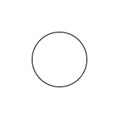

### 목차 <!-- omit in toc -->

## 1. 글씨회전

> 회전하는 글씨를 만들어보자

[!button variant='primary' icon='play' text='실행화면' target='blank'](https://qwerewqwerew.github.io/source/css/17-effect/rotate.html)


==- STEP 1

1. 피그마를 열고 아래와 같은 이미지를 제작한다.
  
2. 원을 더블클릭하여 선택후 2->3 순서대로 클릭한다.
   + 도형 레이어를 패스로 깨는 과정이다.
  
3. 프레임에서 우클릭후 번호 순서대로 클릭한다
  

==- STEP 2
1. vscode 를 열고 복사한 코드를 붙여넣는다.
1. 파일명 `rotate.svg` 로 저장한다.
```xml

<svg width="150" height="150" viewBox="0 0 150 150" fill="none" xmlns="http://www.w3.org/2000/svg">
<rect width="150" height="150" fill="white"/>
<path d="M109.5 75C109.5 94.0538 94.0538 109.5 75 109.5C55.9462 109.5 40.5 94.0538 40.5 75C40.5 55.9462 55.9462 40.5 75 40.5C94.0538 40.5 109.5 55.9462 109.5 75Z" stroke="black"/>
</svg>

```
2. svg 태그에 아래의 코드를 추가한다.
```xml
	<svg ... xmlns:xlink="http://www.w3.org/1999/xlink">
```
+ 해당 코드는 'xlink:href'를 사용할수 있게 설정한다.

3. svg 파일을 수정한다.
```xml #2-16
<svg width="150" height="150" viewBox="0 0 150 150" xmlns="http://www.w3.org/2000/svg" xmlns:xlink="http://www.w3.org/1999/xlink">
<style>
  .r_text {
    animation: rotate 10s linear infinite;
    transform-origin:50% 50% ;
    font-size:1rem;
  }
  @keyframes rotate {
    to {
      transform: rotate(1turn);
    }
  }
</style>
<path id="line" d="M109.5 75C109.5 94.0538 94.0538 109.5 75 109.5C55.9462 109.5 40.5 94.0538 40.5 75C40.5 55.9462 55.9462 40.5 75 40.5C94.0538 40.5 109.5 55.9462 109.5 75Z" fill="rgba(0,0,0,0)" />
<text class="r_text">
  <textPath xlink:href="#line">Sentence Examples | Examples of Words Used in a Sentence</textPath>
</text>
</svg>
```
4. html 문서를 생성하고 svg 이미지를 삽입한다.
```html rotate.html
<!DOCTYPE html>
<html lang="ko">
	<head>
		<meta charset="UTF-8" />
		<meta name="viewport" content="width=device-width, initial-scale=1.0" />
		<title>Document</title>
	</head>
	<body>
    
	</body>
</html>

```
===
