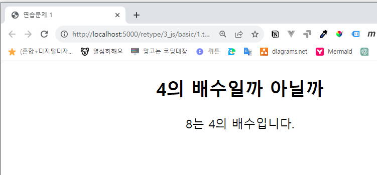
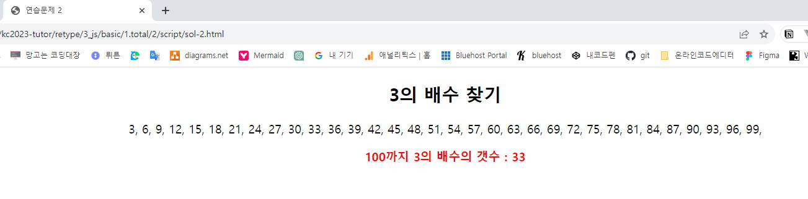

# 2. 기본문법 <!-- omit in toc -->

### 목차 <!-- omit in toc -->

- [1. 변수](#1-변수)
	- [1.1. 예제 **선언과 할당** \[01\]](#11-예제-선언과-할당-01)
	- [1.2. 예제 \[02\]](#12-예제-02)
- [2. 자료형](#2-자료형)
	- [2.1. 개요](#21-개요)
	- [2.2. 종류](#22-종류)
	- [2.3. 원시형](#23-원시형)
		- [2.3.1. 예제\[03\]](#231-예제03)
	- [2.4. 참조형](#24-참조형)
		- [2.4.1. 예제 \[04\]](#241-예제-04)
- [3. 연산자](#3-연산자)
	- [3.1. 연산자의 종류](#31-연산자의-종류)
		- [3.1.1. 추가연산자(병합연산자 nullish)](#311-추가연산자병합연산자-nullish)
	- [3.2. 산술연산자](#32-산술연산자)
		- [3.2.1. 산술연산자의 기본활용 예제 \[05\]](#321-산술연산자의-기본활용-예제-05)
		- [3.2.2. 산술연산자의 자료형 활용예제 \[06\]](#322-산술연산자의-자료형-활용예제-06)
		- [3.2.3. 산술연산자의 자료형 활용예제 \[07\]](#323-산술연산자의-자료형-활용예제-07)
		- [3.2.4. 증가연산자예제 \[08\]](#324-증가연산자예제-08)
	- [3.3. 할당연산자](#33-할당연산자)
		- [3.3.1. 예제-\[08\]](#331-예제-08)
	- [3.4. 비교연산자](#34-비교연산자)
		- [3.4.1. 예제-\[09\]](#341-예제-09)
	- [3.5. 논리연산자](#35-논리연산자)
		- [3.5.1. 예제-\[10\]](#351-예제-10)
		- [3.5.2. 마무리문제-\[11\]](#352-마무리문제-11)
		- [3.5.3. 마무리문제-\[12\]](#353-마무리문제-12)
	- [3.6. 조건부연산자](#36-조건부연산자)
		- [3.6.1. 예제-\[13\]](#361-예제-13)
		- [3.6.2. 마무리문제-\[14\]](#362-마무리문제-14)
		- [3.6.3. 마무리문제-\[15\]](#363-마무리문제-15)
	- [3.7. 연산자의 우선순위](#37-연산자의-우선순위)
- [4. 제어문](#4-제어문)
	- [4.1. 조건문](#41-조건문)
		- [4.1.1. if](#411-if)
			- [4.1.1.1. if-예제\[16\]](#4111-if-예제16)
			- [4.1.1.2. if-예제\[17\]](#4112-if-예제17)
			- [4.1.1.3. if-마무리문제\[18\]](#4113-if-마무리문제18)
		- [4.1.2. if~else](#412-ifelse)
			- [4.1.2.1. if-else-예제\[19\]](#4121-if-else-예제19)
			- [4.1.2.2. if-else-마무리문제\[20\]](#4122-if-else-마무리문제20)
		- [4.1.3. if~else if](#413-ifelse-if)
			- [4.1.3.1. if~else if-예제\[21\]](#4131-ifelse-if-예제21)
			- [4.1.3.2. if~else if-마무리문제\[22\]](#4132-ifelse-if-마무리문제22)
		- [4.1.4. 삼항연산자를 활용한 조건문](#414-삼항연산자를-활용한-조건문)
			- [4.1.4.1. if~else if-마무리문제\[23\]](#4141-ifelse-if-마무리문제23)
		- [4.1.5. 논리연산자를 활용한 조건문](#415-논리연산자를-활용한-조건문)
			- [4.1.5.1. OR 연산자-예제\[24\]](#4151-or-연산자-예제24)
			- [4.1.5.2. AND 연산자-예제\[24\]](#4152-and-연산자-예제24)
			- [4.1.5.3. NOT 연산자-예제\[25\]](#4153-not-연산자-예제25)
	- [4.2. 선택문](#42-선택문)
			- [4.2.0.1. switch-예제\[26\]](#4201-switch-예제26)
	- [4.3. 실습문제\[27\]](#43-실습문제27)
	- [4.4. 반복문](#44-반복문)
		- [4.4.1. for](#441-for)
			- [4.4.1.1. for-예제\[28\]](#4411-for-예제28)
			- [4.4.1.2. for-예제\[29\]](#4412-for-예제29)
			- [4.4.1.3. 중첩 for-예제\[30\]](#4413-중첩-for-예제30)
			- [4.4.1.4. 배열과 함께 사용하는 for in](#4414-배열과-함께-사용하는-for-in)
			- [4.4.1.5. 배열과 함께 사용하는 for of](#4415-배열과-함께-사용하는-for-of)
		- [4.4.2. while](#442-while)
			- [4.4.2.1. while-예제\[33\]](#4421-while-예제33)
			- [4.4.2.2. while-예제\[34\]](#4422-while-예제34)
		- [4.4.3. do~while](#443-dowhile)
			- [4.4.3.1. do~while-예제\[35\]](#4431-dowhile-예제35)
		- [4.4.4. break/continue](#444-breakcontinue)
			- [4.4.4.1. break/continue-예제](#4441-breakcontinue-예제)
	- [4.5. 마무리문제-\[38\]](#45-마무리문제-38)
- [5. 마무리문제](#5-마무리문제)

---

## 1. 기본문법 <!-- omit in toc -->

### 1. 변수


<aside style="border:1px solid #ddd; padding:2rem; background:#ebebeb">

    ✅ 변수(상수)란? 데이터(값)를 저장 할 수 있는 메모리 공간

    - 변하는 값은 변수 `var, let`
    - 변하지 않는 값은 상수 `const`
    -

    ✅ 변수명 규칙

    - 영문,숫자, 일부 특수문자($,\_)만 포함
    - 첫 글자로는 $,\_,영문자만 사용가능
    - 한글 사용불가
    - 의미에 맞는 이름으로 사용
    - 소문자로 시작
    - 기본 this, with(상수), document,window,screen, location등등 자바스크립트에서 사용하는 단어(예약어)를 사용불가

    ✅ 변수 사용 이유

    - 변수를 쓰는 이유는 코드의 재활용성을 높여준다.

</aside>

#### 1.1. 예제 **선언과 할당** [01]

```js
var currentYear; //올해 연도의 변수 선언
var name; // 이름의 변수 선언
var age; // 나이의 변수 선언
var currentYear, name, age; //한번에 선언

//선언후 할당하기
var frontend;
frontend = '김망고';

//선언과 할당을 동시에 하기
var variable = '변수';
```

#### 1.2. 예제 [02]

+++지시문

나이계산 프로그램을 만들어봅시다.

+++문제

[문제](./script/age.html)

```html
<!DOCTYPE html>
<html lang="ko">
	<head>
		<meta charset="UTF-8" />
		<meta name="viewport" content="width=device-width, initial-scale=1.0" />
		<title>나이 계산하기</title>
	</head>
	<body></body>
</html>
```

+++해설
[정답](./script/age-result.html)

```html
<!DOCTYPE html>
<html lang="ko">
	<head>
		<meta charset="UTF-8" />
		<meta name="viewport" content="width=device-width, initial-scale=1.0" />
		<title>나이 계산하기</title>
	</head>
	<body>
		<script>
			var currentYear = 2021;
			var birthYear;
			var age;
			birthYear = prompt('태어난 연도를 입력하세요. (YYYY)', '');
			age = currentYear - birthYear + 1;
			document.write(currentYear + '년 현재<br>');
			document.write(birthYear + '년에 태어난 사람의 나이는 ' + age + '세입니다.');
		</script>
	</body>
</html>
```

+++

### 2. 자료형

#### 2.1. 개요

  <aside style='border:1px solid #ddd; padding:2rem;'>

🚩 자료형이란?

1. 자료(data): 컴퓨터에서 처리할수 있는 모든 것

1. 자료형(data type): 자료를 형태별로 분류해 놓은것

  

  </aside>

#### 2.2. 종류

| 종류            | 자료형    | 설명                                                                                               | 예시                                           |
| --------------- | --------- | -------------------------------------------------------------------------------------------------- | ---------------------------------------------- |
| 기본(원시) 유형 | Number    | 숫자를 나타내는 데이터 타입. 정수 및 부동소수점 숫자를 포함.                                       | `var num = 123;`                               |
| --------------- | String    | 문자열을 나타내는 데이터 타입. 0개 이상의 16비트 유니코드 문자로 구성.                             | `var str = "Hello World";`                     |
| --------------- | Boolean   | 논리적인 값을 나타내며 `true`와 `false` 두 가지 값을 가짐.                                         | `var isTrue = false;`                          |
| 복합(참조) 유형 | Object    | JavaScript의 객체를 나타냄. 객체는 이름과 값으로 구성된 프로퍼티들의 집합.                         | `var obj = {name: "John", age: 30};`           |
| ---             | Array     | 순서가 있는 요소들의 집합을 나타냄. 배열 요소에 접근하는 것은 대괄호([])를 사용하여 인덱스로 접근. | `var arr = [1, 2, 3];`                         |
| ---             | Function  | 실행 가능한 코드 블록을 가지며, 기능을 반복해서 사용할 수 있음.                                    | `function sayHello() { alert('Hello!'); }`     |
| 특수 유형       | undefined | 변수가 선언되었으나 초기화되지 않았을 때의 값.                                                     | `var x; console.log(x);  // 출력: undefined`   |
| ---             | null      | 값이 없음을 의미. 변수에 명시적으로 할당해 사용.                                                   | `var y = null; console.log(y);  // 출력: null` |

#### 2.3. 원시형

> `typeof` : 자료형을 확인하는 단항 연산자인 typeof와 함께 알아보자

##### 2.3.1. 예제[03]

```js
//number
let num1 = 1;
let num2 = 2;
let sum = num1 + num2;
console.log('sum:', sum, typeof sum);

//string
let str1 = '1';
let str2 = '2';
let para = str1 + str2;
console.log('para:', para, typeof para);

//boolean
let fact = true;
let lie = false;
console.log('fact:', fact, typeof fact);

//null
let temp = null;
console.log('temp:', temp, typeof temp);

//undefined
let noName;
console.log('noName:', noName, typeof noName);
```

#### 2.4. 참조형

!!

원시형과 참조형의 차이는 쉽게 아래처럼 값을 여러개 나누어 저장할수 있다는 것에 있다.

!!!

> 
>
> ▲ 원시타입은 한개의 물건을 저장하는 수납박스
>
> 
>
> ▲ 참조타입은 한번에 여러개의 물건을 저장하는 수납박스이다

##### 2.4.1. 예제 [04]

```js
//Object
let person = {
	name: 'mimi',
	age: 20,
	city: 'seoul',
};
console.log(person);

//Array
let zoo = ['koala', 'cat', 'dog'];
console.log(zoo[0]);

let arr = [1, 2, 3, 4, 5];
console.log(arr);

//function
function addNums(num1, num2) {
	return num1 + num2;
}
console.log(addNums(5, 10));
```

---

### 3. 연산자

!!! [🔗mdn](https://developer.mozilla.org/ko/docs/Web/JavaScript/Guide/Expressions_and_operators#%EA%B4%80%EA%B3%84_%EC%97%B0%EC%82%B0%EC%9E%90)

연산자란? 프로그램에서 특정한 동작을 하도록 지시하는 기호.

프로그래밍에서 연산이란 사칙연산은 물론 문자열을 연결해서 새로운 문자열을 만들고 값의 크기를 비교하는 등의 여러가지 동작을 의미한다.
이런 연산을 지시하는 기호가 연산자이다.

산술,관계,할당,논리,부정,삼항,비트,단항,등이 있다.

!!!

#### 3.1. 연산자의 종류

| 연산자 유형 | 연산자                | 설명                                            |
| ----------- | --------------------- | ----------------------------------------------- | ---------------------- |
| 산술 연산자 | `+`                   | 덧셈                                            |
|             | `-`                   | 뺄셈                                            |
|             | `*`                   | 곱셈                                            |
|             | `/`                   | 나눗셈                                          |
|             | `%`                   | 나머지 계산                                     |
|             | `++`                  | 증가 (값에 1을 더함)                            |
|             | `--`                  | 감소 (값에서 1을 뺌)                            |
| 대입 연산자 | `=`                   | 값을 변수에 할당함                              |
|             | `+=`                  | 기존 값에 값을 더하고 결과를 변수에 할당함      |
|             | `-=`                  | 기존 값에서 값을 빼고 결과를 변수에 할당함      |
|             | `*=`                  | 기존 값에 값을 곱하고 결과를 변수에 할당함      |
|             | `/=`                  | 기존 값으로 값을 나누고 결과를 변수에 할당함    |
|             | `%=`                  | 기존 값으로 나머지 계산 후 결과를 변수에 할당함 |
| 비교 연산자 | `==`                  | 동등 비교 (값이 같은지 확인)                    |
|             | `!=`                  | 부등 비교 (값이 다른지 확인)                    |
|             | `=== `                | 일치 비교 (값과 타입이 모두 같은지 확인)        |
|             | `!== `                | 부일치 비교 (값과 타입이 모두 다른지 확인)      |
|             | `<`, `<=_`, `>`, `>=` | 크기/같음을 비교하는 관계 연산자들              |
| 논리 연산자 | `&&`,``               | ``, `!`                                         | AND, OR, NOT 로직 구현 |

##### 3.1.1. 추가연산자(병합연산자 nullish)

> 변수나 표현식이 null 또는 undefined인 경우에만 대체 값을 반환하는 연산자

```
//nullish 병합 연산자 '??'
const a = null;
const b = "1";
console.log(a ?? b);

```

#### 3.2. 산술연산자

##### 3.2.1. 산술연산자의 기본활용 예제 [05]

```js
console.log(100 + 200); // 300
console.log(200 - 80); // 120
console.log(100 * 3); // 300
console.log(400 / 5); // 80	나누기 연산자
console.log(402 % 5); // 2	나머지 연산자
console.log(2 ** 3); // 8 **은 제곱!!
```

##### 3.2.2. 산술연산자의 자료형 활용예제 [06]

| 표현식        | 결과   |
| ------------- | ------ |
| 문자형+문자형 | 문자형 |
| 문자형+숫자형 | 문자형 |

+++ 코드

```js
var t1 = '망고는';
var t2 = 5;
var t3 = '살';
var t6 = true;
var t4 = t1 + t2 + t3 + t6;
console.log(typeof t4); //string
alert(t4); //'망고는5살true'
```

+++ 설명

<mark>문자형과 `+` 연산자를 사용하면 모든 자료형이 문자형으로 변환된다.</mark>

🔑 자바스크립트는 변수가 가지는 값에 따라 그 타입이 동적으로 결정되는 동적 타이핑(dynamic typing) 언어이다.

동적 타이핑의 장점은 유연성이다.

변수의 타입이 자유롭기 때문에 언제든지 동적인 값에 따라 변수의 타입이 자동으로 바뀔 수 있으므로 유연하고 생산적인 코딩이 가능하다.

하지만 동적 타이핑으로 인해 변수의 타입을 예측하기 어려우므로, 이에 따라 예상하지 않은 에러가 발생할 수도 있다.

이를 보완한 것이 타입스크립트 이다.
+++

##### 3.2.3. 산술연산자의 자료형 활용예제 [07]

+++ 코드

```js
const x = 75;
const y = 87;
const add = x + y;
document.write('국어 점수 :' + x + '<br>');
document.write('수학 점수 :' + y + '<br>');
document.write('합계 :' + add + '<br>');
document.write('평균은 :');
document.write(add / 2);
document.write(`국어점수: ${x}<br>수학점수: ${y}<br>합계: ${add}<br> `);
```

+++ 설명

- `const add = x + y;`
  - `+` 는 숫자 자료형으로 연산하였다.
- `document.write('국어 점수 :' + x + '<br>');`
  - `+` 는 문자 자료형으로 연산하였다.
- `document.write(`국어점수: ${x}<br>수학점수: ${y}<br>합계: ${add}<br> `);`
  - 백틱을 사용하면 표현식과 문자를 쉽게 연결할수 있다. (Template literals)

+++

##### 3.2.4. 증가연산자예제 [08]

:::comment_box
변수에 붙이면 1씩 증가/감소 시키는 연산자

앞에 붙이면 전위연산, 뒤에 붙이면 후위 연산이라고 하며 위치에 따라 결과가 다르다

:::

| 종류    | 설명                                 |
| ------- | ------------------------------------ |
| A = ++A | A에 A에 1을 더한값을 재할당 전위연산 |
| A = A++ | A에 A에 1을 더한값을 재할당 후위연산 |
| A = --A | A에 A에 1을 뺀값을 재할당 전위연산   |
| A = A-- | A에 A에 1을 뺀값을 재할당 후위연산   |

+++ 코드

```js
let x = 1;

document.write(x++); //1(2)
document.write(x++); //2(3)
document.write(x++); //3(4)
document.write(x++); //4(5)
document.write('<br>');

x = 1;

document.write(++x); //2
document.write(++x); //3
document.write(++x); //4
document.write(++x); //5
```

+++ 설명
후위 연산은 결과를 다음 호출시 반환하고
전위 연산은 결과를 즉시 반환한다.
+++

#### 3.3. 할당연산자

| 종류 | 설명                               |
| ---- | ---------------------------------- |
| =    | 우항을 좌항에 할당                 |
| +=   | 좌항에 우항을 더한후 좌항에 재할당 |

##### 3.3.1. 예제-[08]

+++ 코드

```html
<!DOCTYPE html>
<html>
	<head>
		<title>노드 추가</title>
	</head>
	<body>
		<div id="container">
			<p>첫 번째 단락</p>
		</div>

		<script>
			// 기존의 요소 선택
			const container = document.getElementById('container');

			// 새로운 노드 생성 및 추가
			container.innerHTML += '<p>두 번째 단락</p>';
		</script>
	</body>
</html>
```

+++ 설명
!!! `container.innerHTML += '<p>두 번째 단락</p>';` 의 연산자를 `+` 로 변경하면 두번째 p 태그는 교체된다.
`+=` 연산자는 가산후 재할당 한다.
+++

#### 3.4. 비교연산자

!!! 비교연산자는 우항과 좌항의 값은 비교후 참이나 거짓을 반환한다.
주로 조건문에 사용한다.
!!!

| 종류  | 설명                         |
| ----- | ---------------------------- |
| A==B  | A와 B가 같다                 |
| A!=B  | A와 B가 같지 않다            |
| A===B | A와 B가 자료형까지 같다      |
| A!==B | A와 B가 자료형까지 같지 않다 |
| A<B   | A가 B보다 작다               |
| A<=B  | A가 B보다 작거나 같다        |
| A>B   | A가 B보다 크다               |
| A>=B  | A가 B보다 크거나 같다        |

##### 3.4.1. 예제-[09]

+++ 코드

```js
var x = 10;
var y = 20;

document.write(x + '>=' + y + ': ');
document.write(x >= y);
document.write('<br>');

document.write(x + '<=' + y + ': ');
document.write(x <= y);
document.write('<br>');

document.write(x + '!=' + y + ': ');
document.write(x != y);
document.write('<br>');

document.write(x + '==' + y + ': ');
document.write(x == y);
document.write('<br>');

document.write(x + '===' + y + ': ');
document.write(x === y);
document.write('<br>');

document.write(x + '!==' + y + ': ');
document.write(x !== y);
document.write('<br>');
```

+++ 설명

x=10, y=20 입니다.

`document.write(x >= y);` 10은 20보다 크거나 같다는 false 입니다

`document.write(x <= y);` 10은 20보다 작거나 같다는 true 입니다

`document.write(x != y);` 10은 20과 같지 않다는 true 입니다

`document.write(x == y);` 10은 20과 같다 는 false 입니다

`document.write(x !== y);` 10은 20과 자료형까지 같지 않다는 true 입니다

`document.write(x === y);` 10은 20과 자료형까지 같다 는 false 입니다

+++

#### 3.5. 논리연산자

!!!불리언(boolean) 연산자 라고도 하며 결괏값이 true, false 를 반환하는 연산자
!!!

| 종류   | 설명                               |
| ------ | ---------------------------------- |
| A&&B   | A와 B가 모두 True일 경우에만 True  |
| A ∣∣ B | A또는 B가 True일 경우 True         |
| !A     | A가 True이면 False, False이면 True |

##### 3.5.1. 예제-[10]

+++ 코드

```js
var x = 7 > 6 && 1 > 8;
var y = 7 > 6 || 1 > 8;
var z = !(7 > 6);

document.write('7이 6보다 크고 1이 8보다 크면 논리값은?');
document.write(x + '<br>');
document.write('7이 6보다 크거나 1이 8보다 크면 논리값은?');
document.write(y + '<br>');
document.write('7이 6보다 크지 않으면 논리값은?');
document.write(z + '<br>');
```

+++ 설명
!!!

1. t/f => false
2. t/f => true
3. t => false
   !!!
   +++

##### 3.5.2. 마무리문제-[11]

+++ 지시문
!!!danger :zap: 20대 여성이라면 결과값이 true로, 아니라면 결과 값으로 false:zap:
20대 대상의 소개팅을 준비 중입니다.<br>
남성은 모집이 완료 되었지만 여성은 아직 모집이 다 되지 않았네요.
prompt메서드를 활용하여 참가 희망자의 성별과 나이를 확인합니다.<br>
20대 여성이라면 결과값이 true로, 아니라면 결과 값으로 false가 나오게 만드세요
!!!
+++ 힌트
[MDN :link:](https://developer.mozilla.org/ko/docs/Web/API/Window/prompt)
`prompt(message, default);`
+++ 정답

```js
var gender = prompt('당신의 성별은', '여성');
var age = prompt('당신의 나이는', '20');
var result = age >= 20 && age < 30 && gender == '여성';
document.write(result);
```

+++ 설명
!!!This is another Tab!!!
+++

##### 3.5.3. 마무리문제-[12]

+++ 지시문
!!!danger :zap: 평균이 70점 이상이고 각 과목별 점수가 60점 이상이면 true를 아니라면 false:zap:
prompt 메서드를 활용하여 국어, 영어, 수학 점수를 입력 받으세요.<br>
평균이 70점 이상이고 각 과목별 점수가 60점 이상이면 true를 아니라면 false를 출력합니다.
!!!
+++ 힌트
엄청쉽다
+++ 정답

```js
var korNum = Number(prompt('국어점수는?', '0'));
var engNum = Number(prompt('영어점수는?', '0'));
var mathNum = Number(prompt('수학점수는?', '0'));
var avg = (korNum + engNum + mathNum) / 3;
var result = avg >= 70 && konNum >= 60 && engNum >= 60 && mathNum >= 60;
document.write(result);
```

+++ 설명
!!!This is another Tab!!!
+++

#### 3.6. 조건부연산자

!!! 자바스크립트에서 항을 3개 가지는 연산자는 이것 밖에 없어서 삼항연산자라고도 불리우며 조건문을 간단히 작성할때 많이 사용됨
!!!

| 문법           | 설명                                 |
| -------------- | ------------------------------------ |
| (조건) ? A : B | 조건 ? 참이면 A실행 : 거짓이면 B실행 |

##### 3.6.1. 예제-[13]

+++ 코드

```js
//your="어려워요"
your = '재밌어요';
let study = your == '어려워요' ? ' 천재이시군요' : '복습하세요';
document.write(`자바스크립트가 ${your} <h1>${study}</h1>`);
```

+++ 설명
!!!This is another Tab!!!
+++

##### 3.6.2. 마무리문제-[14]

+++ 지시문
!!!info :zap: 삼항 연산자 사용 :zap:
경아는 오늘 교통비 3,000원 식비 7,000원, 음료비 2,000원을 사용했습니다.
하루 용돈인 10,000원을 초과했을 경우 "000원 초과"라고 출력되거나,
아니면 "돈 관리 참 잘했어요!"라고 출력되도록 해보세요
!!!
+++ 힌트
!!!danger
정답틀림
!!!
+++ 정답

```js
var price1 = 3000;
var price2 = 6000;
var price3 = 3000;
var total = price1 + price2 + price3;
var result = total > 1000 ? total - 10000 + '원 초과' : '돈 관리 잘 했어요!';
document.write(result);
```

+++ 설명
!!!This is another Tab
!!!
+++

##### 3.6.3. 마무리문제-[15]

+++ 지시문
!!!info :zap: 삼항 연산자 사용 :zap:
방문자에게 질의응답 창(prompt)을 이용하여 신장과 몸무게를 입력받아 옵니다.
방문자의 몸무게가 적정 몸무게보다 이상일 경우 "적정 몸무게 이상", 미만일 경우에는 "적정 몸무게 미달"로 출력되도록 하세요.
적정 몸무게 공식은 '몸무게=(신장-100)\*0.9'입니다
!!!
+++ 힌트
!!!danger
정답틀림
!!!
+++ 정답

```js
var user_height = prompt('당신의 신장은?', '0');
var user_weight = prompt('당신의 체중은?', '0');
var normal_weight = (user_height - 100) * 0.9;
var result = user_weight > normal_weight ? '적정 몸무게 이상' : '적정 몸무게 미달';
document.write(result);
```

+++ 설명
!!!This is another Tab
!!!
+++

#### 3.7. 연산자의 우선순위

!!!info
자바스크립트에서 연산자 우선순위는 표현식 내에서 연산자가 어떤 순서로 평가되는지를 결정하는 규칙입니다.

이 규칙에 따라 표현식의 평가 순서와 결과가 달라질 수 있습니다.
!!!
|우선순위|연산자|
|---|---|
|1. |`( )`|
|2. 단항 연산자|`--,++,!`|
|3. 산술 연산자 |`_,/,%,+,-`|
|4. 비교 연산자|`>,>=,<,<=,==,===,!==`|
|5. 논리 연산자|`&&,||`|
|6. 대입(복합 대입)연산자|`=,+=,-+,_=,/=,%=`|

---

### 4. 제어문

:::comment_box
<mark>제어문</mark> 에는 <mark>조건문, 선택문, 반복문</mark> 이 있습니다.

1. 조건문이란 조건에 따라 실행이 달라지게 할 때 사용되는 제어문입니다.

   - 자바 스크립트의 조건문 에는` if, else, else if`가 있습니다.

2. 선택문이란 값에 따라서 실행 내용을 선택하여 실행 할때 사용되는 제어문입니다.

   - 자바 스크립트의 선택문 에는 `switch`가 있습니다.

3. 반복문이란 주어진 조건에 따라서 문장을 반복 실행 할때 사용되는 제어문 입니다
   - 자바 스크립트의 반복문 에는 `for, while, do while` 등이 있습니다.

:::

#### 4.1. 조건문

##### 4.1.1. if

!!!
프로그래밍을 할때는 특정 조건과 명령에 따라 실행 순서를 정해야 합니다.

이때 특정 조건이 맞는지 확인하기 위해 조건문 을 사용하며 프로그래밍 시 가장 빈번히 사용하는 구문입니다.

자바스크립트의 조건문과 조건 연산자에 대해 학습하겠습니다.
!!!

> if 문이나 if~else문을 사용하여 스크립트 안에서 조건을 체크할수 있습니다.<br>
> if문은 소괄호 안의 조건을 체크하여 결괏값이 true 면 중괄호 내부의 실행문을 실행하고<br>
> 조건의 결과가 false 이면 중괄호의 실행문을 무시합니다.<br>
> 아래는 if 문의 기본 문법 예시입니다.<br>

[!badge variant='primary' size='m' text='기본형']

```js
if (조건) {
	실행문;
}
```

###### 4.1.1.1. if-예제[16]

+++ 코드

```js
var your_sex = '남자';
document.write('당신은' + your_sex + '이므로');
if (your_sex == '남자') document.write('치마를 입으세요.');
if (your_sex == '여자') document.write('바지를 입으세요.');
```

+++ 설명
!!!This is another Tab!!!
+++

> if문은 조건이 true 일때만 실행할수 있으므로 false 일때도 명령을 하려면 실행문을 두번 작성해야 하는 번거로움이 있습니다.<br>
> 이럴때 else 를 사용하면 됩니다.<br>
> 아래는 if ~ else if 문의 기본 문법 예시입니다.<br>

###### 4.1.1.2. if-예제[17]

+++ 지시문
!!!
질의응답 창(prompt)을 이용하여
시험 점수를 입력 받아 저장한 후 만일 :zap:70점보다 크거나 같으면 '합격':zap:이라는 메시지를 출력하시오
!!!
+++ 힌트
정답틀림
+++ 정답

```js
var testNum = prompt('시험 점수를 입력하세요');
if (textNum >= 70) {
	document.write('합격입니다.');
}
```

+++ 설명
GPT 한테 물어보세요
+++

###### 4.1.1.3. if-마무리문제[18]

+++ 지시문
!!!
사용자로부터 입력받은 숫자가 3의 배수인지를 확인후 결과를 출력하는 프로그램을 작성하시오
[⚡](./script/18.html)
!!!
+++ 힌트
3의 배수는 3으로 나눈 나머지가 0일 꺼에요 🤔
+++ 정답
사는게 쉽지 않아요
+++ 설명
GPT 한테 물어보세요
+++

##### 4.1.2. if~else

> if문은 조건이 true 일때만 실행할수 있으므로 false 일때도 명령을 하려면 실행문을 두번 작성해야 하는 번거로움이 있습니다.<br>
> 이럴때 else 를 사용하면 됩니다.<br>
> 아래는 if ~ else if 문의 기본 문법 예시입니다.<br>

[!badge variant='primary' size='m' text='기본형']

```js
if (조건1) {
	실행문1;
}else {
	조건1이 false 일때 실행문;
}
```

###### 4.1.2.1. if-else-예제[19]

+++ 코드

```js
const weight = 70;
const height = 170;
const test = (height - 100) * 0.9;
if (weight > test) document.write('당신은 비만이예요');
else document.write('당신은 정상이네요');
```

+++ 설명
!!!This is another Tab!!!
+++

###### 4.1.2.2. if-else-마무리문제[20]

+++ 지시문
!!!info
나이가 20세 이상이고, 30세 미만일 경우에는 '통과'라고 출력하고, 그렇지 않으면 '비통과'라고 출력하시오. [:koala:](./script/20.html)
!!!
+++ 힌트
이상은 해당 숫자를 포함하고 미만은 해당 숫자를 포함하지 않아요

+++ 정답

```js
모르니까 저도 물어보는 거예요
```

+++ 설명
+++

##### 4.1.3. if~else if

> 조건이 복잡할 경우 if~else if 를 사용하여 다중 조건을 판별할수 있습니다.<br>
> 아래는 else if 문의 기본 문법 예시입니다.<br>

[!badge variant='primary' size='m' text='기본형']

```js
if (조건1) {
	실행문1;
} else if (조건2) {
	실행문2;
}
```

###### 4.1.3.1. if~else if-예제[21]

+++ 지시문
사용자가 입력한 숫자가 3의 배수인지를 판별하여 알려주고 취소를 누를 경우 입력이 취소됨을 표시하는 프로그램을 작성해봅시다
+++ 코드

```js
var userNumber = prompt('숫자를 입력하세요.');

if (userNumber !== null) {
	if (userNumber % 3 === 0) alert('3의 배수입니다.');
	else alert('3의 배수가 아닙니다.');
} else alert('입력이 취소됐습니다.');
```

+++ 설명
!!! ghost
**순서도**
:::comment_box
프로그래밍 작업시 소스의 순서나 계획을 순서도로 작성해보면 코드의 이해와 작성이 수월해집니다.
아래는 사용자가 입력한 숫자가 3의 배수인지를 판별하여 알려주고 취소를 누를 경우 입력이 취소됨을 표시하는 프로그램의 순서도 입니다.
:::


!!!
+++

###### 4.1.3.2. if~else if-마무리문제[22]

+++ 지시문
!!!info
사용자로 취득점수를 입력 받습니다. <br>
점수가 90점 이상일 경우 A학점, 80점 이상일경우 B학점, 70점 이상일경우 C학점 , <br>60점 이상일 경우 D학점, 60점 이하일 경우 F학점 메시지를 출력하는 프로그램을 작성하세요. [:koala:](./script/22.html)
!!!
+++

##### 4.1.4. 삼항연산자를 활용한 조건문

###### 4.1.4.1. if~else if-마무리문제[23]

+++ 지시문
!!!info
[4.1.3.1. if~else if-예제\[21\]](#4131-ifelse-if-예제21) 의 if문을 삼항연산자로 작성하세요. [:koala:](./script/23.html)
!!!
+++

##### 4.1.5. 논리연산자를 활용한 조건문

:::comment_box
두조건이 true 일 경우와 조건 1개만 true 일 경우 처럼 여러 경우의 수를 따질때는 논리 연산자를 사용합니다.
:::

###### 4.1.5.1. OR 연산자-예제[24]

+++ 설명
**:key:OR 연산자는 `||` 를 사용하며 우항의 2개중 true가 하나라도 있으면 결과를 true로 반환합니다.**
!!!
OR 연산자를 사용하여 50보다 작은 숫자 2개를 입력받아 둘 중 하나가 10보다 작은 지를 판단하는 프로그램을 작성해 봅시다 [:koala:](./script/or.html)
!!!

+++ 코드

```html
<!DOCTYPE html>
<html lang="ko">
	<head>
		<meta charset="UTF-8" />
		<meta name="viewport" content="width=device-width, initial-scale=1.0" />
		<title>조건문</title>
	</head>
	<body>
		<script>
			var numberOne = prompt('50미만의 숫자를 입력하세요.');
			var numberTwo = prompt('50미만의 숫자를 입력하세요.');

			if (numberOne < 10 || numberTwo < 10) alert('두 개의 숫자 중 최소한 하나는 10 미만이군요.');
			else alert('두 개의 숫자 중 10 미만인 수는 없습니다.');
		</script>
	</body>
</html>
```

+++

###### 4.1.5.2. AND 연산자-예제[24]

+++ 설명
**:key:AND 연산자는 `&&` 를 사용하며 우항의 2개중 false가 하나라도 있으면 결과를 false로 반환합니다.**
!!!
AND 연산자를 사용하여 입력한 두개의 숫자가 50보다 작은지 체크하는 프로그램을 작성해봅시다.[:koala:](./script/and.html)
!!!

+++ 코드

```js
var numberOne = prompt('50미만의 숫자를 입력하세요.');
var numberTwo = prompt('50미만의 숫자를 입력하세요.');

if (numberOne < 50 && numberTwo < 50) alert('두 개의 숫자 모두 50 미만이군요.');
else alert('조건에 맞지 않는 숫자가 있습니다.');
```

+++

###### 4.1.5.3. NOT 연산자-예제[25]

+++ 설명
**🐸 NOT 연산자는 `!` 를 사용하며 청개구리 처럼 결과값을 반대로 반환합니다. 결과가 true 이면 false 를 결과가 false 이면 true 를 반환합니다.**
!!!
NOT 연산자를 사용하여 사용자가 입력한 값이 null 이 아닌지를 체크해 봅시다.[:koala:](./script/not.html)
!!!

+++ 코드

```js
var numberOne = prompt('50미만의 숫자를 입력하세요.');
var numberTwo = prompt('50미만의 숫자를 입력하세요.');

if (numberOne !== null && numberTwo !== null) {
	if (numberOne < 10 || numberTwo < 10) alert('두 개의 숫자 중 최소한 하나는 10 미만이군요.');
	else alert('두 개의 숫자 중 10 미만인 수는 없습니다.');
} else {
	alert('50 미만의 숫자를 입력하세요.');
}
```

+++

:::comment_box
<mark>조건 계산을 빠르게 하는 방법</mark>

조건이 2가지 이상일 경우 동시에 함께 체크하는 조건식을 만들때는 첫번째 조건을 보고 빠르게 판단할수 있도록 작성해야 합니다.<br>
예를 들어 다음과 같은 조건식의 경우를 살펴보겠습니다.<br>
`(( x === 10 ) && ( y === 20 ))`<br>
AND 연산자는 조건식이 둘 이상일 경우 하나만 false 라도 최종값이 false 입니다.<br>
그러므로 첫번째 조건식의 결과를 false 로 작성할 경우 두번째 조건은 체크 하지 않고 바로 false 를 반환하게 됩니다.<br>
이런 식으로 AND 연산자 사용시 false 를 반환하게 될 확률이 높은 식을 첫번째 조건으로 사용하게 된다면<br>
컴퓨터의 일을 덜어주는 셈이 됩니다.<br>
반대로 OR 연산자의 경우 하나만 true 라도 최종 값이 true 이기 때문에 첫번째 조건으로 true 를 반환하는 식을 작성한다면<br>
효율적인 코드를 작성할수 있습니다.<br>
[!badge variant='primary' size='l' text='이런 연산 방식을 단축평가(short circuit evaluation) 라고 합니다']
:::

#### 4.2. 선택문

:::comment_box
선택문이란 하나의 변수 값을 여러 개의 값과 비교하여 해당하는 case 절의 코드를 실행하는 제어문 입니다.

변수에 저장된 데이터(data)와 정확히 일치되는 경우(case)가 있는지 검사 후 일치하는 데이터가 있을 때

해당 실행문을 수행한 뒤 마지막의 break문으로 반복을 끝냅니다.

일치되는 값이 없을 때에는 default에 해당하는 실행문을 수행한 뒤 문장을 마칩니다.
:::

[!badge variant='primary' size='m' text='기본형']

```js
switch (조건) {
	case 값1:
		명령1;
		break;
	case 값2:
		명령2;
		break;
	default:
		기본명령;
}
```


###### 4.2.0.1. switch-예제[26]

+++ 설명
!!!사용자에게 1,2,3 중 하나의 값을 입력받아 session 변수에 저장한다.

switch 문을 이용해 session 값을 체크하여 입력받은 값이

1이면 마케팅-201호, 2이면 개발-203호, 3이면 디자인-204호로

안내하는 프로그램을 작성해보자
[:koala:](./script/switch.html)
!!!
+++ HTML

```html
<!DOCTYPE html>
<html lang="ko">
	<head>
		<meta charset="UTF-8" />
		<meta name="viewport" content="width=device-width, initial-scale=1.0" />
		<title>세션 선택 - switch문</title>
		<link rel="stylesheet" href="css/switch.css" />
	</head>
	<body>
		<script>
			var session = prompt('관심 세션을 선택해 주세요. 1-마케팅, 2-개발, 3-디자인');

			switch (session) {
				case '1':
					document.write('<p>마케팅 세션은 <strong>201호</strong>에서 진행됩니다.</p>');
					break;
				case '2':
					document.write('<p>개발 세션은 <strong>203호</strong>에서 진행됩니다.</p>');
					break;
				case '3':
					document.write('<p>디자인 세션은 <strong>205호</strong>에서 진행됩니다.</p>');
					break;
				default:
					alert('잘못 입력했습니다.');
			}
		</script>
	</body>
</html>
```

+++ CSS

```css
body {
	background-color: #0c3268;
	color: rgb(243, 243, 243);
}

p {
	margin-top: 80px;
	font-size: 2em;
	font-weight: 700;
	text-align: center;
	text-shadow: 1px 2px 1px #000;
}

p strong {
	font-size: 2.2em;
	color: yellow;
}
```

+++

[:koala:스위치문제](./script/switch2.html)

#### 4.3. 실습문제[27]

+++ 지시문
!!!info 자리배치도에 필요한 줄의 갯수를 구하시오.

대관서비스 앱을 제작 중입니다. 사용자로 부터 총 입장객과 한줄에 앉을 인원수를 입력받아

총 몇개의 줄이 필요한지 출력해주세요

!!!
+++ 힌트

- 전체 입장객의 수가 10명이고 한줄에 2명씩 앉아야 한다면 `10/2` 를 하여 총 5줄이 필요하겠죠?
- 필요한 값들을 변수로 지정하고 프로그램을 작성해보세요.
  +++ 정답

```js #
var memNum = prompt('입장객은 몇 명인가요?'); // 전체 입장객
var colNum = prompt('한 줄에 몇 명씩 앉습니까?'); // 한 줄에 앉을 사람
if (memNum % colNum === 0) rowNum = parseInt(memNum / colNum);
else rowNum = parseInt(memNum / colNum) + 1;
document.write('모두 ' + rowNum + '개의 줄이 필요합니다.');
```

+++ 설명

    - 입장객의 수가 나누어 떨어지는 경우와 그렇지 않은 경우가 있습니다. 프로그램은 두개의 경우를 고려하여 작성하였습니다.

    1. memNum 변수에 전체 입장객의 수를 입력받아 할당합니다.
    2. colNum 변수에 한줄에 앉힐 인원수를 입력받아 할당합니다.
    3. 전체 입장객 수(memNum)을 한 줄에 앉을 사람 수(colNum)으로 나눈 나머지가 0인지 확인합니다.
    	즉, 모든 사람이 정확히 분배되면 그 결과값(줄의 개수)을 그대로 반환하고, 그렇지 않으면 결과값에서 소수점 아래를 버리고
    	1을 더하여 필요한 줄의 개수를 계산합니다. 결괏값은 rowNum 변수에 저장됩니다.
    	prompt 함수를 사용하여 입력 받은 자료는 string 타입으로 저장되기 때문에 parseInt 함수로 number 타입으로 변환하여 나누기 연산을 수행합니다.

    4. document.write() 함수를 이용해 웹 페이지 상에서 "모두 n개의 줄이 필요합니다."라는 메시지를 출력하며, 여기서 n은 계산된 줄의 개수(rownum)입니다. [:koala:](./script/seat-1.html)

+++

#### 4.4. 반복문

:::comment_box
반목문이란 주어진 <mark>조건에 따라서 문장을 반복 실행</mark>하게 하는 제어문입니다.

자바 스크립트에서 반복문은 <mark>for문, while문, do while문</mark>이 있습니다.
:::

##### 4.4.1. for

반복문 사용시 얼마나 편리해지는지 체험해 보겠습니다.

###### 4.4.1.1. for-예제[28]

+++ 반복문 사용전

```js #
var sum = 0;

sum += 1;
sum += 2;
sum += 3;
sum += 4;
sum += 5;
document.write('1부터 5까지 더하면 ' + sum);
```

[:icon-play:](./script/repeat-1.html)

+++ 반복문 사용후

```js #
var i;
var sum = 0;

for (i = 1; i < 6; i++) {
	sum += i;
}
document.write('1부터 5까지 더하면 ' + sum);
```

[ :icon-play:](./script/repeat-2.html)
+++

[!badge variant='primary' size='m' text='기본형']

```js
for (초기값; 조건; 증가식) {
	실행문;
}
```

for 문은 초기값->조건->명령->증가식의 순서로 수행합니다.

###### 4.4.1.2. for-예제[29]

+++ 지시문
!!! for 문을 사용해 1부터 100까지 숫자 더하기 [:icon-play:](./script/repeat-3.html)
!!!

+++ 코드

```#
var i;
var sum = 0;

for(i = 1; i < 1001; i++) {
	sum += i;
}
document.write("1부터 5까지 더하면 " + sum);
```

+++

###### 4.4.1.3. 중첩 for-예제[30]

+++ 지시문
!!! 중첩 for문으로 1단부터 9단까지 구구단 만들기
!!!

+++ JS1
[:icon-play:](./script/gugudan-1.html)

```js #
var i, j;

for (i = 1; i <= 9; i++) {
	document.write('<h3>' + i + '단</h3>');
	for (j = 1; j <= 9; j++) {
		document.write(i + ' X ' + j + ' = ' + i * j + '<br>');
	}
}
```

+++ CSS

```css #
div {
	display: inline-block;
	padding: 0 20px 30px 20px;
	margin: 15px;
	border: 1px solid #ccc;
	line-height: 2;
}
div h3 {
	text-align: center;
	font-weight: bold;
}
```

+++ JS2
동적요소추가 후 스타일반영
[:icon-play:](./script/gugudan-2.html)

```js #4,8
var i, j;
for (i = 1; i <= 9; i++) {
	document.write('<div>');
	document.write('<h3>' + i + '단</h3>');
	for (j = 1; j <= 9; j++) {
		document.write(i + ' X ' + j + ' = ' + i * j + '<br>');
	}
	document.write('</div>');
	if (i === 3) break;
}
```

+++

###### 4.4.1.4. 배열과 함께 사용하는 for in

[:link: 배열학습하기](../../2.partial/array.md) [31]

```js [32]
const todos = ['우유구매', '업무 메일 확인하기', '필라테스 수업']
for (const i in todos) {
document.write(`
${i}번째 할 일: ${todos[i]}`)

```

###### 4.4.1.5. 배열과 함께 사용하는 for of

```js [32]
const todos = ['우유구매', '업무 메일 확인하기', '필라테스 수업'];
for (const todo of todos) {
	document.write(`
오늘의 할 일: ${todo}`);
}
```

##### 4.4.2. while

while문은 조건이 true인 동안 실행문을 반복 합니다.
조건을 먼저 체크한 후 실행하기 때문에 조건이 false 라면 한번도 실행하지 않을수도 있습니다.

[!badge variant='primary' size='m' text='기본형']

```js
while (조건) {
	실행문;
}
```

###### 4.4.2.1. while-예제[33]

+++ 지시문
while 문을 사용하여 1부터 10까지 반복하여 출력해봅시다
+++ 코드
[:icon-play:](./script/while.html)

```js #
var i = 1; //초기값
while (i <= 10) {
	document.write(i + '<br />');
	i++;
}
```

+++ 설명
+++

###### 4.4.2.2. while-예제[34]

+++ 지시문
while 문을 사용하여 1부터 10까지의 합을 계산해보세요
+++ 코드
[:icon-play:](./script/while2.html)

```js #
let x = 0;
let total = 0;
while (x < 10) {
	x++;
	total = total + x; //total+=x
	document.write(x);
	if (x != 10) document.write('+');
}
document.write('=' + total);
```

+++ 설명
`let x = 0과 let total = 0` : 변수 x와 total을 선언하고 각각 초기값으로 0을 할당합니다.

`while (x < 10) {...}` : while 반복문을 사용하여 조건식인 x < 10이 참인 동안 아래의 코드 블록이 반복 실행됩니다.

`x++`: 반복문 내에서 x 값을 증가시킵니다. 이는 x 값을 1씩 증가시키는 역할을 합니다.

`total = total + x` : total 변수에 현재의 x 값을 더해줍니다. 이로써 각 숫자들이 계속해서 누적되어 더해지게 됩니다.

`document.write(x)` : 현재의 x 값을 웹 페이지에 출력합니다.

`if (x != 10) document.write("+")` : 만약 현재의 x 값이 10이 아니라면 "+" 문자를 웹 페이지에 출력합니다.

숫자 사이에 `+` 문자를 출력하기 위한 것으로 마지막 숫자는 출력되지 않게 조건을 작성했습니다.

반복문이 종료되면, "=`" 문자열과 함께 total 변수의 값을 웹 페이지에 출력합니다.

"1+2+3+4...=" 과 같은 형태로 시작하여, 마지막으로 계산된 total 값(55)을 추가로 표시합니다.
+++

##### 4.4.3. do~while

기본적으로 while 문과 같이 조건을 체크하여 반복하는 반복문 입니다.

하지만 do~while은 실행후 조건을 체크하기 때문에 조건이 false 라도 무조건 한번은 실행합니다.

[!badge variant='primary' size='m' text='기본형']

```js
do {
	실행문;
} while (조건);
```

###### 4.4.3.1. do~while-예제[35]

+++ 지시문

do~while 문으로 사용자로부터 숫자를 입력받아서 1부터 해당 숫자까지의 합을 계산하고 출력하는 프로그램을 작성해 봅시다

+++ 코드
[:icon-play:](./script/while3.html)

```js #
let number;
let sum = 0;

do {
	number = parseInt(prompt('숫자를 입력하세요:'));
	sum += number;
} while (!isNaN(number));

document.write('입력한 숫자들의 합은 ' + sum + '입니다.');
```

+++설명

1.  `let number; let sum = 0;`: 변수 number와 sum을 선언하고 초기값으로 각각 undefined와 0을 할당합니다.

2.  `do { ... } while (isNaN(number));`: do-while 반복문을 사용하여 중괄호 안의 코드 블록이 최소한 한 번 실행되도록 합니다. 이후 조건식인 isNaN(number)가 참인 동안 반복문이 계속 실행됩니다.

        isNaN(number)는 입력된 값(number)이 NaN(숫자가 아님)인지 확인하는 조건입니다.

`number = prompt("숫자를 입력하세요:");`: 사용자에게 '숫자를 입력하세요'라는 메시지와 함께 대화상자를 표시하고, 사용자가 입력한 값을 문자열로 받아 변수 number에 저장합니다.

for 반복문을 사용하여 1부터 해당 숫자까지의 합(sum)을 계산합니다.

반복문의 시작값은 1부터 시작하며, 종료 조건은 parseInt() 함수를 통해 문자열로 받은 숫자(number)로 변환하여 설정됩니다.

매번 반복할 때마다 현재의 값을 누적하여 (+=) 변수 sum에 더해줍니다. `sum=sum+number` 과 같습니다.

반복문 종료 후, "입력한 숫자들의 합은 x입니다."라는 메시지를 웹 페이지에 출력합니다.

여기서 x는 루프에서 계산된 총합(sum) 값입니다.

+++

##### 4.4.4. break/continue

반복문의 실행문들은 수행과정에서 break문을 만나면 해당 반복문을 종료합니다.
break문은 반복문 등을 정지시킬 때에 사용합니다.

[!badge variant='primary' size='m' text='break 기본형']

```js break 정지
break
```

반복문 문장 안에 사용하여 반복 실행 중에 조건문으로 되돌아 가게 해주는 역할을 합니다
즉, 반목문에서 특정 부분을 실행하지 않게 하고 싶을 때 간단하게 사용할 수 있습니다.

[!badge variant='primary' size='m' text='continue 기본형']

```js continue 통과
continue
```

###### 4.4.4.1. break/continue-예제

+++ 코드[36]
[!badge variant='contrast' size='xl' text='34-break']

```js #
for (let i = 0; true; i++) {
	alert(i + '번째 반복문입니다.');
	// 진행 여부를 물어봅니다.
	const isContinue = confirm('계속하시겠습니까?');
	if (!isContinue) {
		//조건에 충족하면 break 키워드실행
		break;
	}
}
// 프로그램의 종료를 확인.
alert('프로그램 종료');
```

+++ 코드[37]
[!badge variant='contrast' size='xl' text='35-continue']

```js #
var x = 0;
var total = 0;

while (x < 10) {
	x++;

	if (x == 3) continue;
	total = total + x;
	document.write(x);

	if (x != 10) document.write('+');
}

document.write('=' + total);
```

+++

#### 4.5. 마무리문제-[38]

+++ 지시문
자리배치도를 만드세요
[:icon-play:](./script/seat-result.html)

27번 문제에서 작성했던 조건문을 활용하여 좌석의 번호를 출력하는 프로그램을 작성하세요

+++ 힌트
+++ 정답

```html #
<!DOCTYPE html>
<html lang="ko">
	<head>
		<meta charset="UTF-8" />
		<meta name="viewport" content="width=device-width, initial-scale=1.0" />
		<title>자리 배치도</title>
		<style>
			table,
			td {
				border: 1px solid #ccc;
				border-collapse: collapse;
			}
			td {
				padding: 5px;
				font-size: 0.9em;
			}
		</style>
	</head>
	<body>
		<h1>자리 배치도</h1>
		<script>
			var i, j;
			var memNum = prompt('입장객은 몇 명인가요?'); // 전체 입장객
			var colNum = prompt('한 줄에 몇 명씩 앉습니까?'); // 한 줄에 앉을 사람

			if (memNum % colNum == 0) rowNum = parseInt(memNum / colNum);
			else rowNum = parseInt(memNum / colNum) + 1;

			// document.write("모두 " + rowNum + "개의 줄이 필요합니다.");

			document.write('<table>');
			for (i = 0; i < rowNum; i++) {
				document.write('<tr>');
				for (j = 1; j <= colNum; j++) {
					seatNo = i * colNum + j; // 좌석 번호
					if (seatNo > memNum) break;
					document.write('<td> 좌석 ' + seatNo + ' </td>');
				}
				document.write('</tr>');
			}
			document.write('</table>');
		</script>
	</body>
</html>
```

+++

### 5. 마무리문제

:::comment_box
[!badge variant='primary' size='xl' text='01']
다음 조건을 확인하여 사용자가 입력한 숫자가 4의 배수인지 확인하는 프로그램을 작성하세요
[:icon-play:](./script/sol-1.html)
!!! :zap: 조건 :zap:

1. 프롬프트 문을 이용하여 숫자를 입력 받으세요
2. [취소] 버튼을 누르면 결과를 출력하지 않습니다.
3. 입력받은 숫자를 4로 나눈 나머지가 0이면 4의 배수이고 아니면 4의 배수가 아닙니다.

!!!

!!! :zap: 실행화면 :zap:
{.shadow}
{.shadow}

!!!
:::
:::comment_box
[!badge variant='primary' size='xl' text='02']
숫자를 입력 받은후 1부터 그 숫자까지 3의 배수를 모두 출력합니다.
그리고 출력된 3의 배수가 총 몇개인지 알려주는 프로그램을 작성하세요
[:icon-play:](./script/sol-2.html)
!!! :zap: 조건 :zap:

1. 프롬프트 문을 이용하여 숫자를 입력 받으세요
2. [취소] 버튼을 누르면 결과를 출력하지 않습니다.
3. 반복문을 이용해서 1부터 입력받은 숫자까지 실행합니다.
4. 3의 배수인지 알려면 입력받은 숫자를 3으로 나눈 나머지가 0인지 확인합니다.
5. 카운터의 갯수를 함께 출력합니다.
   !!!

!!! :zap: 실행화면 :zap:
{.shadow}
{.shadow}

!!!
:::
