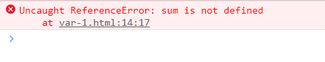
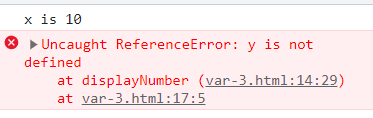
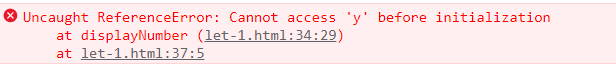
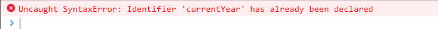
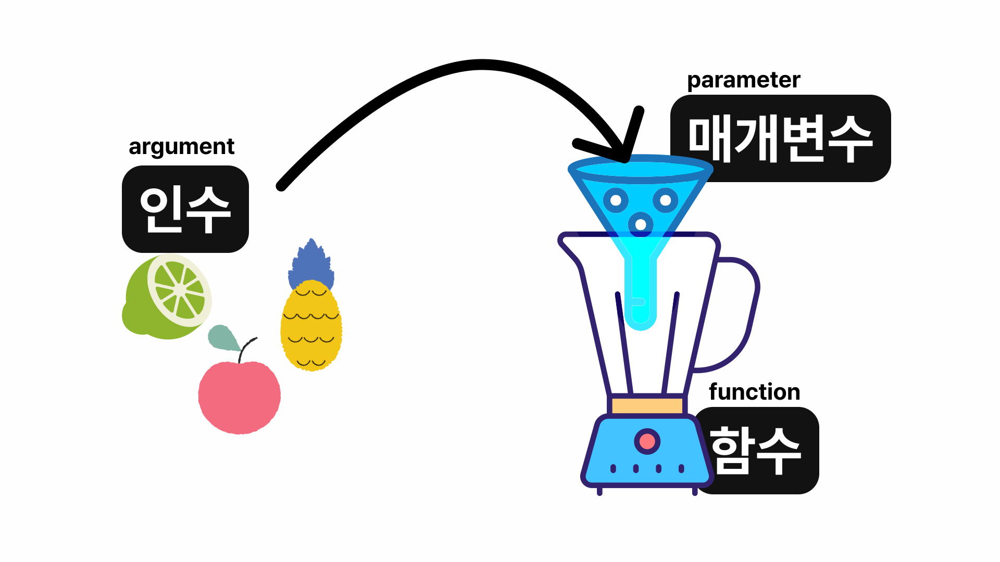

# 3. 함수와 이벤트 <!-- omit in toc -->

### 목차 <!-- omit in toc -->

- [1. 함수](#1-함수)
	- [1.1. 함수의 선언과 호출](#11-함수의-선언과-호출)
			- [1.1.0.1. 예제-01](#1101-예제-01)
			- [1.1.0.2. 함수의 선언-예제\[02\]](#1102-함수의-선언-예제02)
			- [1.1.0.3. 함수의 호출-예제\[02\]](#1103-함수의-호출-예제02)
	- [1.2. 변수의 호이스팅](#12-변수의-호이스팅)
		- [1.2.1. 지역변수](#121-지역변수)
			- [1.2.1.1. 예제\[02\]](#1211-예제02)
		- [1.2.2. 전역변수](#122-전역변수)
			- [1.2.2.1. 예제\[03\]](#1221-예제03)
		- [1.2.3. var의 호이스팅](#123-var의-호이스팅)
			- [1.2.3.1. 예제\[04\]](#1231-예제04)
		- [1.2.4. var의 재선언과 재할당](#124-var의-재선언과-재할당)
			- [1.2.4.1. 예제 \[05\]](#1241-예제-05)
		- [1.2.5. let 과 const](#125-let-과-const)
			- [1.2.5.1. let-예제\[06\]](#1251-let-예제06)
			- [1.2.5.2. const-예제\[07\]](#1252-const-예제07)
	- [1.3. 재사용가능한 함수 만들기](#13-재사용가능한-함수-만들기)
		- [1.3.1. 매개변수,인수,return](#131-매개변수인수return)
			- [1.3.1.1. 그림으로 이해하는 매개변수,인수,return](#1311-그림으로-이해하는-매개변수인수return)
			- [1.3.1.2. 매개변수를 사용한 함수만들기-예제-\[08\]](#1312-매개변수를-사용한-함수만들기-예제-08)
		- [1.3.2. 매개변수의 기본값 지정하기](#132-매개변수의-기본값-지정하기)
			- [1.3.2.1. 매개변수의 기본값 지정하기-예제\[09\]](#1321-매개변수의-기본값-지정하기-예제09)
		- [1.3.3. 실습문제\[10\]](#133-실습문제10)
	- [1.4. 함수표현식](#14-함수표현식)
		- [1.4.1. 익명함수-예제\[11\]](#141-익명함수-예제11)
		- [1.4.2. 즉시실행함수-예제\[12\]](#142-즉시실행함수-예제12)
		- [1.4.3. 화살표함수-예제\[13\]](#143-화살표함수-예제13)
- [2. 이벤트](#2-이벤트)
	- [2.1. 이벤트](#21-이벤트)
		- [2.1.1. 마우스이벤트](#211-마우스이벤트)
		- [2.1.2. 키보드이벤트](#212-키보드이벤트)
		- [2.1.3. 문서로딩이벤트](#213-문서로딩이벤트)
		- [2.1.4. 폼이벤트](#214-폼이벤트)
	- [2.2. 이벤트처리기](#22-이벤트처리기)
		- [2.2.1. HTML 속성을 이용한 방식-버튼 클릭시 알림창표시-예제\[14\]](#221-html-속성을-이용한-방식-버튼-클릭시-알림창표시-예제14)
		- [2.2.2. 버튼 클릭시 배경변경-예제\[15\]](#222-버튼-클릭시-배경변경-예제15)
		- [2.2.3. 버튼 클릭시 상세설명 표시-예제\[16\]](#223-버튼-클릭시-상세설명-표시-예제16)
		- [2.2.4. DOM을 이용한 방식-버튼클릭시 글자변경-예제\[17\]](#224-dom을-이용한-방식-버튼클릭시-글자변경-예제17)
	- [2.3. 마무리문제](#23-마무리문제)

## 1. 함수

[!badge variant="info" size="2xl" icon="dependabot" text="함수란 여러 동작을 묶어놓은 덩어리 입니다"]

### 1.1. 함수의 선언과 호출

##### 1.1.0.1. 예제-01

+++ 지시문
두수를 더하는 함수를 만들어 봅시다
+++ 코드

```js #
function addNumber(a, b) {
	var sum = a + b;
	alert(sum);
}
```

+++

##### 1.1.0.2. 함수의 선언-예제[02]

> 함수의 선언에 대해 알아보겠습니다.
>
> 함수사용의 가장 기본적인 방법은 함수를 만들때 이름을 붙이고 필요할때 마다 함수의 이름을 불러 실행하는 것입니다.
>
> **함수가 어떤 명령을 처리할지 미리 알려주는 것**을 함수를 **선언한다** 혹은 **정의한다** 라고 합니다.
>
> 함수를 선언할 때는 함수마다 서로 다른 이름을 붙여 나중에 사용할때 알아보기 쉽도록 해야 합니다.
>
> 선언할때는 예약어 `function` 을 사용하고 `{ }` 안에 실행문을 작성합니다.

+++ 지시문
함수를 선언해봅시다
[:icon-play:](./script/using-function.html)

[!badge variant='primary' size='l' text='기본형']

```js
function 함수이름() {
	실행문;
}
```

+++ 코드

```js #
function addNumber() {
	var num1 = 2;
	var num2 = 3;
	var sum = num1 + num2;
	alert('결과 값: ' + sum);
}
```

+++

##### 1.1.0.3. 함수의 호출-예제[02]

함수는 선언만으로 동작 하지 않습니다.

선언은 앞으로 자주할 동작에 대해 예약을 해 놓는 것이고 동작을 하려면 함수를 불러 줘야 합니다.

**함수를 부르는 것**을 **호출 한다**라고 합니다.

+++ 지시문
[:icon-play:](./script/using-function.html)
이전 예제에 이어서 작성해 봅시다
+++ 코드

```js #7,8
function addNumber() {
	var num1 = 2;
	var num2 = 3;
	var sum = num1 + num2;
	alert('결과 값: ' + sum);
}
addNumber();
addNumber();
```

+++
!!!warning [함수의 선언과 실행순서]
웹브라우저에서 자바스크립트 소스를 해석할때 함수 선언부분을 가장 먼저 합니다.
그래서 개발자가 원하는 곳에 함수를 선언해 놓기만 하면 선언 위치와 무관하게 함수를 실행할수 있습니다.
아래의 예시를 비교해 보면 함수를 호출, 선언하는 위치가 다르지만 둘다 문제없이 실행되는것을 볼수 있습니다.

||| caseA

```js #
addNumber();
function addNumber() {
	//실행문
}
```

||| caseB

```js #
function addNumber() {
	//실행문
}
addNumber();
```

|||

함수의 선언 위치는 프로그램 흐름에 영향을 주지 않습니다.

때문에 일반적으로 한 파일내에 여러 함수 선언시 스크립트 소스의 앞부분이나 뒷부분에 함수 선언 부분을 모아놓고 필요할때 마다 호출해서 사용합니다.
!!!

### 1.2. 변수의 호이스팅

> 자바스크립트의 2023년 현재 표준 버전은 ES6 이며 최신 버전은 ES13 (ECMAscript 2022) 입니다.
>
> 변수를 선언하기 위해 사용하는 키워드인 let,const는 ES6에 새로 추가되었으며 이전에는 var 키워드만 사용하였습니다.
>
> let과 const 의 등장배경과 더불어 let,const,var 의 특징에 대해 학습하겠습니다.

#### 1.2.1. 지역변수

> **변수나 함수,객체는 유효한 범위**가 있습니다. 우리는 그것을 **스코프(scope)** 라고 부릅니다.
>
> **함수 내에서 var 키워드와 함께 선언된 변수**를 **지역변수**라고 부르며 지역 변수는 선언된 함수 내에서만 스코프를 가집니다.

##### 1.2.1.1. 예제[02]

+++ 지시문
[:icon-play:](./script/var-1.html) 지역변수 선언하기
+++ 코드

```js #
function addNumber() {
	var sum = 10 + 20;
}
addNumber();
console.log(sum);
```

+++ 설명
변수 sum 이 정의 되지 않았다는 메시지가 출력됩니다


함수 내에서 선언된 변수는 함수내에서만 유효하므로 함수 밖에서 접근할수 없습니다.
+++

#### 1.2.2. 전역변수

> 전역변수는 적용범위의 제한 없이 스크립트 **소스코드 전체에서 유효범위**를 갖습니다.
>
> **전역변수**는 **함수 밖에서 선언**하거나 **함수 내에서 var 키워드 없이** 선언시 사용할수 있습니다.

##### 1.2.2.1. 예제[03]

+++ 지시문
[:icon-play:](./script/var-2.html)전역변수 선언하기
+++ 코드

```js #
var total; //전역 변수
function addNumber() {
	var sum = 10 + 20; // 지역 변수
	multi = 10 * 20; // 전역 변수
	total = sum + multi;
}
addNumber();
console.log(multi);
document.write(`<h1>${total}</h1>`);
```

+++

#### 1.2.3. var의 호이스팅

var 변수는 자바스크립트 해석기에서 따로 기억을 합니다.

그렇기 때문에 해석시 끌어올림(hosting) 현상이 발생하게 됩니다.

변수를 실행하기 전이지만 해석기에서 변수의 존재를 미리 저장해 두기 때문에 아래와 같은 문제가 발생하게 됩니다.

##### 1.2.3.1. 예제[04]

||| [:icon-play:](./script/var-3.html) [04] hoisting

```js #
var x = 10;

function displayNumber() {
	console.log('x is ' + x);
	console.log('y is ' + y);
	var y = 20;
}
displayNumber();
```

||| 설명
{ .shadow }
{ .shadow }
호이스팅이 발생하여 변수 y가 8번에서 선언되었음에도 선언은 되었으나 값이 미정인 상태라는 의미의 undefined 가 확인된다.
|||

#### 1.2.4. var의 재선언과 재할당

> var 키워드로 선언한 변수는 호이스팅 외에도 **재선언과 재할당**이 가능합니다.
>
> 선언 : 변수를 생성하기 위해 식별자를 지정하는 단계
>
> 할당 : 변수에 값을 넣는 단계
>
> 초기화 : 변수의 식별자에 값의 할당을 완료한 단계

##### 1.2.4.1. 예제 [05]

||| [:icon-play:](./script/var-4.html) [05]

```js #
function addNumber(num1, num2) {
	return num1 + num2;
}
var sum = addNumber(10, 20);
console.log(sum);
sum = 50;
console.log(sum);
var sum = 100;
console.log(sum);
```

||| 설명
{.shadow}
|||

#### 1.2.5. let 과 const

> var 변수의 유연함으로 인해 프로그램의 작성시 예상치 못한 버그가 잦았으며 디버깅 시 원인을 찾는 것 또한 어려웠습니다.
>
> 그래서 ES6에서 블록레벨 에서만 사용할수 있는 `let`과 `const` 가 등장하게 되었습니다.
>
> 블록이란 **`{ }`**{.red} 를 의미합니다.

##### 1.2.5.1. let-예제[06]

+++ 지시문
[:icon-play:](./script/let-1.html) let 키워드를 사용하여 변수를 선언해 봅시다.
1부터 10까지 더하는 함수를 작성합니다.
+++ 코드

```js #13-15
function calcSum(n) {
	//1-블록변수 선언
	let sum = 0;
	//2-전역변수 선언
	sum2 = 0;
	for (let i = 1; i < n + 1; i++) {
		sum += i;
	}
	console.log(`블록변수sum:${sum}`);
	//3-변수sum 값 재할당
	sum = 100;
	console.log(`sum변수 재할당:${sum}`);
	//4-sum의 재선언
	//let sum=5;
}
calcSum(10);
console.log(`전역변수sum2:${sum2}`);
```

!!! let 변수는 같은 식별자로 재선언이 불가하므로 표시된 부분은 콘솔창에서 중복선언이라는 메시지의 오류가 반환됩니다.
!!!

```js # 호이스팅-같은 문서에 이어서 코딩
var x = 10;
function displayNumber() {
	console.log('x is ' + x);
	console.log('y is ' + y);
	let y = 20;
}
displayNumber();
```

||| 설명
!!! let 변수는 호이스팅이 발생하지 않으므로 우측과 같이 y 변수는 초기화 되지 않았다는 콘솔오류가 출력됩니다.
!!!
||| 결과
{.shadow}
|||
+++

##### 1.2.5.2. const-예제[07]

+++ 지시문
[:icon-play:](./script/const-1.html) const 키워드를 사용하여 변수(상수)를 선언해봅시다.
+++ 코드
||| [07]

```js #
const currentYear = 2020;
console.log(currentYear);
const currentYear;
console.log(currentYear);
```

||| 결과
!!! 3행의 currentYear 은 1행에서 이미 선언한 식별자 이므로 다시 사용할수 없습니다.
콘솔메시지에 이미 선언되었다는 메시지와 함께 오류가 반환됩니다.
!!!

{.shadow}

|||
||| [07]

```js #3-4
const currentYear = 2020;
console.log(currentYear);
currentYear = 2100;
console.log(currentYear);
```

||| 결과
!!! 3행의 currentYear 은 1행에서 이미 초기화 하였으므로 값을 재할당 할수 없습니다.
콘솔메시지에 초기화 할수없다는 메시지와 함께 오류가 반환됩니다.
!!!

{.shadow}

|||
+++

!!! warning **변수사용팁**

1. 전역변수는 최소한으로 사용합니다.
   - 전역변수는 접근이 용이해 편리하지만 예상치 못한 곳에서 값이 변경될수 있으므로 버그가 발생할 확률이 높습니다.
2. var 변수는 함수의 시작부분에 선언합니다.
   - var 변수는 호이스팅이 발생하므로 함수의 시작부분에 선언하는것이 유지보수 하기 편하고 버그발생도 줄일수 있습니다.
3. for 문에서 변수 사용시 var 키워드는 사용하지 않습니다.
   - for 문 내의 중감식은 for문의 블록 내에서만 사용되는데 종종 var 변수로 선언하기도 합니다. var은 호이스팅이 발생하므로 다른 함수의 변수와 충돌을 일으킬수 있으니 let 키워드를 사용합니다.

!!!

### 1.3. 재사용가능한 함수 만들기

> 지금까지 `alert()`, `log()` 등의 함수를 사용하여 화면에 매번 다른 결괏값을 출력하는 명령을 수행했습니다.
>
> 이렇게 입력되는 내용을 (재료) 를 바꿔서 **여러번 사용할수 있는 성질**{.red}을 **함수의 '재사용성'**{.red} 이라고 합니다.
>
> [:link:설명PPT열기](https://drive.google.com/file/d/1CTWT0FmbTkE_l5zrGOAvbpNXhgGSd4qu/view?pli=1)
>
> !!!warning 자바스크립트의 함수 4종
>
> 1. 명명함수(Function Declarations) : `function` 키워드로 선언하는 방식 (**호이스팅 발생**{.red})
> 2. 익명함수(Function Expressions) : 변수에 할당하는 방식
> 3. 즉시실행함수(IIFE, Immediately Invoked Function Expression) : 선언과 동시에 실행하는 방식
> 4. 화살표함수(Arrow Functions) : 축약표기방식
>
> !!!

#### 1.3.1. 매개변수,인수,return

##### 1.3.1.1. 그림으로 이해하는 매개변수,인수,return

!!!warning **함수는 정해진 기능을 수행하는 기계와 같습니다. 믹서기의 예를 들어 보겠습니다.**

아래의 믹서기는 어떤 것이든 재료만 넣으면 무조건 갈아서 섞어 줍니다.

이때 **믹서기의 기능은 함수**{.red} 입니다.

이때 **재료는 인수**{.red} 입니다.

이 믹서기는 재료를 넣는 투입구가 정해져 있습니다. **투입구가 매개변수**{.red} 입니다.

{.shadow}

믹서기로 섞은후 우리는 음료를 다른 그릇에 담습니다.

이때 **믹서기가 생산한 결과를 리턴**{.red} 이라고 합니다.
{.shadow}

!!!

##### 1.3.1.2. 매개변수를 사용한 함수만들기-예제-[08]

+++ 지시문
[:icon-play:](./script/addNumber-1.html) 매개변수를 사용한 함수를 작성해봅시다

+++ 코드
||| 코드

```js # [08]
function addNumber(num1, num2) {
	const sum = num1 + num2;
	return sum;
	//return num1 + num2;//합을 바로 반환
}
const result = addNumber(2, 3);
document.write('두 수를 더 한 값 : ' + result);
```

||| 설명

1. 자바스크립트 해석기가 `function` 이라는 키워드를 만나면 함수의 선언부 라는것을 인식하고 함수블록 {}`을 해석합니다. 아직 실행하지 않습니다.

2. 6번의 `addNumber(2, 3)` 을 만나면 해석해 두었던 `addNumber()` 함수를 실행합니다.
3. ` addNumber()` 함수는 매개변수 num1에 인수 2를 매개변수 num2에 인수 3 을 넘기고 두 수의 합을 sum 변수에 저장합니다.
4. `return sum` 함수의 실행이 완료되면 결과를 함수의 호출지점인 5번의 `const result` 에 전달합니다.
5. 전달받은 결괏값을 `result` 상수에 저장합니다.
6. `document.write('두 수를 더 한 값 : ' + result);` result의 값을 화면에 출력합니다.
   |||

+++

#### 1.3.2. 매개변수의 기본값 지정하기

##### 1.3.2.1. 매개변수의 기본값 지정하기-예제[09]

+++ 코드
[:icon-play:](./script/multiple.html)

```js #
function multiple(a, b = 5, c = 10) {
	return a * b + c;
}
const result1 = multiple(5, 10, 20);
document.write(`multiple(5, 10, 20)을 실행하면 결과는${result1}입니다<br>`);
const result2 = multiple(10, 20);
document.write(`multiple(10, 20)을 실행하면 세번째 매개변수는 기본값을 사용하고 결과는${result2}입니다<br>`);
const result3 = multiple(30);
document.write(`multiple(30)을 실행하면 두번째,  세번째 매개변수는 기본값을 사용하고 결과는${result3}입니다<br>`);
```

+++

#### 1.3.3. 실습문제[10]

+++ 지시문
[:icon-play:](./script/calcSum-result.html) 이전에 작성한 [:link:1부터10까지 더하는 함수[06]](#1251-let-예제06) 예제를 참고하여 사용자가 입력한 숫자까지 계속 더하는 함수를 만들어보세요
+++ 코드

```js #
/*컨닝하지 말고 양심껏 하세요*/
```

+++ 힌트
[:link: MDN](https://developer.mozilla.org/ko/docs/Web/JavaScript/Reference/Global_Objects/parseInt)

prompt 함수로 반환받은 결괏값은 string 자료형으로 반환되므로 숫자연산이 불가합니다.

숫자 자료형으로 변환해주는 `parseInt()` 함수를 사용하세요
+++

### 1.4. 함수표현식

> 자바스크립트의 함수는 자료형 중의 하나로 취급되며 모든 식의 값으로 취급될수 있습니다.
>
> [:link:함수 4종 다시보기](#13-재사용가능한-함수-만들기) 4가지 방식의 함수중 2~4번에 대해 학습하겠습니다.

#### 1.4.1. 익명함수-예제[11]

> 익명함수는 이름이 없는 함수를 의미합니다.
>
> 선언시 이름을 붙이지 않으며 변수에 할당하여 실행합니다.

||| Code [11] [:icon-play:](./script/addNumber-3.html)

```js #
const sum = function (a, b) {
	return a + b;
};
document.write(`함수 실행 결과\u00A0\u00A0\u00A0\u00A0: ${+sum(10, 20)}`);
```

||| Result
template literal 내에서 공백을 여러개 표시할때에는 `\u00A0` 를 작성합니다
|||

#### 1.4.2. 즉시실행함수-예제[12]

> 일반적으로 함수는 선언후 필요할 때 호출하여 실행합니다.
>
> 하지만 상황에 따라 딱 한번 실행해야 하는 함수일 경우 선언과 동시에 실행을 시킬수 있습니다.

[!badge variant='primary' size='l' text='기본형']
||| 매개변수가 없을떄

```js #
(function (매개변수) {
	실행문;
})();
```

||| 매개변수가 있을떄

```js #
(function (매개변수) {
	실행문;
})(인자, 인자);
```

|||

+++ 코드1
매개변수가 없는경우
||| [:icon-play:](./script/function.html) [12] Js

```js #
(function () {
	let userName = prompt('이름을 입력하세요.');
	document.write(`안녕하세요? <span class='accent'>${userName}</span>님!`);
})();
```

||| Css

```css #
body {
	padding-top: 20px;
	text-align: center;
}
.accent {
	font-weight: bold;
	font-size: 1.2em;
	color: #00f;
}
```

|||
+++ 코드2

매개변수가 있는경우

```js #
(function (a, b) {
	// 함수 선언을 위한 매개변수
	sum = a + b;
})(100, 200); // 마지막에 함수 실행을 위한 인수
document.write(`<h1>함수실행결과:${sum}</h1>`);
```

+++

#### 1.4.3. 화살표함수-예제[13]

> 익명함수를 줄여쓰는 방식입니다

[!badge variant='primary' size='l' text='기본형']

```js
(매개변수) => {
	실행문;
};
```

익명함수를 작성하여 화살표 함수로 변경해 봅시다. [:icon-play:](./script/arrow-1.html)

```js # 매개변수가 없는 경우-basic
const hi = function () {
	return '안녕하세요';
};

alert(hi()); //호출
```

||| [Step1] - function 생략

```js #
const hi = () => {
	return '안녕하세요?';
};
```

||| [Step2] - function,return,중괄호생략

```js #
const hi = () => '안녕하세요?';
```

|||

```js # 매개변수 하나-basic
let hihi = function (user) {
	document.write(`${user}님, 안녕하세요?`);
};

hihi('망고'); //호출
```

||| [:icon-play:](./script/arrow-1.html) [Step3]

```js
let hihi = (user) => {
	document.write(`${user}님, 안녕하세요?`);
};
```

||| [Step4] - 소괄호생략

```js #
let hihi = (user) => {
	document.write(`${user}님, 안녕하세요?`);
};
```

|||

```js # 매개변수 여러개-basic
let sum = function (a, b) {
	return a + b;
};
document.write(`두 수의 합 :${sum(10, 20)}`);
```

||| [Step5]

```js
let sum = (a, b) => {
	return a + b;
};
```

||| [Step6]

```js
let sum = (a, b) => a + b;
```

|||

## 2. 이벤트

> 자바스크립트에서 이벤트는 웹 페이지에서 발생하는 특정한 동작이나 사건을 의미합니다.
>
> 사용자의 마우스 클릭, 키보드 입력, 페이지 로딩 완료, AJAX 요청 완료 등과 같은 다양한 상황에서 이벤트가 발생할 수 있습니다.
>
> 웹브라우저나 사용자가 행하는 어떤 동작을 이벤트라 칭하며 웹 브라우저 내에 새로운 페이지를 불러오는것도 이벤트에 해당합니다.
>
> **웹문서 영역 내에서 이루어 지는 동작**{.red}에 한해 이벤트라 하며 웹문서 영역을 벗어나 클릭하는 행위는 자바스크립트의 이벤트가 아닙니다.

### 2.1. 이벤트

**[:link:MDN](https://developer.mozilla.org/en-US/docs/Web/Events)**

#### 2.1.1. 마우스이벤트

| 이벤트 이름  | 설명                                                                                |
| ------------ | ----------------------------------------------------------------------------------- |
| `click`      | 사용자가 요소를 클릭했을 때 발생합니다.                                             |
| `dblclick`   | 사용자가 요소를 더블 클릭했을 때 발생합니다.                                        |
| `mousedown`  | 사용자가 마우스 버튼을 눌렀을 때 발생합니다.                                        |
| `mouseup`    | 사용자가 마우스 버튼을 놓았을 때 발생합니다.                                        |
| `mousemove`  | 마우스 커서가 요소 위에서 움직일 때마다 발생합니다.                                 |
| `mouseover`  | 마우스 커서가 요소 위로 이동하면 발생합니다. (하위 요소에 대해서도 반응)            |
| `mouseenter` | 마우스 커서가 요소 위로 이동하면 발생합니다. (하위 요소에 대해서는 반응하지 않음)   |
| `mouseout`   | 마우스 커서가 요소 바깥으로 나갈 때 발생합니다. (하위 요소에 대해서도 반응)         |
| `mouseleave` | 마우스 커서가 요소 바깥으로 나갈 때 발생합니다.(하위 요소에 대해서는 반응하지 않음) |

#### 2.1.2. 키보드이벤트

| 이벤트 이름 | 설명                                                                                                |
| ----------- | --------------------------------------------------------------------------------------------------- |
| `keydown`   | 키보드의 키를 누르는 순간 발생합니다.                                                               |
| `keyup`     | 키보드의 키를 놓는 순간 발생합니다.                                                                 |
| `keypress`  | 문자키가 눌렸을 때 발생합니다. 'keydown'과 'keyup' 사이에서 발생하며, 특수키에는 반응하지 않습니다. |

#### 2.1.3. 문서로딩이벤트

| 이벤트 이름        | 설명                                                                                                                                |
| ------------------ | ----------------------------------------------------------------------------------------------------------------------------------- |
| `DOMContentLoaded` | HTML 문서의 파싱이 완료되었고, DOM 트리가 완성되었을 때 발생합니다. 외부 리소스(images, stylesheets 등)의 로딩 상태와는 무관합니다. |
| `load`             | 페이지와 모든 관련 리소스(images, stylesheets 등)가 완전히 로드되었을 때 window 객체에서 발생합니다.                                |
| `beforeunload`     | 사용자가 페이지를 벗어나려 할 때 window 객체에서 발생합니다. 이를 활용하여 사용자에게 페이지를 벗어나지 않도록 경고할 수 있습니다.  |
| `unload`           | 사용자가 페이지를 벗어났을 때 window 객체에서 발생합니다.                                                                           |
| `resize`           | 문서 화면 크기가 바뀌었을때 이벤트가 발생합니다.                                                                                    |
| `scroll`           | 문서 화면이 스크롤 되었을때 이벤트가 발생합니다.                                                                                    |

#### 2.1.4. 폼이벤트

| 이벤트 이름 | 설명                                                                                                                                                      |
| ----------- | --------------------------------------------------------------------------------------------------------------------------------------------------------- |
| `submit`    | 폼 데이터가 서버로 제출되기 전에 발생합니다. 이 이벤트의 기본 동작은 페이지를 새로고침하는 것이지만, preventDefault 메소드를 사용하여 중단할 수 있습니다. |
| `reset`     | 폼의 리셋 버튼이 클릭되었을 때 발생합니다.                                                                                                                |
| `focus`     | 요소가 포커스를 받았을 때 발생합니다.                                                                                                                     |
| `blur`      | 요소가 포커스를 잃었을 때 발생합니다.                                                                                                                     |
| `change`    | 사용자가 입력 필드의 값을 변경하고 포커스를 잃었을 때 발생합니다.                                                                                         |
| `input`     | 사용자가 입력 필드에 값을 입력할 때마다 발생합니다.                                                                                                       |

### 2.2. 이벤트처리기

> 이벤트 처리기(event handler) 또는 이벤트 리스너(event listener)는 특정 **이벤트가 발생했을 때 실행되는 함수**{.red}를 말합니다.
>
> 웹 페이지에서 사용자의 상호작용(마우스 클릭, 키보드 입력 등) 또는 브라우저의 특정 동작(페이지 로딩, 이미지 로딩 완료 등)과 같은 이벤트가 발생하면, 그에 따른 반응을 처리하기 위해 이벤트 처리기를 사용합니다.

+++ 지시문
<mark>이벤트 처리기의 3가지 기본문법</mark>

1. html 속성으로 설정
2. dom 프로퍼티로 설정
3. `addEventListener` 메서드로 설정
   +++ 1-HTML
   HTML 속성으로 설정

```html
<button onclick="console.log('Button clicked!')">Click me</button>
```

+++ 2-DOM
DOM 프로퍼티로 설정

```javascript
document.querySelector('button').onclick = function () {
	console.log('Button clicked!');
};
```

+++ 3-메서드
`addEventListener` 메서드 사용 [강추 :+1:]

여러 개의 이벤트 리스너를 동일한 요소와 이벤트에 대해 추가할 수 있습니다.

```javascript
document.querySelector('button').addEventListener('click', function () {
	console.log('Button clicked!');
});
```

+++

#### 2.2.1. HTML 속성을 이용한 방식-버튼 클릭시 알림창표시-예제[14]

+++ HTML [:icon-play:](./script/event-1.html)

```html #11-13
<!DOCTYPE html>
<html lang="ko">
	<head>
		<meta charset="UTF-8" />
		<meta name="viewport" content="width=device-width, initial-scale=1.0" />
		<title>자바스크립트 이벤트</title>
		<link rel="stylesheet" href="css/function.css" />
	</head>
	<body>
		<ul>
			<li><a href="#" onclick="alert('버튼을 클릭했습니다.')">Green</a></li>
			<li><a href="#" onclick="alert('버튼을 클릭했습니다.')">Orange</a></li>
			<li><a href="#" onclick="alert('버튼을 클릭했습니다.')">Purple</a></li>
		</ul>
		<div id="result"></div>
	</body>
</html>
```

+++ CSS

```css #
a:link,
a:visited {
	color: black;
	text-decoration: none;
}
ul {
	list-style: none;
	width: 500px;
	margin: 10px auto;
	padding: 0;
}
li {
	display: inline-block;
	width: 120px;
	border: 1px solid #ccc;
	padding: 10px 15px;
	font-size: 16px;
	text-align: center;
}
#result {
	width: 500px;
	height: 300px;
	margin: 30px auto;
	border: 2px solid #ccc;
	border-radius: 15px;
}
p {
	width: 80%;
	padding: 10px;
	line-height: 2em;
}
```

+++

#### 2.2.2. 버튼 클릭시 배경변경-예제[15]

+++ HTML [:icon-play:](./script/event-2.html)

```html #11-13
<!DOCTYPE html>
<html lang="ko">
	<head>
		<meta charset="UTF-8" />
		<meta name="viewport" content="width=device-width, initial-scale=1.0" />
		<title>자바스크립트 이벤트</title>
		<link rel="stylesheet" href="css/function.css" />
	</head>
	<body>
		<ul>
			<li><a href="#" onclick="changeBg('green')">Green</a></li>
			<li><a href="#" onclick="changeBg('orange')">Orange</a></li>
			<li><a href="#" onclick="changeBg('purple')">Purple</a></li>
		</ul>
		<div id="result"></div>
		<script>
			<!-- 스크립트작성 -->
		</script>
	</body>
</html>
```

+++ CSS

```css #
a:link,
a:visited {
	color: black;
	text-decoration: none;
}
ul {
	list-style: none;
	width: 500px;
	margin: 10px auto;
	padding: 0;
}
li {
	display: inline-block;
	width: 120px;
	border: 1px solid #ccc;
	padding: 10px 15px;
	font-size: 16px;
	text-align: center;
}
#result {
	width: 500px;
	height: 300px;
	margin: 30px auto;
	border: 2px solid #ccc;
	border-radius: 15px;
}
p {
	width: 80%;
	padding: 10px;
	line-height: 2em;
}
```

+++ JS

```js #
function changeBg(color) {
	var result = document.querySelector('#result');
	result.style.backgroundColor = color;
}
```

+++

#### 2.2.3. 버튼 클릭시 상세설명 표시-예제[16]

+++ 지시문
아래의 코드를 복사하여 시작하겠습니다.

||| 16.html [:icon-play:](./script/detail-1.html)

```html #20-30
<!DOCTYPE html>
<html lang="ko">
	<head>
		<meta charset="UTF-8" />
		<meta name="viewport" content="width=device-width, initial-scale=1.0" />
		<title>자바스크립트 이벤트</title>
		<link rel="stylesheet" href="css/event.css" />
	</head>

	<body>
		<div id="item">
			
			<button class="over" id="open">상세 설명 보기</button>
			<div id="desc" class="detail">
				<h4>이벤트 처리기(event handler)</h4>
				<p>이벤트 처리기(event handler) 또는 이벤트 리스너(event listener)는 특정 이벤트가 발생했을 때 실행되는 함수를 말합니다. 웹 페이지에서 사용자의 상호작용(마우스 클릭, 키보드 입력 등) 또는 브라우저의 특정 동작(페이지 로딩, 이미지 로딩 완료 등)과 같은 이벤트가 발생하면, 그에 따른 반응을 처리하기 위해 이벤트 처리기를 사용합니다.</p>
				<button id="close">상세 설명 닫기</button>
			</div>
		</div>
		<script>
			function showDetail() {
				document.querySelector('#desc').style.display = 'block'; // 상세 설명 부분을 화면에 표시
				document.querySelector('#open').style.display = 'none'; // '상세 설명 보기' 단추를 화면에서 감춤
			}

			function hideDetail() {
				document.querySelector('#desc').style.display = 'none'; // 상세 설명 부분을 화면에서 감춤
				document.querySelector('#open').style.display = 'block'; // '상세 설명 보기' 단추를 화면에 표시
			}
		</script>
	</body>
</html>
```

||| css/event.css

```css #
#item {
	position: relative;
	width: 500px;
	height: auto;
	padding: 15px 20px;
	margin: auto;
}
button {
	background-color: rgba(255, 255, 255, 0.7);
	padding: 5px;
	border: 1px solid #ccc;
	font-size: 0.8em;
}
.over {
	position: absolute;
	left: 30px;
	bottom: 30px;
}
.detail {
	width: 400px;
	text-align: left;
	line-height: 1.8;
	display: none;
}
```

|||
+++ 코드
[:icon-play:](./script/detail-1-result.html)

```html #13,17,21-30
<!DOCTYPE html>
<html lang="ko">
	<head>
		<meta charset="UTF-8" />
		<meta name="viewport" content="width=device-width, initial-scale=1.0" />
		<title>자바스크립트 이벤트</title>
		<link rel="stylesheet" href="css/event.css" />
	</head>

	<body>
		<div id="item">
			
			<button class="over" id="open" onclick="showDetail()">상세 설명 보기</button>
			<div id="desc" class="detail">
				<h4>이벤트 처리기(event handler)</h4>
				<p>이벤트 처리기(event handler) 또는 이벤트 리스너(event listener)는 특정 이벤트가 발생했을 때 실행되는 함수를 말합니다. 웹 페이지에서 사용자의 상호작용(마우스 클릭, 키보드 입력 등) 또는 브라우저의 특정 동작(페이지 로딩, 이미지 로딩 완료 등)과 같은 이벤트가 발생하면, 그에 따른 반응을 처리하기 위해 이벤트 처리기를 사용합니다.</p>
				<button id="close" onclick="hideDetail()">상세 설명 닫기</button>
			</div>
		</div>
		<script>
			function showDetail() {
				document.querySelector('#desc').style.display = 'block'; // 상세 설명 부분을 화면에 표시
				document.querySelector('#open').style.display = 'none'; // '상세 설명 보기' 단추를 화면에서 감춤
			}

			function hideDetail() {
				document.querySelector('#desc').style.display = 'none'; // 상세 설명 부분을 화면에서 감춤
				document.querySelector('#open').style.display = 'block'; // '상세 설명 보기' 단추를 화면에 표시
			}
		</script>
	</body>
</html>
```

+++설명
html속성을 사용하여 이벤트핸들러를 처리한 예시 였습니다.
+++

#### 2.2.4. DOM을 이용한 방식-버튼클릭시 글자변경-예제[17]

+++ 지시문
[:icon-play:](./script/event-3.html)
아래의 코드를 복사하여 시작합니다.

||| 16.html

```html #
<!DOCTYPE html>
<html lang="ko">
	<head>
		<meta charset="UTF-8" />
		<meta name="viewport" content="width=device-width, initial-scale=1.0" />
		<title>자바스크립트 이벤트</title>
		<link rel="stylesheet" href="css/function.css" />
	</head>
	<body>
		<button id="change">글자색 바꾸기</button>
		<p>Reprehenderit tempor do quis sunt eu et exercitation deserunt. Laboris adipisicing est sint aliquip nulla pariatur velit irure elit qui id. Dolore aliquip dolore eu ut irure sint Lorem reprehenderit velit. Duis veniam irure cillum anim excepteur culpa pariatur sunt esse. Eu nulla commodo velit ex id dolore incididunt mollit incididunt nisi labore culpa qui ea. Commodo veniam veniam in ipsum ad minim occaecat qui pariatur adipisicing laborum quis.</p>

		<script></script>
	</body>
</html>
```

||| css/function.css

```css #
a:link,
a:visited {
	color: black;
	text-decoration: none;
}
ul {
	list-style: none;
	width: 500px;
	margin: 10px auto;
	padding: 0;
}
li {
	display: inline-block;
	width: 120px;
	border: 1px solid #ccc;
	padding: 10px 15px;
	font-size: 16px;
	text-align: center;
}
#result {
	width: 500px;
	height: 300px;
	margin: 30px auto;
	border: 2px solid #ccc;
	border-radius: 15px;
}
p {
	width: 80%;
	padding: 10px;
	line-height: 2em;
}
```

|||

+++ 코드

```js # 방법 1 : 요소를 변수로 지정 & 미리 만든 함수 사용
let changeBttn = document.querySelector('#change');
changeBttn.onclick = changeColor;

function changeColor() {
	document.querySelector('p').style.color = '#f00';
}
```

```js # 방법 2 : 요소를 따로 변수로 만들지 않고 사용
document.querySelector('#change').onclick = changeColor;
function changeColor() {
	document.querySelector('p').style.color = '#f00';
}
```

```js # 방법 3 : 직접 함수를 선언
document.querySelector('#change').onclick = function () {
	document.querySelector('p').style.color = '#f00';
};
```

### 2.3. 마무리문제

:::comment_box

[!badge variant='primary' size='xl' text='01']

[:link:16](#223-버튼-클릭시-상세설명-표시-예제16)예제 를 응용하여 DOM 방식으로 상세설명열고 닫는 함수를 수정해 보세요
[:icon-play:](./script/detail-2.html)
:::

:::comment_box
[!badge variant='primary' size='xl' text='01']
다음 조건을 참고하여 매개변수로 전달받은 두수의 값이 같으면 곱하고 다르면 더하는 함수 sumMulti() 를 작성하세요.

그후 인자로 5,10 을 전달할때와 10,10 을 전달할때의 실행결과를 콘솔창에 표시하세요.
[:icon-play:](./script/sol-1.html)

!!! warning <mark>조건</mark>

1.  함수의 선언은 function sumMulti(x,y) 로 합니다.

2.  if~else 문을 사용하여 두수의 값을 비교합니다.

3.  값의 비교시 비교연산자는 === 를 사용합니다.

!!!
:::
:::comment_box
[!badge variant='primary' size='xl' text='03']
프롬프트 창에서 두수를 입력받아 크기를 서로 비교한 후 더 큰 숫자를 알림창으로 표시하는 함수를 작성하세요.

그후 인자로 5,10 을 전달할때와 10,10 을 전달할때의 실행결과를 콘솔창에 표시하세요.
[:icon-play:](./script/sol-2.html)

!!! warning <mark>조건</mark>

1. 프롬프트 창에서 입력받은 두수를 각각 num1, num2 변수에 저장합니다.

2. 함수 선언시 함수명은 자유롭게 지정하고 매개변수는 2개를 사용합니다.

3. if~else 문을 사용하며 값의 비교시 비교연산자는 === 를 사용합니다.

4. 두수가 같을경우 '같습니다' 를 출력합니다.

!!!
:::
