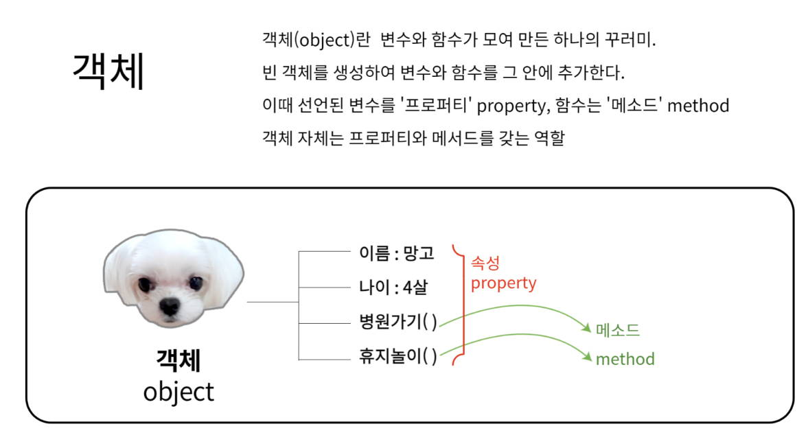

# 4. 객체 <!-- omit in toc -->

- [1. 객체의 이해](#1-객체의-이해)
	- [1.1. 객체 생성하기-예제\[01\]](#11-객체-생성하기-예제01)
	- [1.2. 인스턴스 만들기-예제\[02\]](#12-인스턴스-만들기-예제02)
- [2. 내장객체](#2-내장객체)
	- [2.1. Array객체](#21-array객체)
	- [2.2. Array객체로 배열 만들기-예제-\[03\]](#22-array객체로-배열-만들기-예제-03)
	- [Array 객체의 메서드 (method)](#array-객체의-메서드-method)
- [3. BOM(브라우저객체)](#3-bom브라우저객체)

## 1. 객체의 이해

> 자바스크립트엔 여덟 가지 자료형이 있습니다.
> 이 중 일곱 개는 오직 하나의 데이터(문자열, 숫자 등)만 담을 수 있어 '원시형(primitive type)'이라 부릅니다
> 객체형(Reference type)은 원시형과 달리 다양한 데이터를 담을 수 있습니다.
> 키로 구분된 데이터 집합이나 복잡한 개체(entity)를 저장합니다
> [:link:모던자바스크립트](https://ko.javascript.info/object)

!!!warning

객체는 쉽게 설명하면 이름표를 붙일수 있는 멀티수납공간 입니다.
자바스크립트는 객체 기반 언어로 배열도 객체입니다.
!!!

### 1.1. 객체 생성하기-예제[01]

+++ 지시문
[:icon-play:](./script/object.html) 객체를 선언해봅시다
+++ 01

```js #
var dog = new Object();
dog = {
	/* 키:값 */
	name: '망고',
	features: '말티즈',
};
document.write(`<h1>${dog.name}</h1>`);
```

`Object()`{.red} 생성자 함수를 사용해서 생성할수 있습니다.
[:link:MDN](https://developer.mozilla.org/ko/docs/Web/JavaScript/Reference/Global_Objects/Object/Object)

+++ 02

```js #
const baby = {
	name: '망고',
	features: '말티즈',
};
document.write(`<h1>${baby.features}</h1>`);
```

`{ }`{.red} 를 사용해서 생성할수 있습니다.

+++ 03

```js #3-6
const pet = {
	name: '망고',
	eat: function (food) {
		//메소드
		alert(this.name + '는 ' + food + '를 먹습니다.');
	},
};
pet.eat('간식');
```

객체 내에 선언된 함수를 **메소드**{.red} 라고 합니다.

+++

### 1.2. 인스턴스 만들기-예제[02]

> 자바스크립트에서 제공하는 내장 객체를 꺼내어 사용해 보겠습니다.
> 자바스크립트는 개발자들이 자주 사용하는 요소들을 미리 객체로 정의해 놓았는데 그것을 내장 객체 라고 합니다.
> 예를들어 날짜, 시간과 관련된 프로그램을 개발하려면 자바스크립트의 Date 객체를 가져와서 사용할수 있습니다.
>
> 자바스크립트에서 내장객체는 참조형태로 사용해야 합니다.
> Date 객체를 꺼내어 사용시 객체 자체를 사용하면 안되고 인스턴스의 형태로 만들어서 사용해야 합니다.
> 마치 나루토의 그림자 분신술 처럼 본체는 안전하게 보관되어 있는 상태에서 분신만 소환하는 것이죠.
> 
>
> _객체가 사용하는 분신술을 자바스크립트에선 인스턴스 라고 하며 자바스크립트는 인스턴스에 식별자를 붙여서 사용합니다._{.red .normal}

+++ 지시문
[:icon-play:](./script/time-1.html)
:::box
인스턴스를 생성하는 문법은 아래와 같습니다.
[!badge variant='primary' size='m' text='기본형'] `new 객체명`{.red}
:::
+++ 01

```html #
<!DOCTYPE html>
<html lang="ko">
	<head>
		<meta charset="UTF-8" />
		<meta name="viewport" content="width=device-width, initial-scale=1.0" />
		<title>What time is it?</title>
		<style>
			body {
				font-size: 2em;
				text-align: center;
			}
		</style>
	</head>
	<body>
		<script>
			var now = new Date();
			document.write('현재 시각은 ' + now); // 현재 날짜와 시간 표시하기
		</script>
	</body>
</html>
```

+++ 02
[:icon-play:](./script/time-2.html)

```js
var now = new Date();
document.write('현재 시각은 ' + now.toLocaleString()); // 로컬 형식으로 표시하기
```

01번의 16-17번 라인의 코드를 위와 같이 변경하면 국내 시간으로 변경됩니다.
`.toLocaleString()` 은 `Date()` 객체가 갖고 있는 현지 시각을 표시하는 메서드 입니다.

+++설명
{.shadow .w50}
01 단계에서 위와 같이 실행화면이 확인됩니다.
GMT는 "Greenwich Mean Time"의 약어로, 그리니치 평균시를 나타냅니다.
그리니치 평균시는 영국 런던의 그리니치 천문대를 기준으로 한 세계 표준 시간입니다.
GMT 시간은 지구 상의 임의의 위치에서 현재 시간을 나타내는 것이 아니라, 국제적인 표준으로 사용되며 다른 시간대와 비교하기 위한 기준점 역할을 합니다
+++

## 2. 내장객체

### 2.1. Array객체

Array 객체는 자바스크립트의 여러가지 내장 객체중에서 배열을 다룹니다.
배열은 자바스크립트에서 자주 사용하는 자료형 이므로 Array 객체의 주요 프로퍼티와 메서드를 숙지하는 것이 중요합니다.

### 2.2. Array객체로 배열 만들기-예제-[03]

+++ 지시문
[:icon-play:](./script/array-2.html){.blank}
내장객체는 인스턴스를 생성하여 사용할수 있었습니다.
Array 객체의 인스턴스를 생성하여 배열을 만들어 봅시다.

+++ 코드

```js # :icon-rocket: Array 객체 인스턴스 생성 :icon-dot-fill: 초깃값이 없는 경우
let number1 = new Array(); //배열의 크기를 지정하지 않음
let number2 = new Array(4); //배열의 크기를 지정함
```

```js # :icon-rocket: Array 객체 인스턴스 생성 :icon-dot-fill: 초깃값이 있는 경우
let number3 = [1, 2, 3, 4, 5];
let number4 = Array(1, 2, 3, 4, 5); //배열의 크기를 지정함
```

```js # :icon-rocket: 배열을 만들고 요소 표시하기
let numbers = ['one', 'two', 'three', 'four'];

for (i = 0; i < numbers.length; i++) {
	document.write('<p>' + numbers[i] + '</p>');
}
```

+++

### Array 객체의 메서드 (method)

Array 객체는 많은 메서드를 가지고 있습니다. 이중 주요 메서드를 정리했습니다.

더 자세한 내용은 MDN 레퍼런스를 참고해보세요.

[🔗MDN](https://developer.mozilla.org/ko/docs/Web/JavaScript/Reference/Global_Objects/Array){.red}

| 메소드 이름     | 설명                                                                                                                                                      |
| --------------- | --------------------------------------------------------------------------------------------------------------------------------------------------------- |
| `push()`        | 배열의 끝에 하나 이상의 요소를 추가하고, 변경된 배열의 길이를 반환합니다.                                                                                 |
| `pop()`         | 배열에서 마지막 요소를 제거하고, 제거된 요소를 반환합니다.                                                                                                |
| `shift()`       | 배열에서 첫 번째 요소를 제거하고, 그 요소를 반환합니다. 이 메서드는 배열의 길이를 변경합니다.                                                             |
| `unshift()`     | 배열의 시작 부분에 하나 이상의 요소를 추가하고, 새로운 길이를 반환합니다.                                                                                 |
| `concat()`      | 인수로 주어진 배열이나 값들을 기존 배열에 합쳐서 새 배열을 만듭니다.                                                                                      |
| `join()`        | 모든 배열 요소들을 문자열로 만듭니다. 각각의 문자열은 구분자로 연결됩니다.                                                                                |
| `slice()`       | 어떤 특정 부분을 복사하여 새롭게 생성한 후 그 부분만 리턴해줍니다. 원본 array는 변하지 않습니다.                                                          |
| `splice()`      | 기존 array에서 특정 위치에 있는 원하는 개수만큼 삭제 후 해당 부분에 새롭게 값을 추가할 수 있습니다.                                                       |
| `reverse()`     | array 안에 들어있는 아이템 순서 반전시킵니다.                                                                                                             |
| `sort()`        | 배열의 요소를 적절한 위치에 정렬한 후 그 배열을 반환합니다. 정렬 순서는 문자열의 유니코드 코드 포인트 값을 따릅니다.                                      |
| `filter()`      | 주어진 함수의 테스트를 통과하는 모든 요소를 모아 새로운 배열로 반환합니다.                                                                                |
| `map()`         | 배열 내의 모든 요소 각각에 대하여 주어진 함수를 호출한 결과를 모아 새로운 배열을 반환합니다.                                                              |
| `reduce()`      | 누적 계산기와 현재 값으로 이루어진 reducer 함수가 array의 각 요소에 대해 왼쪽에서 오른쪽으로 함수를 적용해 하나의 출력값을 만듭니다.                      |
| `reduceRight()` | reduce()와 동일하지만, array의 각 요소에 대해 오른쪽에서 왼쪽으로 함수가 적용됩니다.                                                                      |
| `find()`        | 주어진 판별 함수를 만족하는 첫 번째 요소 값을 반환합니다. 그런 요소가 없다면 undefined를 반환합니다.                                                      |
| `findIndex()`   | 주어진 판별 함수를 만족하는 첫 번째 인덱스 값을 반환합니다. 그런 인덱스가 없다면 -1을 반환합니다.                                                         |
| `includes()`    | array 안에 특정 element가 포함되어 있는지 판별하고, true 또는 false 를 알려줍니다.                                                                        |
| `forEach()`     | 배열의 각 요소에 대해 주어진 함수를 실행합니다. 반환 값은 없습니다.                                                                                       |
| `some()`        | 배열 안의 어떤 요소라도 주어진 판별 함수를 통과하는지 테스트합니다. 조건을 만족하는 요소를 찾으면 즉시 true를 반환하고, 그렇지 않으면 false를 반환합니다. |
| `every()`       | 배열 안의 모든 요소가 주어진 판별 함수를 통과하는지 테스트합니다. 모든 요소가 조건을 만족하면 true, 그렇지 않으면 false를 반환합니다.                     |
| `indexOf()`     | 배열에서 지정된 요소를 찾을 수 있는 첫 번째 인덱스를 반환하고 존재하지 않으면 -1을 반환합니다.                                                            |
| `lastIndexOf()` | 배열에서 지정된 요소를 찾을 수 있는 마지막 인덱스를 반환하고 존재하지 않으면 -1을 반환합니다.                                                             |
| `fill()`        | array의 시작 인덱스부터 끝 인덱스까지 정적인 값 하나로 채웁니다.                                                                                          |


## 3. BOM(브라우저객체)
