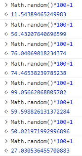
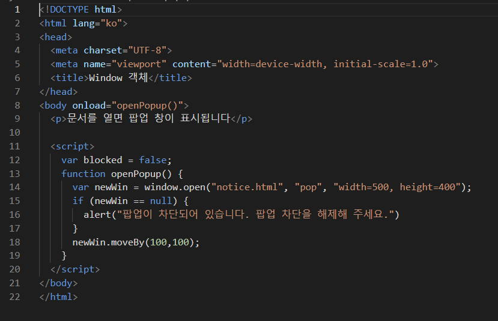
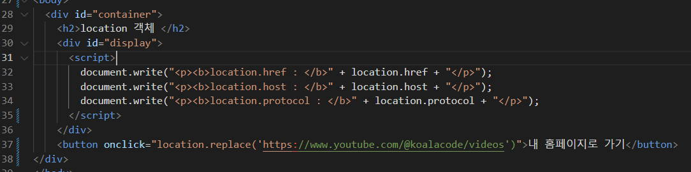

# 4. 객체 <!-- omit in toc -->

- [1. 객체의 이해](#1-객체의-이해)
	- [1.1. 객체 생성하기-예제\[01\]](#11-객체-생성하기-예제01)
	- [1.2. 인스턴스 만들기-예제\[02\]](#12-인스턴스-만들기-예제02)
- [2. 내장객체](#2-내장객체)
	- [2.1. Array객체](#21-array객체)
	- [2.2. Array객체로 배열 만들기-예제-\[03\]](#22-array객체로-배열-만들기-예제-03)
	- [2.3. Array 객체의 메서드 (method)](#23-array-객체의-메서드-method)
		- [2.3.1. 배열에 대해 알아보자](#231-배열에-대해-알아보자)
	- [2.4. Date객체-\[04\]](#24-date객체-04)
		- [2.4.1. 현재날짜출력하기-예제](#241-현재날짜출력하기-예제)
		- [2.4.2. 특정날짜출력하기-예제](#242-특정날짜출력하기-예제)
		- [2.4.3. 자바스크립트의 날짜,시간 입력방식-예제](#243-자바스크립트의-날짜시간-입력방식-예제)
		- [2.4.4. Date 객체의 메서드](#244-date-객체의-메서드)
		- [2.4.5. 날짜계산하는 프로그램 만들기-예제](#245-날짜계산하는-프로그램-만들기-예제)
	- [2.5. Math 객체-\[05\]](#25-math-객체-05)
		- [2.5.1. Math객체의 프로퍼티](#251-math객체의-프로퍼티)
		- [2.5.2. Math객체의 메서드](#252-math객체의-메서드)
			- [2.5.2.1. 이벤트당첨자뽑기프로그램만들기](#2521-이벤트당첨자뽑기프로그램만들기)
			- [2.5.2.2. 문제: 여러명의 당첨자를 뽑아주세요](#2522-문제-여러명의-당첨자를-뽑아주세요)
- [3. BOM(브라우저객체)](#3-bom브라우저객체)
	- [3.1. 브라우저관련 주요 내장객체](#31-브라우저관련-주요-내장객체)
	- [3.2. window 객체의 프로퍼티](#32-window-객체의-프로퍼티)
	- [3.3. window객체의 메서드](#33-window객체의-메서드)
		- [3.3.1. open()](#331-open)
			- [3.3.1.1. 팝업창 만들기-예제](#3311-팝업창-만들기-예제)
	- [3.4. navigator 객체](#34-navigator-객체)
		- [3.4.1. 웹브라우저와 렌더링 엔진](#341-웹브라우저와-렌더링-엔진)
	- [3.5. location 객체](#35-location-객체)
		- [3.5.1. 사이트위치 고정하기-예제](#351-사이트위치-고정하기-예제)
		- [3.5.2. 팝업창에서 클릭한 콘텐츠를 메인페이지에 표시하기-예제](#352-팝업창에서-클릭한-콘텐츠를-메인페이지에-표시하기-예제)

## 1. 객체의 이해

> 자바스크립트엔 여덟 가지 자료형이 있습니다.
> 이 중 일곱 개는 오직 하나의 데이터(문자열, 숫자 등)만 담을 수 있어 '원시형(primitive type)'이라 부릅니다
> 객체형(Reference type)은 원시형과 달리 다양한 데이터를 담을 수 있습니다.
> 키로 구분된 데이터 집합이나 복잡한 개체(entity)를 저장합니다
> [:link:모던자바스크립트](https://ko.javascript.info/object)

!!!warning

객체는 쉽게 설명하면 이름표를 붙일수 있는 멀티수납공간 입니다.
자바스크립트는 객체 기반 언어로 배열도 객체입니다.
!!!

### 1.1. 객체 생성하기-예제[01]

+++ 지시문
[:icon-play:](./script/object.html) 객체를 선언해봅시다
+++ 01

```js #
var dog = new Object();
dog = {
	/* 키:값 */
	name: '망고',
	features: '말티즈',
};
document.write(`<h1>${dog.name}</h1>`);
```

`Object()`{.red} 생성자 함수를 사용해서 생성할수 있습니다.
[:link:MDN](https://developer.mozilla.org/ko/docs/Web/JavaScript/Reference/Global_Objects/Object/Object)

+++ 02

```js #
const baby = {
	name: '망고',
	features: '말티즈',
};
document.write(`<h1>${baby.features}</h1>`);
```

`{ }`{.red} 를 사용해서 생성할수 있습니다.

+++ 03

```js #3-6
const pet = {
	name: '망고',
	eat: function (food) {
		//메소드
		alert(this.name + '는 ' + food + '를 먹습니다.');
	},
};
pet.eat('간식');
```

객체 내에 선언된 함수를 **메소드**{.red} 라고 합니다.

+++

### 1.2. 인스턴스 만들기-예제[02]

> 자바스크립트에서 제공하는 내장 객체를 꺼내어 사용해 보겠습니다.
> 자바스크립트는 개발자들이 자주 사용하는 요소들을 미리 객체로 정의해 놓았는데 그것을 내장 객체 라고 합니다.
> 예를들어 날짜, 시간과 관련된 프로그램을 개발하려면 자바스크립트의 Date 객체를 가져와서 사용할수 있습니다.
>
> 자바스크립트에서 내장객체는 참조형태로 사용해야 합니다.
> Date 객체를 꺼내어 사용시 객체 자체를 사용하면 안되고 인스턴스의 형태로 만들어서 사용해야 합니다.
> 마치 나루토의 그림자 분신술 처럼 본체는 안전하게 보관되어 있는 상태에서 분신만 소환하는 것이죠.
> 
>
> _객체가 사용하는 분신술을 자바스크립트에선 인스턴스 라고 하며 자바스크립트는 인스턴스에 식별자를 붙여서 사용합니다._{.red .normal}

+++ 지시문
[:icon-play:](./script/time-1.html)
:::box
인스턴스를 생성하는 문법은 아래와 같습니다.
[!badge variant='primary' size='m' text='기본형'] `new 객체명`{.red}
:::
+++ 01

```html #
<!DOCTYPE html>
<html lang="ko">
	<head>
		<meta charset="UTF-8" />
		<meta
			name="viewport"
			content="width=device-width, initial-scale=1.0"
		/>
		<title>What time is it?</title>
		<style>
			body {
				font-size: 2em;
				text-align: center;
			}
		</style>
	</head>
	<body>
		<script>
			var now = new Date();
			document.write('현재 시각은 ' + now); // 현재 날짜와 시간 표시하기
		</script>
	</body>
</html>
```

+++ 02
[:icon-play:](./script/time-2.html)

```js
var now = new Date();
document.write('현재 시각은 ' + now.toLocaleString()); // 로컬 형식으로 표시하기
```

01번의 16-17번 라인의 코드를 위와 같이 변경하면 국내 시간으로 변경됩니다.
`.toLocaleString()` 은 `Date()` 객체가 갖고 있는 현지 시각을 표시하는 메서드 입니다.

+++설명
{.shadow .w50}
01 단계에서 위와 같이 실행화면이 확인됩니다.
GMT는 "Greenwich Mean Time"의 약어로, 그리니치 평균시를 나타냅니다.
그리니치 평균시는 영국 런던의 그리니치 천문대를 기준으로 한 세계 표준 시간입니다.
GMT 시간은 지구 상의 임의의 위치에서 현재 시간을 나타내는 것이 아니라, 국제적인 표준으로 사용되며 다른 시간대와 비교하기 위한 기준점 역할을 합니다
+++

## 2. 내장객체

### 2.1. Array객체

Array 객체는 자바스크립트의 여러가지 내장 객체중에서 배열을 다룹니다.
배열은 자바스크립트에서 자주 사용하는 자료형 이므로 Array 객체의 주요 프로퍼티와 메서드를 숙지하는 것이 중요합니다.

### 2.2. Array객체로 배열 만들기-예제-[03]

+++ 지시문
[:icon-play:](./script/array-2.html){.blank}
내장객체는 인스턴스를 생성하여 사용할수 있었습니다.
Array 객체의 인스턴스를 생성하여 배열을 만들어 봅시다.

+++ 코드

```js # :icon-rocket: Array 객체 인스턴스 생성 :icon-dot-fill: 초깃값이 없는 경우
let number1 = new Array(); //배열의 크기를 지정하지 않음
let number2 = new Array(4); //배열의 크기를 지정함
```

```js # :icon-rocket: Array 객체 인스턴스 생성 :icon-dot-fill: 초깃값이 있는 경우
let number3 = [1, 2, 3, 4, 5];
let number4 = Array(1, 2, 3, 4, 5); //배열의 크기를 지정함
```

```js # :icon-rocket: 배열을 만들고 요소 표시하기
let numbers = ['one', 'two', 'three', 'four'];

for (i = 0; i < numbers.length; i++) {
	document.write('<p>' + numbers[i] + '</p>');
}
```

+++

### 2.3. Array 객체의 메서드 (method)

Array 객체는 많은 메서드를 가지고 있습니다. 이중 주요 메서드를 정리했습니다.

더 자세한 내용은 MDN 레퍼런스를 참고해보세요.

[🔗MDN](https://developer.mozilla.org/ko/docs/Web/JavaScript/Reference/Global_Objects/Array){.red}

| 메소드 이름     | 설명                                                                                                                                                      |
| --------------- | --------------------------------------------------------------------------------------------------------------------------------------------------------- |
| `push()`        | 배열의 끝에 하나 이상의 요소를 추가하고, 변경된 배열의 길이를 반환합니다.                                                                                 |
| `pop()`         | 배열에서 마지막 요소를 제거하고, 제거된 요소를 반환합니다.                                                                                                |
| `shift()`       | 배열에서 첫 번째 요소를 제거하고, 그 요소를 반환합니다. 이 메서드는 배열의 길이를 변경합니다.                                                             |
| `unshift()`     | 배열의 시작 부분에 하나 이상의 요소를 추가하고, 새로운 길이를 반환합니다.                                                                                 |
| `concat()`      | 인수로 주어진 배열이나 값들을 기존 배열에 합쳐서 새 배열을 만듭니다.                                                                                      |
| `join()`        | 모든 배열 요소들을 문자열로 만듭니다. 각각의 문자열은 구분자로 연결됩니다.                                                                                |
| `slice()`       | 어떤 특정 부분을 복사하여 새롭게 생성한 후 그 부분만 리턴해줍니다. 원본 array는 변하지 않습니다.                                                          |
| `splice()`      | 기존 array에서 특정 위치에 있는 원하는 개수만큼 삭제 후 해당 부분에 새롭게 값을 추가할 수 있습니다.                                                       |
| `reverse()`     | array 안에 들어있는 아이템 순서 반전시킵니다.                                                                                                             |
| `sort()`        | 배열의 요소를 적절한 위치에 정렬한 후 그 배열을 반환합니다. 정렬 순서는 문자열의 유니코드 코드 포인트 값을 따릅니다.                                      |
| `filter()`      | 주어진 함수의 테스트를 통과하는 모든 요소를 모아 새로운 배열로 반환합니다.                                                                                |
| `map()`         | 배열 내의 모든 요소 각각에 대하여 주어진 함수를 호출한 결과를 모아 새로운 배열을 반환합니다.                                                              |
| `reduce()`      | 누적 계산기와 현재 값으로 이루어진 reducer 함수가 array의 각 요소에 대해 왼쪽에서 오른쪽으로 함수를 적용해 하나의 출력값을 만듭니다.                      |
| `reduceRight()` | reduce()와 동일하지만, array의 각 요소에 대해 오른쪽에서 왼쪽으로 함수가 적용됩니다.                                                                      |
| `find()`        | 주어진 판별 함수를 만족하는 첫 번째 요소 값을 반환합니다. 그런 요소가 없다면 undefined를 반환합니다.                                                      |
| `findIndex()`   | 주어진 판별 함수를 만족하는 첫 번째 인덱스 값을 반환합니다. 그런 인덱스가 없다면 -1을 반환합니다.                                                         |
| `includes()`    | array 안에 특정 element가 포함되어 있는지 판별하고, true 또는 false 를 알려줍니다.                                                                        |
| `forEach()`     | 배열의 각 요소에 대해 주어진 함수를 실행합니다. 반환 값은 없습니다.                                                                                       |
| `some()`        | 배열 안의 어떤 요소라도 주어진 판별 함수를 통과하는지 테스트합니다. 조건을 만족하는 요소를 찾으면 즉시 true를 반환하고, 그렇지 않으면 false를 반환합니다. |
| `every()`       | 배열 안의 모든 요소가 주어진 판별 함수를 통과하는지 테스트합니다. 모든 요소가 조건을 만족하면 true, 그렇지 않으면 false를 반환합니다.                     |
| `indexOf()`     | 배열에서 지정된 요소를 찾을 수 있는 첫 번째 인덱스를 반환하고 존재하지 않으면 -1을 반환합니다.                                                            |
| `fill()`        | array의 시작 인덱스부터 끝 인덱스까지 정적인 값 하나로 채웁니다.                                                                                          |

#### 2.3.1. 배열에 대해 알아보자

[:link:배열](../../2.partial/array.md)

### 2.4. Date객체-[04]

Date 객체는 날짜와 시간정보를 나타낼수 있습니다.

#### 2.4.1. 현재날짜출력하기-예제

```js
//Date 객체로 현재 날짜 나타내기
new Date();
console.log(new Date());
```

#### 2.4.2. 특정날짜출력하기-예제

```js
let date = new Date('2020-02-25');
console.log(date);
date = new Date('2020-02-25T18:00:00');
console.log(date);
```

#### 2.4.3. 자바스크립트의 날짜,시간 입력방식-예제

Date 객체를 사용하여 날짜와 시간을 지정하려면 자바스크립트가 인식할수 있는 날짜와 시간 형식으로 작성해야 합니다.
자바스크립트에서 주로 사용하는 날짜와 시간 입력 방식을 알아보겠습니다.

**:icon-tag: 날짜 입력형식의 `YYYY` 는 `연도`를 `MM` 은 `월`을 `DD`는 `일`을 시간 입력형식에서 `HH`는 `시`, `MM`은 `분` , `SS`는 `초` 를 뜻합니다.**

1. `YYYY-MM-DD`{.red}
2. `YYYY-MM-DDTHH`{.red}
   ...

```js
/* YYYY-MM-DD */
let date = new Date('2020');
console.log(date);
date = new Date('2020-02');
console.log(date);
date = new Date('2020-03');
console.log(date);

/* YYYY-MM-DDTHH */
date = new Date('2020-03T18:00:00');
console.log(date);
```

#### 2.4.4. Date 객체의 메서드

[🔗MDN](https://developer.mozilla.org/en-US/docs/Web/JavaScript/Reference/Global_Objects/Date#Methods_2)

| Method             | Description                                                   |
| ------------------ | ------------------------------------------------------------- |
| `getDate()`        | 일(day)을 반환합니다. (from 1-31)                             |
| `getDay()`         | Returns the day of the week (from 0-6)                        |
| `getFullYear()`    | 연도(year)를 반환합니다.                                      |
| `getHours()`       | 시간(hours)을 반환합니다.(from 0-23)                          |
| `getMinutes()`     | 분(minutes)을 반환합니다.(from 0-59)                          |
| `getMonth()`       | 월(month)을 반환합니다. 0부터 시작하며, 0은 1월을 나타냅니다. |
| `getSeconds()`     | 초(seconds)를 반환합니다. (from 0-59)                         |
| `toLocaleString()` | 현재 날짜와 시간을 현지 시간으로 표시합니다.                  |
| `toString()`       | Date 객체 타입을 문자열로 표시합니다.                         |

#### 2.4.5. 날짜계산하는 프로그램 만들기-예제

+++ 지시문
[:icon-play:](./script/day-result.html)
날짜를 계산하는 프로그램을 만들어 보겠습니다.
+++ 코드

||| HTML

```html
<div id="container">
	<h1>책 읽기</h1>
	<p>
		<span
			class="accent"
			id="result"
		></span
		>일 연속으로 <br />
		책 읽기를 달성했군요.
	</p>
	<p>축하합니다!</p>
</div>
```

||| CSS

```css
#container {
	margin: 50px auto;
	width: 300px;
	height: 300px;
	border-radius: 50%;
	border: 2px double #222;
	background-color: #d8f0fc;
	text-align: center;
}
h1 {
	margin-top: 80px;
}
.accent {
	font-size: 1.8em;
	font-weight: bold;
	color: red;
}
```

|||

<details markdown='block'>
	<summary>
		😁
	</summary>
	
</details>
+++

### 2.5. Math 객체-[05]

수학 계산과 관련된 메서드가 많이 포함되어 있는 객체입니다.
난수생성이나 반올림 계산을 해야 할 경우 많이 사용합니다.
Math 객체는 별도의 인스턴스를 생성하지 않고 사용해도 됩니다.
아래의 기본 문법을 참고하세요.

[!badge variant='primary' size='xl' text='기본형']
`Math.프로퍼티명`{.red}
`Math.메서드명`{.red}

#### 2.5.1. Math객체의 프로퍼티

**Math객체의 프로퍼티는 항상 정해진 값을 갖고 있습니다.**

| 속성           | 설명                                               |
| -------------- | -------------------------------------------------- |
| `Math.E`       | 오일러 수 (약 2.718)을 반환합니다.                 |
| `Math.LN2`     | 2의 자연로그 (약 0.693)을 반환합니다.              |
| `Math.LN10`    | 10의 자연로그 (약 2.302)을 반환합니다.             |
| `Math.LOG2E`   | E의 밑이 2인 로그 (약 1.442)를 반환합니다.         |
| `Math.LOG10E`  | E의 밑이 10인 로그 (약 0.434)를 반환합니다..       |
| `Math.PI`      | 원주율 PI (약 3.14159)을 반환합니다..              |
| `Math.SQRT1_2` | 1/2 의 제곱근( 약 .707 ) 을 반환 합니다 .          |
| `Math.SQRT2`   | 제곱근 of 제곱근 of 두 번째( 약 .414 ) 를 돌려준다 |

#### 2.5.2. Math객체의 메서드

| 메서드                | 설명                                                     |
| --------------------- | -------------------------------------------------------- |
| `Math.abs(x)`         | x의 절대값을 반환합니다.                                 |
| `Math.ceil(x)`        | x의 소수점 이하 부분을 올립니다.                         |
| `Math.floor(x)`       | x의 소수점 이하 부분을 버립니다.                         |
| `Math.max(a, b, ...)` | 주어진 숫자 중에서 가장 큰 값을 반환합니다.              |
| `Math.min(a, b, ...)` | 주어진 숫자 중에서 가장 작은 값을 반환합니다.            |
| `Math.pow(x, y)`      | x 의 y 거듭제곱을 계산하여 반환합니다.                   |
| `Math.random()`       | 0 (포함)과 1 (미포함) 사이의 난수를 생성하여 반환합니다. |
| `Math.round(x)`       | x 를 반올림한 값을 반환 합니다 .                         |
| `Math.sqrt(x)`        | x 의 제곱근을 계산하여 돌려줍니다 .                      |

##### 2.5.2.1. 이벤트당첨자뽑기프로그램만들기

+++ 지시문
[:icon-play:](./script/event-result.html)
전체 응모자가 몇명인지 입력하면 번호를 무작위로 추출하여 당첨자를 선정하는 프로그램을 작성해 보겠습니다.
+++ 시작코드
||| HTML

```html
<h1>당첨자 발표</h1>
```

||| CSS

```css
h1 {
	border: 1px solid black;
	padding: 10px;
	background: #eee;
}
```

|||
+++ 단계별코딩

1.  콘솔창에 `Math.random()`{.red} 을 입력후 반환값을 확인합니다. 실행할때 마다 매번 0~1 사이의 다른수가 반환됩니다.
    {.shadow}
2.  1~100 사이의 난수(정의된 범위 내에서 무작위로 추출된 수)를 출력해봅시다.
    1단계에서 확인한 값에 100을 곱하면 약 0.000~99.999 범위의 값이 반환 될 것 입니다. 이 결과에 1을 더합니다.
    `Math.random()*100+1`{.red}
    {.shadow}
3.  소수점 이하는 버리고 출력하는 메서드를 적용합니다.
    `Math.floor(Math.random()*100+1)`{.red}
    {.shadow}
4.  코드 완성하기

    ```js
    const seed = prompt("전체 응모자 수 : ","");
    const picked = Math.floor((Math.random() \* seed) + 1);
    	document.write(`전체 응모자 수 : ${seed} 명 <br> 당첨자 : ${picked} 번`);
    ```

+++

##### 2.5.2.2. 문제: 여러명의 당첨자를 뽑아주세요

[:icon-play:](./script/event-2.html)

<details markdown='block'>
	<summary>
		🐨
	</summary>
	
</details>

## 3. BOM(브라우저객체)

자바스크립트 사용시 특정 사이트로 이동하거나 새 탭을 여는 등 웹 브라우저와 관련된 여러가지 효과를 제작할수 있습니다.
이런 작업이 가능한 이유는 자바스크립트 내에 웹 브라우저와 관련된 여러 객체가 미리 정의 되어있기 때문입니다.

### 3.1. 브라우저관련 주요 내장객체

[🔗MDN](https://developer.mozilla.org/en-US/docs/Web/API)

| 객체           | 설명                                                                                           |
| -------------- | ---------------------------------------------------------------------------------------------- |
| `window`       | 전역 객체로, 모든 요소 (DOM 요소, localStorage 등)에 대한 부모 역할을 합니다.                  |
| `document`     | 페이지의 DOM을 조작하는 데 사용되는 메서드와 속성을 가진 객체입니다.                           |
| `navigator`    | 브라우저 및 운영 체제 정보에 액세스할 수 있는 메서드와 속성이 포함된 객체입니다.               |
| `location`     | 현재 페이지의 URL 정보를 제공하고, 새 URL로 리디렉션하는 메서드를 포함한 객체입니다.           |
| `history`      | 브라우저 세션 히스토리를 조작하는데 사용되는 메서드 (예: forward(), back())가 있는 객체입니다. |
| `localStorage` | 웹 스토리지 API의 일부로, 데이터를 사용자의 브라우저에 영구적으로 저장하는데 사용됩니다.       |

### 3.2. window 객체의 프로퍼티

[🔗MDN](https://developer.mozilla.org/en-US/docs/Web/API/Window)

window 객체는 웹브라우저 상태를 제어하며 자바스크립트의 최상위에 있습니다.
그래서 자바스크립트의 모든 객체는 window 객체 안에 포함됩니다.

| 프로퍼티         | 설명                                                                                                           |
| ---------------- | -------------------------------------------------------------------------------------------------------------- |
| `document`       | 문서 객체 모델 (DOM)을 대표하는 Document 객체에 대한 참조입니다.                                               |
| `history`        | 사용자의 브라우저 세션 히스토리에 대한 History 객체에 대한 참조입니다.                                         |
| `location`       | 현재 URL을 포함하고 있는 Location 객체에 대한 참조입니다.                                                      |
| `navigator`      | 브라우저 및 운영 체제 정보를 포함하는 Navigator 객체에 대한 참조입니다.                                        |
| `screen`         | 사용자의 화면 정보를 포함하는 Screen 객체에 대한 참조입니다.                                                   |
| `localStorage`   | 웹 스토리지 API의 일부인 localStorage 속성으로, 데이터를 사용자 브라우저에서 영구적으로 저장할 수 있게 합니다. |
| `innerHeight`    | 뷰포트의 높이(스크롤바를 제외)를 픽셀 단위로 반환합니다.                                                       |
| `innerWidth`     | 뷰포트의 너비(스크롤바를 제외)를 픽셀 단위로 반환합니다.                                                       |
| `outerHeight`    | 전체 브라우저 창의 외부 높이(주소 바 및 기타 UI 부분 포함)을 픽셀 단위로 반환합니다.                           |
| `outerWidth`     | 전체 브라우저 창의 외부 너비(주소 바 및 기타 UI 부분 포함)을 픽셀 단위로 반환합니다.                           |
| `pageXOffset`    | 스크롤했을때 수평으로 이동하는 픽셀수로 scrollX와 같습니다.                                                    |
| `pageYOffset`    | 스크롤했을때 수직으로 이동하는 픽셀수로 scrollY와 같습니다.                                                    |
| `screenX`        | 브라우저 창의 왼쪽 테두리가 모니터 왼쪽 테두리에서 떨어져 있는 거리를 나타냅니다.                              |
| `screenY`        | 브라우저 창의 상단 테두리가 모니터 위쪽 테두리에서 떨어져 있는 거리를 나타냅니다.                              |
| `scrollX`        | 스크롤했을때 수평으로 이동하는 픽셀수를 나타냅니다.                                                            |
| `scrollY`        | 스크롤했을때 수직으로 이동하는 픽셀수를 나타냅니다.                                                            |
| `sessionStroage` | 웹브라우저에서 데이터를 저장하는 세션스토리지를 반환합니다.                                                    |

### 3.3. window객체의 메서드

| 메서드                                | 설명                                                                                               |
| ------------------------------------- | -------------------------------------------------------------------------------------------------- |
| `alert(message)`                      | 경고 대화 상자를 표시하며, 사용자가 확인을 클릭하기 전까지 스크립트 실행을 중단합니다.             |
| `confirm(message)`                    | 확인/취소 버튼이 있는 대화 상자를 표시하며, 사용자가 선택한 값을 boolean으로 반환합니다.           |
| `prompt(message, default)`            | 입력 필드와 확인/취소 버튼이 있는 대화 상자를 표시하며, 사용자가 입력한 값을 문자열로 반환합니다.  |
| `open(url, name, specs)`              | 새 브라우저 창이나 탭을 열고 그에 대한 참조를 반환합니다.                                          |
| `close()`                             | 현재 브라우저 창을 닫습니다. (주의: 보안상의 이유로 스크립트에서 열지 않은 창은 닫을 수 없습니다.) |
| `setTimeout(function, milliseconds)`  | 지정된 시간(밀리초) 후에 함수를 실행하는 타이머를 설정합니다.                                      |
| `setInterval(function, milliseconds)` | 지정된 시간 간격(밀리초)으로 함수를 반복적으로 실행하는 타이머를 설정합니다.                       |
| `resizeTo(width,height)`              | 브라우저 창의 외부 크기(메뉴 바 및 기타 UI 부분 포함)을 지정된 너비와 높이로 변경합니다.           |
| `resizeBy(dx,dy)`                     | 현재 윈도우 크기에 dx와 dy만큼 가감하여 윈도우 크기를 변경 합니다.                                 |
| `scrollTo(xpos,ypos)`                 | 페이지에서 지정된 위치까지 스크롤 합니다.                                                          |
| `scrollBy(xpos,ypos)`                 | 페이지에서 지정된 위치만큼씩 스크롤 합니다.                                                        |
| `scroll()`                            | 문서에서 특정 위치로 스크롤합니다.                                                                 |
| `sizeToContent()`                     | 내용에 맞게 창의 크기를 맞춥니다                                                                   |
| `postMessage()`                       | 메시지를 다른 창으로 전달합니다                                                                    |
| `print()`                             | 현재 페이지를 인쇄합니다.                                                                          |

#### 3.3.1. open()

[!badge variant='primary' size='xl' text='기본형']
`window.open(경로,창이름,창옵션)`{.red}

1. 경로: 팝업창에 표시할 문서나 사이트의 경로(주소)를 나타냅니다.
2. 창이름: 팝업창의 이름을 지정하면 항상 이 창에 팝업 내용이 나타나도록 할수 있습니다. 미 지정시 팝업창이 계속 새로 나타납니다.
3. 창옵션: left, top 속성을 사용해 위치를 정하거나 width, height 속성을 사용해 크기를 지정할수 있습니다. 미지정시 팝업창은 화면의 좌측상단에 표시됩니다.

##### 3.3.1.1. 팝업창 만들기-예제

+++ 지시문
팝업이 차단된 브라우저의 알림창을 표시하는 팝업을 작성해보겠습니다.

[:icon-play:](./script/popup-check.html)

코드1을 복사하여 팝업을 열 페이지를 준비합니다.

+++ 코드1

```html # notice.html
<!DOCTYPE html>
<html lang="ko">
	<head>
		<meta charset="UTF-8" />
		<title>공지사항</title>
		<style>
			#content {
				border: 2px double skyblue;
				border-radius: 10px;
				padding: 10px;
			}
			ul {
				margin-left: 15px;
				list-style-type: none;
			}
			ul li {
				margin: 10px 5px;
			}
			button {
				position: absolute;
				bottom: 20px;
				right: 20px;
			}
		</style>
	</head>
	<body>
		<div id="content">
			<h1>공지사항</h1>
			<ul>
				<li>항목 1</li>
				<li>항목 2</li>
				<li>항목 3</li>
				<li>항목 4</li>
				<li>항목 5</li>
			</ul>
			<button>닫기</button>
		</div>
	</body>
</html>
```

+++코드2


+++코드3
notice.html 의 button 에 close 함수 작성
`<button onclick="javascript:window.close();">닫기</button>
`
+++

### 3.4. navigator 객체

navigator객체는 웹브라우저의 버전을 포함하여 플러그인 설치정보나 온/오프라인 등의 여러 정보가 담겨 있습니다.
이 정보는 사용자가 수정할수 없으며 가져와서 보여줄수만 있습니다.

#### 3.4.1. 웹브라우저와 렌더링 엔진

웹 브라우저의 종류가 다양해짐에 따라 사용자의 웹브라우저에서 똑같이 동작하는 웹문서를 개발할 필요성이 생겼습니다. 여러 웹브라우저를 고려하여 개발하는 것은 웹 개발자에게 어려운 숙제이기도 합니다.
여러 웹브라우저를 고려할때 가장 먼저 생각해야 할 부분은 렌더링 엔진 입니다.
아직 표준화 되지 않은 CSS 속성일 경우 벤더프리픽스를 지정합니다.
이유는 브라우저 마다 HTML, CSS 를 해석하는 렌더링 엔진 (rendering engine)이 다르므로 프리픽스를 붙여 브라우저를 구별하는 것인데요.

자바스크립트 역시 웹 브라우저 마다 엔진이 서로 다릅니다. 그래서 같은 HTML5기술을 사용해서 만든 사이트에 접속 하더라도 웹브라우저 마다 보여주는 효과와 성능의 차이가 있을수 있습니다.

| 웹 브라우저   | JavaScript 엔진    | 렌더링 엔진           |
| ------------- | ------------------ | --------------------- |
| Google Chrome | V8                 | Blink                 |
| Firefox       | SpiderMonkey       | Gecko                 |
| Safari        | JavaScriptCore     | WebKit                |
| Edge          | V8 (Chromium 기반) | Blink (Chromium 기반) |
| Opera         | V8                 | Blink                 |

콘솔창에 아래와 같이 입력하여 리턴값을 확인해보자

```
navigator.userAgent
```

{.shadow}

### 3.5. location 객체

location 객체는 브라우저의 주소표시줄에 관련된 정보를 제공합니다.
현재 문서의 URL 주소 정보가 들어있는데 이 정보를 편집하면 현재 브라우저 창에서 열어야할 사이트나 링크를 지정할수 있습니다.
location 객체의 메서드는 브라우저의 새로고침 역할을 하는 reload() 메서드와 현재 창에서 다른 문서나 사이트를 보여주는 replace() 메서드가 유용하게 활용됩니다.

| 프로퍼티/메서드()       | 설명                                                     |
| ----------------------- | -------------------------------------------------------- |
| `location.href`         | 현재 페이지의 URL을 나타냅니다.                          |
| `location.protocol`     | 현재 페이지의 프로토콜을 나타냅니다. (ex. http:, https:) |
| `location.host`         | 현재 페이지의 호스트 이름과 포트 번호를 나타냅니다.      |
| `location.hostname`     | 현재 페이지의 호스트 이름을 나타냅니다.                  |
| `location.port`         | 현재 페이지의 포트 번호를 나타냅니다.                    |
| `location.pathname`     | 현재 페이지의 경로를 나타냅니다.                         |
| `location.search`       | 현재 페이지의 쿼리 문자열을 나타냅니다.                  |
| `location.hash`         | 현재 페이지의 해시 문자열을 나타냅니다.                  |
| `location.assign(url)`  | 새로운 URL로 페이지를 이동합니다.                        |
| `location.reload()`     | 현재 페이지를 새로고침합니다.                            |
| `location.replace(url)` | 현재 페이지를 새로운 URL로 교체합니다.                   |

#### 3.5.1. 사이트위치 고정하기-예제

+++ 지시문
[:icon-play:](./script/locationObject.html)
버튼클릭시 홈페이지로 이동하는 프로그램을 작성해보겠습니다.
+++ 코드
||| HTML

```html #
<div id="container">
	<h2>location 객체</h2>
	<div id="display"></div>
	<button>홈페이지로 가기</button>
</div>
```

||| CSS

```css #
#container {
	width: 500px;
	margin: 10px auto;
}
#display {
	margin-top: 10px;
	padding: 10px;
	border: 1px solid #222;
	box-shadow: 1px 0 1px #ccc;
}
p {
	font-size: 1em;
}
button {
	margin-top: 20px;
	text-align: center;
}
```

|||
+++정답

+++

#### 3.5.2. 팝업창에서 클릭한 콘텐츠를 메인페이지에 표시하기-예제

+++ 지시문
[:icon-play:](./script/main.html)
+++ 코드

```js # This is Tab 1

```

+++
