---
category:
  - javascript
  - class
tags: [dom, 문서객체모델, bom, 브라우저객체모델]
---

# 5. DOM(문서객체모델) <!-- omit in toc -->

### 목차 <!-- omit in toc -->

- [1. 문서객체모델의 이해](#1-문서객체모델의-이해)
- [2. DOM 을 구성하는 기본 원칙](#2-dom-을-구성하는-기본-원칙)
- [3. DOM에 접근하기](#3-dom에-접근하기)
	- [3.1. `getElementById`](#31-getelementbyid)
		- [3.1.1. `getElementByClassName`](#311-getelementbyclassname)
	- [3.2. `getElementsByTagName`](#32-getelementsbytagname)
	- [3.3. `querySelector` , `querySelectorAll`](#33-queryselector--queryselectorall)
- [4. 요소를 취득하고 수정하기](#4-요소를-취득하고-수정하기)
	- [4.1. `innerText`, `textContent`](#41-innertext-textcontent)
	- [4.2. `innerHTML`](#42-innerhtml)
	- [4.3. `getAttribute()`, `setAttribute()`](#43-getattribute-setattribute)
- [5. DOM에서 이벤트 처리하기](#5-dom에서-이벤트-처리하기)
	- [5.1. DOM 요소에 함수 직접연결](#51-dom-요소에-함수-직접연결)
	- [5.2. 함수 이름을 사용해서 연결](#52-함수-이름을-사용해서-연결)
	- [5.3. 이벤트 객체 알아보기](#53-이벤트-객체-알아보기)
	- [5.4. this](#54-this)
	- [5.5. addEventListener()메서드를 사용해서 연결](#55-addeventlistener메서드를-사용해서-연결)
		- [5.5.1. 마무리문제](#551-마무리문제)
		- [5.5.2. 라이트박스 만들기](#552-라이트박스-만들기)
- [6. DOM에서 노드 조작하기](#6-dom에서-노드-조작하기)
	- [6.1. 노드리스트](#61-노드리스트)
	- [6.2. 노드추가](#62-노드추가)
		- [6.2.1. 텍스트 노드를 사용하는 새로운 요소추가](#621-텍스트-노드를-사용하는-새로운-요소추가)
		- [6.2.2. 속성값이 있는 새로운 요소추가](#622-속성값이-있는-새로운-요소추가)
		- [6.2.3. TodoList 만들기](#623-todolist-만들기)
- [7. 마무리문제](#7-마무리문제)
	- [7.1. 체크리스트 완성하기](#71-체크리스트-완성하기)
	- [7.2. 테이블 동적생성](#72-테이블-동적생성)
- [8. 각주](#8-각주)

# 1. 문서객체모델의 이해

> JavaScript의 문서객체 모델(Document Object Model, DOM)은 HTML, XML 문서의 구조화된 표현을 제공하며,
> 이를 프로그래밍적으로 조작할 수 있는 방법을 제공합니다.
> 즉, DOM은 웹 페이지의 모든 요소를 객체로 > 나타내고, 이들 객체에 접근하여 조작할 수 있는 API를 제공합니다.

**DOM은 트리 구조로 이루어져 있으며, 문서의 각 요소는 노드(Node)로 표현됩니다. 노드는 요소 노드(Element Node), 속성 노드(Attribute Node), 텍스트 노드(Text Node) 등 다양한 종류가 있습니다. 이러한 노드들은 상위 노드와 하위 노드로 구성된 계층 구조를 이루고 있습니다.**

> DOM은 웹 개발에서 매우 중요한 역할을 합니다. 웹 페이지의 동적인 기능을 구현하거나, 사용자 인터페이스를 조작하는 등 다양한 기능을 구현할 수 있습니다.

!!!warning
**_DOM 이란_** 자바스크립트를 이용하여 웹문서에 접근하고 제어할수 있도록 객체를 사용하여 웹문서를 체계적으로 정리하는 방법

!!!

# 2. DOM 을 구성하는 기본 원칙

**DOM은 트리라고 하며 html 은 Root 입니다**


:::box

1. 모든 HTML 태그는 요소(element) 노드 입니다.
2. HTML 태그에서 사용하는 텍스트 내용은 자식 노드인 텍스트 노드 입니다.
3. HTML 태그에 있는 속성은 자식 노드인 속성 노드 입니다.
4. 주석은 주석 노드 입니다.
   :::

# 3. DOM에 접근하기

> 아래의 basic.html 을 복사하여 dom 요소를 선택하는 문법을 학습해 보겠습니다.

```html # basic.html
<html>
	<head>
		<title>JavaScript DOM Course</title>
	</head>
	<body>
		<h1>치킨 (리미와감자)</h1>
		<ul>
			<li id="one">I like 치킨 (치킨시켜)</li>
			<li class="highlight">Everybody likes 치킨 (치킨시켜)</li>
			<li>Let's eat 치킨 (치킨시켜)</li>
		</ul>
		<p class="highlight">양념 치킨 후라이드 치킨 치킨 치킨 (치킨시켜) (치킨시켜) x2 반은 양념 치킨 반은 후라이드 치킨 무는 많이 줘요 아줌마 부위는 날개는 세게 다리는 네게 목은 빼주세요 아줌마 고도비만 치킨 알이 꽉 찬 치킨 두 마리 같은 걸로 아줌마 구이는 날개는 미듐 가슴도 미듐 다린 웰던으로 아줌마</p>
		<ul>
			<li class="highlight">Edge 있게 물티슈, (아줌마)</li>
			<li>콜란 서비스 (아줌마)</li>
			<li>할인카드... 되죠? (아줌마)</li>
		</ul>
	</body>
</html>
```

## 3.1. `getElementById`

:::comment_box
ID로 요소 선택
:::

|||:icon-code: Code

```js #
document.getElementById('one').style.background = 'yellow';
```

|||:icon-key: 실행화면

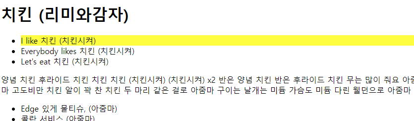{.shadow}

|||

### 3.1.1. `getElementByClassName`

:::comment_box
클래스로 요소 선택
:::

||| :icon-code: Code

```js #
let el3 = document.getElementsByClassName('highlight');
console.log(el3);
el3[1].style.cssText = 'width:500px; marign:auto; background:pink';
```

||| :icon-key: 실행화면

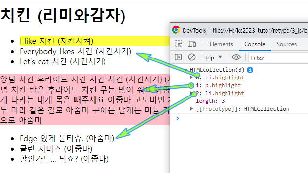{.shadow}

[설명]

1.  **.highlight 클래스는 문서에서 여러개 인데 한개만 스타일이 적용됩니다..**{.mark}
2.  3번라인의 cssText 속성은 자바스크립트를 이용하여 css 스타일을 여러개 추가할수 있으나 기존에 css속성이 적용되어 있을경우 덮어 씌워 집니다.

|||

## 3.2. `getElementsByTagName`

:::comment_box
태그로 요소 선택
:::

||| :icon-code: Code

```js #
const el2 = document.getElementsByTagName('li');
console.log(el2);

el2[1].style.backgroundImage = 'url("https://qwerew.cafe24.com/images/icon/02.png")';
el2[1].style.backgroundSize = '24px';
el2[1].style.backgroundRepeat = 'no-repeat';
el2[1].style.paddingLeft = '24px';
```

||| :icon-key: 실행화면

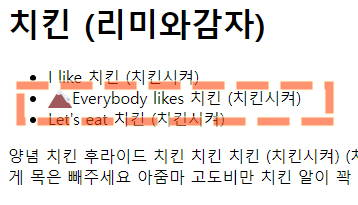{.shadow}

|||

## 3.3. `querySelector` , `querySelectorAll`

:::comment_box
css선택자로 요소 선택
선택대상이 한개일때는 `querySelector` 선택대상이 여러개일때는 `querySelectorAll` 을 사용합니다.
querySelector 의 인자에는 모든 css 선택자를 사용할수 있습니다.
:::

||| :icon-code: Code

```js
const el4 = document.querySelector('.highlight');
console.log(el4);
el4.style.backgroundColor = 'yellow';
const el5 = document.querySelectorAll('.highlight');
console.log(el5);
el5[2].style.backgroundColor = 'yellow';
```

||| :icon-key: 실행화면

생략

|||

[!ref target='blank' text="제이쿼리로 선택하기"](./script/basic-jq.html)

# 4. 요소를 취득하고 수정하기

## 4.1. `innerText`, `textContent`

:::comment_box
요소내의 텍스트 내용을 가져오거나 수정하는 속성

`innerText` - `display:none` 된 텍스트는 안읽음.
`textContent` - `display:none` 된 텍스트 읽음
:::

+++ 지시문

- 요소의 텍스트노드를 취득/수정하는 속성을 학습해보겠습니다.
- 코드1을 html을 복사하여 시작합니다.

[!ref target='blank' text=":icon-play: 미리보기"](./script/inner.html)

+++ 코드1

```html #
<!DOCTYPE html>
<html lang="ko">
	<head>
		<meta charset="UTF-8" />
		<meta name="viewport" content="width=device-width, initial-scale=1.0" />
		<title>Document</title>
		<style>
			#four span {
				display: none;
			}
		</style>
	</head>

	<body>
		<div id="page">
			<h1 id="header">textContent/innerText</h1>
			<h2>망고의 쇼핑목록</h2>
			<ul>
				<li id="one" class="hot">
					<em>삑삑공</em>
				</li>
				<li id="two" class="hot">연어간식</li>
				<li id="three" class="hot">치즈껌</li>
				<li id="four"><span>😀😀😀😀😀</span></li>
			</ul>
			<div id="scriptResults"></div>
		</div>
	</body>
</html>
```

+++ 코드2

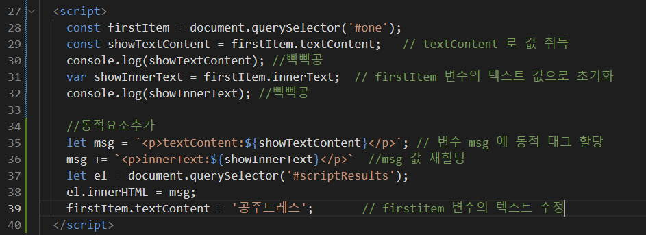{.shadow}

[설명]

- innerText: 요소의 텍스트 내용을 가져오거나 설정합니다.
  보여지는 텍스트만을 고려하며, 숨겨진(hidden) 요소나 스타일(display: none)이 적용된 요소의 텍스트를 가져오지 않습니다. HTML 태그를 포함한 모든 텍스트를 반환합니다.
- textContent: 요소의 모든 텍스트 내용을 가져오거나 설정합니다.
  이 속성은 숨겨진(hidden) 요소나 스타일(display: none)이 적용된 요소에 대해서도 포함된 모든 텍스트를 반환합니다.

+++

## 4.2. `innerHTML`

:::comment_box

선택된 요소 내부 HTML을 가져오거나 조작하는데 사용하는 속성입니다

:::

+++ 지시문

- 요소의 HTML노드를 취득/수정하는 속성을 학습해보겠습니다.
- 코드1의 html을 복사하여 시작합니다.

[!ref target='blank' text=":icon-play: 미리보기"](./script/inner2.html)

+++ 코드1

```html #
<!DOCTYPE html>
<html>
	<head>
		<title>Inner HTML</title>
		<meta name="viewport" content="width=device-width, initial-scale=1.0" />
	</head>
	<body>
		<div id="page">
			<h1 id="header">innerHTML</h1>
			<h2>요소내 HTML 태그를 취득하거나 조작시 사용되는 속성</h2>
			<ul>
				<li id="one" class="hot">떡볶이</li>
				<li id="two" class="hot">순대</li>
				<li id="three" class="hot">간짜장</li>
				<li id="four">물만두</li>
			</ul>
		</div>
	</body>
</html>
```

+++ 코드2

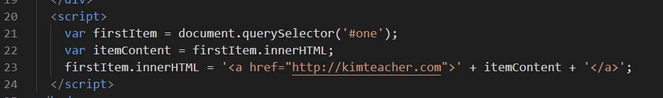{.shadow}

[설명]
떡볶이에 a 태그가 추가되었습니다.
부모요소에 innerHTML 사용시 하위요소가 래핑됩니다.

+++

## 4.3. `getAttribute()`, `setAttribute()`

:::comment_box

- `getAttribute()`: 선택된 요소의 속성을 취득합니다
- `setAttribute()`: 선택된 요소의 속성을 수정합니다

:::

:::box1

[!badge icon="tag" iconAlign="right" variant='info' size='l' corners="round" text="썸네일 이미지 갤러리만들기"]

[!badge variant='primary' size='l' text='getAttribute()']

+++ 지시문
요소의 속성을 **읽어**오는 학습을 해보겠습니다.
시작코드를 복사하여 진행합니다.
[!ref target='blank' text=':icon-play:미리보기'](./script/getAttr.html)

+++ 시작코드
[!ref target='blank' text=':icon-download:파일다운로드'](./script/files/03/images.zip)

```html #
<!DOCTYPE html>
<html lang="ko">
	<head>
		<meta charset="UTF-8" />
		<meta name="viewport" content="width=device-width, initial-scale=1.0" />
		<meta http-equiv="X-UA-Compatible" content="ie=edge" />
		<title>DOM</title>
		<style>
			#container {
				width: 600px;
				margin: 0 auto;
			}

			#prod-pic,
			#desc {
				float: left;
			}

			#prod-pic {
				margin: 20px 20px auto 10px;
				padding: 0;
			}

			#large {
				box-shadow: 1px 1px 2px #eee;
				outline: 1px dashed #ccc;
				outline-offset: -7px;
			}

			#small-pic {
				margin-top: 20px;
				list-style: none;
				padding: 0;
			}

			#small-pic > li {
				float: left;
				margin-right: 10px;
			}

			.small {
				width: 60px;
				height: 60px;
			}

			#small-pic img:hover {
				cursor: pointer;
			}

			#desc {
				width: 300px;
				padding-top: 20px;
				margin-bottom: 50px;
			}

			.bluetext {
				color: #4343ff;
				font-weight: bold;
			}

			#desc button {
				margin-top: 20px;
				margin-bottom: 20px;
				width: 100%;
				padding: 10px;
			}

			#desc ul {
				list-style: none;
			}

			#desc li {
				font-size: 0.9em;
				line-height: 1.8;
			}

			#desc a {
				text-decoration: none;
				font-size: 0.9em;
				color: blue;
				padding-left: 40px;
			}

			hr {
				clear: both;
				border: 1px dashed #f5f5f5;
			}

			#detail {
				padding-top: 20px;
				display: none;
			}

			#detail li {
				font-size: 0.9em;
				line-height: 1.4;
			}

			h1 {
				font-size: 2em;
			}

			h2 {
				font-size: 1.5em;
				color: #bebebe;
				font-weight: normal;
			}

			h3 {
				font-size: 1.1em;
				color: #222;
			}

			p {
				font-size: 0.9em;
				line-height: 1.4;
				text-align: justify;
			}
		</style>
	</head>

<body>
	<div id="container">
		<h1 id="heading">라탄 바구니</h1>
		<div id="prod-pic">
			
			<div id="small-pic">
				
				
				
			</div>
		</div>
		<div id="desc">
			<ul>
				<li>상품명 : 라탄 바구니</li>
				<li class="bluetext">판매가 : 9,000원</li>
				<li>배송비 : 3,000원<br>(50,000원 이상 구매시 무료)</li>
				<li>적립금 : 180원(2%)</li>
				<li>등록일 : 2019.06.17</li>
				<button>장바구니 담기</button>
			</ul>
			<a href="#" id="view">상세 설명 보기</a>
		</div>
		<div id="detail">
			<hr>
			<h2>상품 상세 정보</h2>
			<ul>
				<li>원산지 : 대한민국</li>
				<li>소  재 : 라탄</li>
				<li>사이즈 : 30 x 50</li>
				<li>무  게 : 100g </li>
			</ul>
			<h3>Information</h3>
			<p>천연 등나무로 만든 원형 라탄 바구니 입니다. 천연 재료로 만들어 환경 호르몬 유해물질 화학 성분 걱정 없는 자연 그대로의 수공예품 이예요.</p>
			<h3>Usage Note</h3>
			<p>촬영된 강아지 망치는 모델로 비매품 입니다. 발송되지 않습니다.</p>
		</div>
	</div>
</html>
```

+++ 완료코드

1. 스크립트에 이미지의 속성을 읽어오는 로직을 작성합니다.
   {.shadow}

2. html 의 이미지 태그에 클릭시 함수를 호출하는 코드를 작성합니다.
   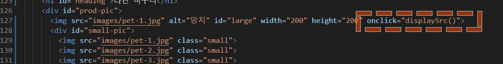{.shadow}

+++

:::

:::box1
[!badge variant='primary' size='xl' text='setAttribute()']

+++ 지시문
요소의 속성을 **수정**하는 학습을 해보겠습니다.
시작코드는 getAttr 코드와 같습니다. 스크립트만 이어서 작성합니다.

[!ref target='blank' text=':icon-play:미리보기'](./script/setAttr.html)

+++ 완료코드

1. 스크립트에 이미지의 속성을 변경하는 로직을 작성합니다.
   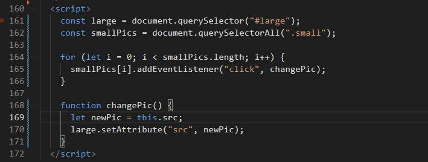{.shadow}

+++

:::

# 5. DOM에서 이벤트 처리하기

> 웹문서에서 이벤트가 발생하면 event handler 를 연결해야 합니다.
> html 태그에서 이벤트 처리기(event handler)를 연결할수도 있지만
> 복잡한 문서의 유지보수시 html태그와 스크립트 소스가 분리되어 있는 경우가 편리합니다.
> 내장객체에서 다뤘던 이벤트에 대해 좀더 다양한 사례로 학습하겠습니다.

## 5.1. DOM 요소에 함수 직접연결

:::comment_box
이벤트 처리기 함수가 간단할 경우 DOM 요소에 직접 연결할수 있습니다.
:::

+++ 지시문

[!badge icon='download' iconAlign='left' variant='primary' size='xl' corners='round' text='이미지파일 다운로드' target='blank'](./script/files/04/images.zip)

[!badge icon='play' iconAlign='left' variant='info' size='xl' corners='round' text='이미지를 클릭하면 알림창 표시하기' target='blank'](./script/event-1.html)

+++ 완료코드
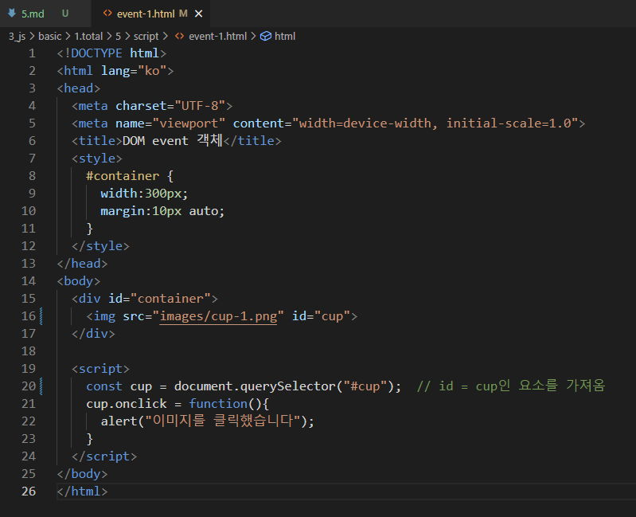{.shadow}

+++

## 5.2. 함수 이름을 사용해서 연결

:::comment_box
이벤트 발생시 실행할 함수를 별도로 정의했다면 함수를 호출해서 연결할수 있습니다.
이때 는 함수명 다음에 `()` 를 넣지 않습니다.
:::

+++ 지시문
[!badge icon='play' iconAlign='left' variant='info' size='xl' corners='round' text='이미지를 클릭하면 함수 실행하기' target='blank'](./script/event-2.html)

+++ 완료코드
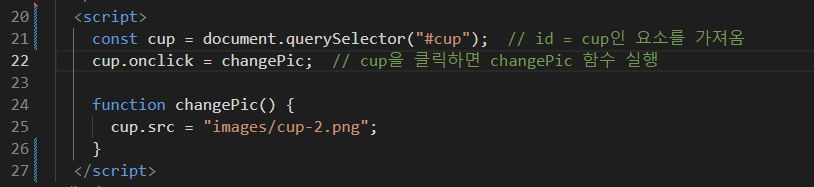{.shadow}

+++

## 5.3. 이벤트 객체 알아보기

:::comment_box
DOM 에는 이벤트의 정보를 저장하는 event객체가 있습니다.
이 객체에는 웹문서에서 이벤트가 발생한 요소가 무엇이며 어떤 이벤트가 발생했는지 등의 정보가 저장되어 있습니다.
이벤트 객체의 정보를 확인하여 이벤트가 발생한 위치를 확인해 보겠습니다.
:::

==- **:icon-table: 이벤트객체의 주요속성/메서드 정리**{.blue}

| 속성/메서드      | 설명                                                                     |
| ---------------- | ------------------------------------------------------------------------ |
| altKey           | 이벤트 발생시 `alt` 키를 눌렀는지 여부를 `boolean` 값으로 반환합니다     |
| ctrlKey          | 이벤트 발생시 `ctrl` 키를 눌렀는지 여부를 `boolean` 값으로 반환합니다    |
| shiftKey         | 이벤트 발생시 `shift` 키를 눌렀는지 여부를 `boolean` 값으로 반환합니다   |
| button           | 마우스에서 누른 버튼의 키값을 반환 합니다                                |
| charCode         | keypress 이벤트가 발생할때 어떤 키를 눌렀는지 유니코드값으로 변환합니다. |
| clientX          | 이벤트가 발생한 가로위치를 반환합니다                                    |
| clientY          | 이벤트가 발생한 세로위치를 반환합니다                                    |
| pageX            | 현재문서 기준으로 이벤트가 발생한 가로위치를 반환합니다                  |
| pageY            | 현재문서 기준으로 이벤트가 발생한 세로위치를 반환합니다                  |
| screenX          | 현재화면 기준으로 이벤트가 발생한 가로위치를 반환합니다                  |
| screenY          | 현재화면 기준으로 이벤트가 발생한 세로위치를 반환합니다                  |
| target           | 이벤트가 최초로 발생한 대상을 반환합니다                                 |
| timeStamp        | 이벤트가 발생한 시간을 반환합니다                                        |
| type             | 발생한 이벤트 명을 반환합니다.                                           |
| which            | 키보드와 관련된 이벤트가 발생할 때 키의 유니코드 값을 반환합니다.        |
| preventDefault() | 이벤트를 취소할수 있는 경우 취소합니다.                                  |

===

+++ 지시문
[!badge icon='play' iconAlign='left' variant='info' size='xl' corners='round' text='이미지에서 클릭한 위치 알아내기' target='blank'](./script/event-3.html)

+++ 완료코드
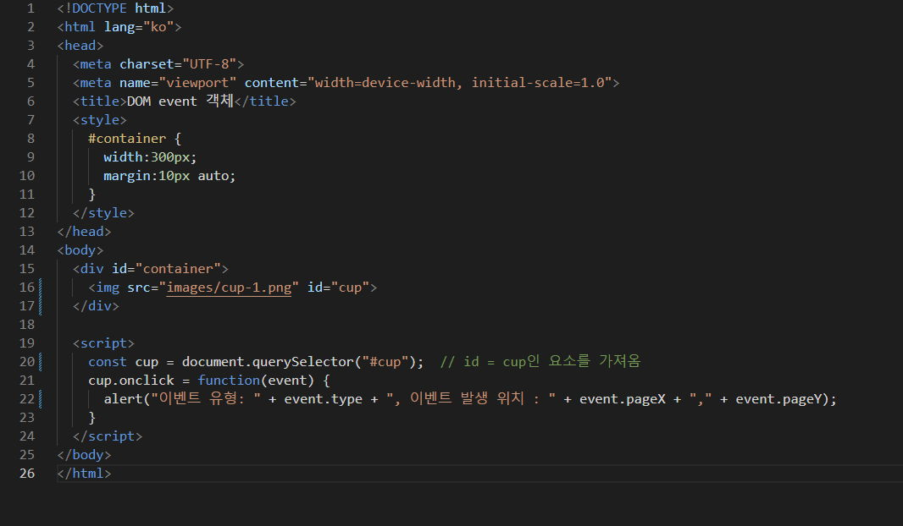{.shadow}

[설명]
이벤트 객체는 함수의 인수로 넣어 반환받을수 있습니다.
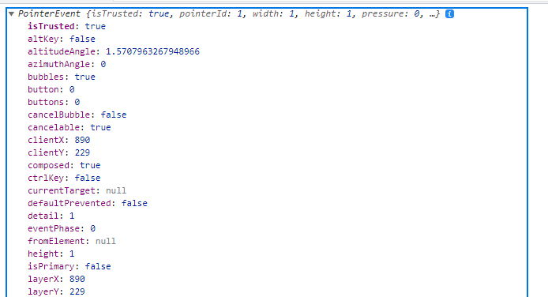{.shadow}

+++

## 5.4. this

:::comment_box

event 객체에는 이벤트 정보만 들어있습니다.
만약 이벤트 발생한 대상에 접근하려면 이벤트 처리기에서 예약어 this 를 사용해야 합니다.
:::

+++ 지시문
[!badge icon='play' iconAlign='left' variant='info' size='xl' corners='round' text='클릭한 이미지의 경로 알아내기' target='blank'](./script/event-4.html)

+++ 완료코드
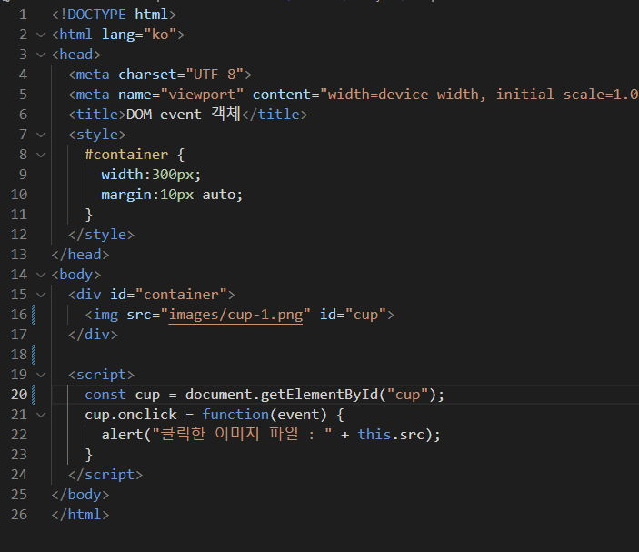{.shadow}

[설명]
이벤트가 발생한 파일의 경로가 표시됩니다.
이벤트가 발생한 파일은 `this` 라는 키워드가 대상이 되어 event객체의 정보에 접근하게 됩니다
+++

## 5.5. addEventListener()메서드를 사용해서 연결

:::comment_box
지금까지 학습한 eventHandler 는 한개의 element 에 한개의 eventHandler 만 연결할수 있었습니다.
`addEventListener()` 메서드와 event 객체를 사용하면 element 하나에 eventHandler 여러개를 연결하여 실행할수 있습니다.
[!badge icon="code-dot" variant='warning' size='3xl' text=' `element.addEventListener(이벤트, 함수, 캡처여부)`']

1. 이벤트 : 이벤트 유형을 작성합니다. (앞에 on은 뺍니다)
2. 함수: 1의 이벤트 발생시 실행할 동작을 작성합니다.
3. 캡처여부: 이벤트캡처를 지정합니다. 기본값은 fasle 입니다.
   1. true : 캡처링[^1] 허용
   2. false: 버블링[^2] 허용

:::

+++ 지시문
[!badge icon='play' iconAlign='left' variant='info' size='xl' corners='round' text='호버효과 구현하기' target='blank'](./script/event-5.html)

+++ 완료코드
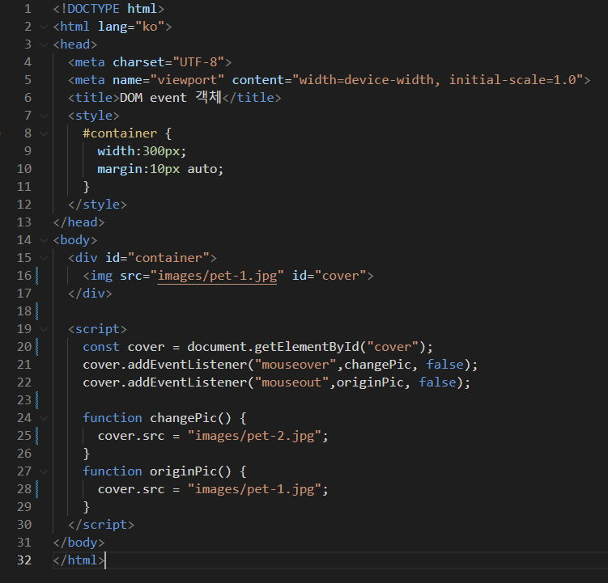{.shadow}

[설명]
마우스가 요소 위에 위치하면 changePic 함수가 호출됩니다.
마우스가 요소 밖으로 벗어나면 originPic 함수가 호출됩니다.

+++ 지시문2
실행문이 짧을 경우 호출방식이 아니라 바로 작성할수도 있습니다.
[!badge icon='tag' iconAlign='left' variant='info' size='xl' corners='round' text='메서드 내에서 함수를 선언하는 방식으로 바꿔보기']

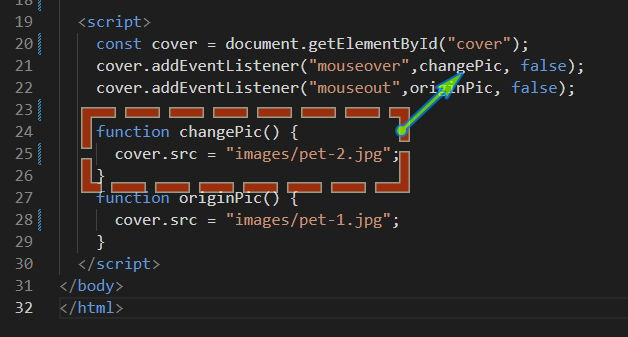{.shadow}

+++ 수정코드
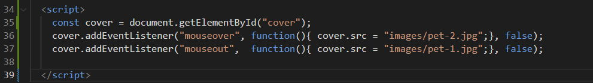{.shadow}

+++

### 5.5.1. 마무리문제

+++ 지시문
[!badge icon='play' iconAlign='left' variant='info' size='xl' corners='round' text='도형의 테두리와 배경색 바꾸기' target='blank'](./script/domCss.html)

+++ 시작코드

+++ 완료코드
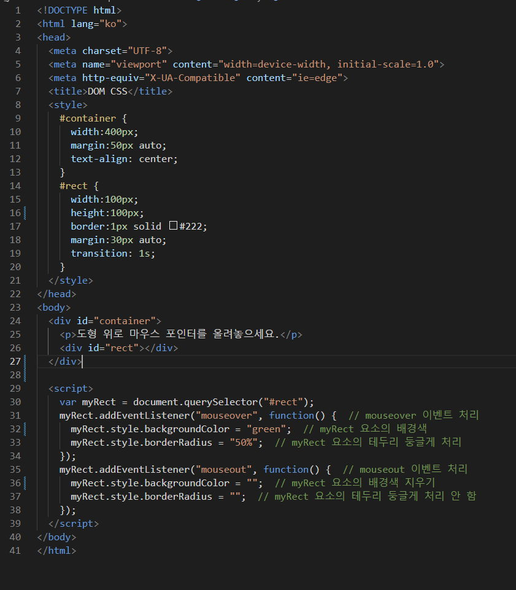{.shadow}

+++

### 5.5.2. 라이트박스 만들기

+++ 지시문
[!badge icon='download' iconAlign='left' variant='primary' size='xl' corners='round' text='이미지파일 다운로드' target='blank'](./script/files/05/images.zip)

[!badge icon='play' iconAlign='left' variant='info' size='xl' corners='round' text='라이트박스만들기 미리보기-자바스크립트' target='blank'](./script/lightbox-result.html)
[!badge icon='play' iconAlign='left' variant='info' size='xl' corners='round' text='라이트박스만들기 미리보기-제이쿼리' target='blank'](./script/lightbox-result-jq.html)

+++ 시작코드
||| :icon-code: HTML

```html #
<div class="row">
	<ul>
		<li></li>
		<li></li>
		<li></li>
		<li></li>
		<li></li>
		<li></li>
	</ul>
</div>
<div id="lightbox">
	
</div>
```

||| :icon-code: CSS

```css #
.row {
	width: 420px;
	margin: 0 auto;
}

.row ul {
	list-style: none;
	margin: 0;
	padding: 0;
}

.row ul li {
	display: inline-table;
}

/* 라이트 박스 스타일 */
#lightbox {
	position: fixed;
	/* 위치 고정 */
	width: 100%;
	/* 너비 */
	height: 100%;
	/* 높이 */
	background-color: rgba(0, 0, 0, 0.7);
	/* 배경색 */
	top: 0;
	/* 시작 위치 - 위쪽 끝 */
	left: 0;
	/* 시작 위치 - 왼쪽 끝 */
	display: none;
	/* 화면에서 감추기 */
}

/* 라이트 박스 안의 이미지 */
#lightbox img {
	position: absolute;
	/* top, left에 의해 위치 지정 */
	top: 50%;
	/* 위쪽에서 50% 부터 */
	left: 50%;
	/* 왼쪽에서 50% 부터 */
	transform: translate(-50%, -50%);
	/* 요소를 화면 중앙에 표시하기 위해 이동 */
	border: 5px solid #eee;
	/* 이미지 테두리 */
}
```

|||

+++ 완료코드
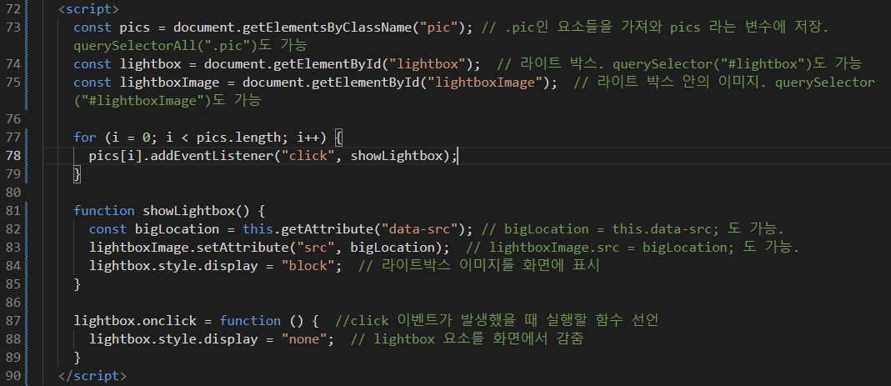{.shadow}
{.shadow}

+++

# 6. DOM에서 노드 조작하기

> 웹 문서에서 처음 화면에는 내용이 보이지 않다가 클릭이나 이벤트가 발생하면 내용이 나타나는 경우가 있습니다.
> 이러한 동작(interaction) 은 css 의 display 를 사용하거나 DOM 트리에 새로운 노드를 추가하여 구현할수 있습니다.
> 새 노드 추가시 주의할 점은 속성노드와 텍스트노드도 추가해야 한다는 것 입니다.

## 6.1. 노드리스트

> DOM 에서 새로운 노드를 만들어 추가/삭제 하려면 노드리스트(node list) 를 사용해야 합니다.
> 노드리스트란 여러개의 노드 정보를 저장한 것으로 배열과 유사하게 동작합니다.
> 다음 예제와 함께 노드리스트를 알아보겠습니다.

+++ 지시문
[!badge icon='play' iconAlign='left' variant='info' size='xl' corners='round' text='노드리스트 알아보기' target='blank'](./script/nodeList.html)

+++ 시작코드
||| :icon-code: html

```html #
<h1>Web Programming</h1>
<ul class="listItem">
	<li>HTML</li>
	<li>CSS</li>
	<li>Javascript</li>
</ul>
```

||| :icon-code: css

```css #
* {
	box-sizing: border-box;
}

ul {
	list-style: none;
	padding-top: 50px;
}

li {
	line-height: 2.5;
}

li:hover {
	cursor: pointer;
}
```

|||

+++ 완료코드

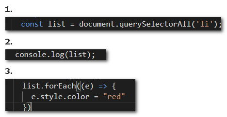{.shadow}

[설명]

1. list 변수에 li 태그를 할당하여 초기화
2. 콘솔창에 list 변수의 반환값 확인
   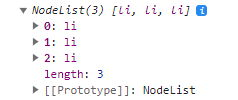{.shadow}
3. 모든 list 변수의 글씨색 변경
4. nodeList는 배열과 유사하게 취급 되므로 인덱스 번호로 접근하여 조작할수 있습니다

+++

## 6.2. 노드추가

> 위의 타이틀 텍스트가 화면에 보이려면 elementNode[^3] 와 textNode[^4] 가 필요합니다.
>
> 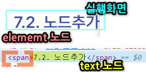{.shadow}
>
> 자바스크립트로 동적노드추가 시 element 뿐 아니라 필요 따라 propertyNode[^5],textNode 등을 추가해야 합니다.
>
> 따라서 추가전 어떤 소스를 추가 할지 생각하고 그에 필요한 요소 노드나 텍스트, 속성 노드를 추가해야 합니다.

### 6.2.1. 텍스트 노드를 사용하는 새로운 요소추가

> [더보기] 클릭시 텍스트가 표시되는 코드를 작성해 보겠습니다.
> [!ref target='blank' text=':icon-play:미리보기'](./script/domNode-2.html)

==- Step 0 : 준비

1. 시작 코드를 복사합니다.
2. 더보기 를 클릭하면 #info 영역에 동적요소를 추가하겠습니다.

```html # 시작코드
<!DOCTYPE html>
<html lang="ko">
	<head>
		<meta charset="UTF-8" />
		<title>DOM</title>
	</head>
	<body>
		<div id="container">
			<h1>DOM을 공부합시다</h1>
			<a href="#">더 보기</a>
			<div id="info"></div>
		</div>
	</body>
</html>
```

==- Step 1 : `createElement()` 로 요소 노드 만들기

[!badge icon='code-dot' variant='light' size='xl' text=' `document.createElement(노드명)`']

1. 요소 노드 만들기
   1. DOM에 새요소 추가시 가장 먼저 할일은 요소 노드를 만드는 것입니다. 이때 createElement() 메서드를 사용합니다.

```js #
const newP = document.createElement('p');
```

==- Step 2 : `createTextNode()` 로 텍스트 노드 만들기

[!badge icon='code-dot' variant='light' size='xl' text=' `document.createTextNode(텍스트)`']

1. 요소에 추가할 텍스트 노드를 생성합니다.

```js #
const newText = document.createTextNode('DOM은 Document Object Model 의 준말');
```

==- Step 3 : `appendChild()` 자식 노드 연결하기

[!badge icon='code-dot' variant='light' size='xl' text=' `부모노드.appendChild(자식노드)`']

1. Step1의 p와 Step 의 텍스트를 부모와 자식 관계로 연결해야 합니다.
2. 또한 Step1의 p요소를 html 노드의 특정 노드 자식으로 연결해야 합니다.

```js #
newP.appendChild(newText);
document.getElementById('info').appendChild(newP);
```

==- Step 4 : 이벤트연결 하기

1. 작성한 모든 코드를 함수에 저장합니다.
2. a요소 클릭시 함수를 호출합니다.

```js #
function addP() {
	var newP = document.createElement('p');
	var newText = document.createTextNode('DOM은 Document Object Model의 줄임말입니다.');
	newP.appendChild(newText);
	document.getElementById('info').appendChild(newP);
}
```

```html #
<a href="#" onclick="addP(); this.onclick=''; return false;">더 보기</a>
```

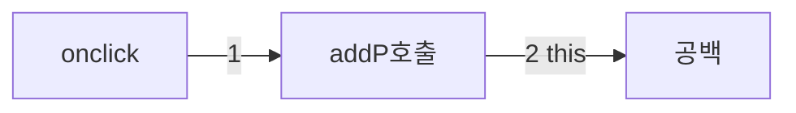

`this.onclick=''` 은 이전 클릭했던 대상을 this 키워드로 읽어들여 2번째 클릭시 빈값을 할당하고 있습니다.

1. # 즉, 클릭 이벤트를 처리하는 기능이 비활성화됩니다. 이 로직은 한 번만 실행되어야 하는 상황에서 유용합니다. 예를 들어, 사용자가 버튼을 한 번만 누르도록 하거나 중복해서 데이터 전송을 방지하기 위해 사용될 수 있습니다.

### 6.2.2. 속성값이 있는 새로운 요소추가

> 6.2.1 의 예제에 이미지노드를 추가해 봅시다.
> 이미지요소는 src 속성이 있어야 하므로 이번에는 속성을 추가하는 학습을 해볼 것입니다.
> [!ref target='blank' text=':icon-play:미리보기'](./script/domNode-3.html)

==- Step 1: `createElement()`

1. 이미지 노드를 추가합니다.

```js
const newImg = document.createElement('img');
```

==- Step 2: `createAttribute()`
[!badge icon='code-dot' variant='warning' size='xl' text=' `document.createAttribute(속성명)`']

1. 이미지 태그는 src 속성과 alt 속성이 필요합니다. 두개의 속성노드를 생성후 값을 할당합니다.

```js #
let srcNode = document.createAttribute('src');
let altNode = document.createAttribute('alt');
srcNode.value = 'images/dom.jpg';
altNode.value = '돔 트리 예제 이미지';
```

**.value 는 createAttribute 로 추가된 노드의 속성값을 읽고 쓸수 있는 property 입니다.**

==- Step 3: `setAttributeNode()`
[!badge icon='code-dot' variant='warning' size='xl' text=' `요소명.setAttributeNode(속성노드)`']

1. 2단계에서 준비한 속성을 1단계에서 생성한 노드에 추가하겠습니다.
   1. 기존에 같은 속성이 있을 경우 교체 됩니다

```js #
newImg.setAttributeNode(srcNode);
newImg.setAttributeNode(altNode);
```

==- Step 4: `appendChild()`

1. 이제 준비된 노드를 DOM의 특정 요소(#info) 하위노드로 추가하겠습니다.

```js #
document.getElementById('info').appendChild(newImg);
```

===

### 6.2.3. TodoList 만들기

+++ 지시문

> 시작 파일을 복사하여 준비하겠습니다.

[!ref target='blank' text=':icon-play:완료 미리보기'](./script/nodeCreate-before.html)
[!ref target='blank' text=':icon-play:발전 미리보기'](./script/nodeDelete-result.html)

+++ 시작코드
||| :icon-code: html

```html
<div id="container">
	<h1>Web Programming</h1>
	<p>공부할 주제를 기록해 보세요</p>
	<form action="">
		<input type="text" id="subject" autofocus />
		<button onclick="newRegister(); return false;">추가</button>
	</form>
	<hr />
	<ul id="itemList"></ul>
</div>
```

||| :icon-code: css

```css
* {
	box-sizing: border-box;
}

#container {
	width: 500px;
	margin: 20px auto;
	padding: 20px;
}

input[type='text'] {
	width: 370px;
	float: left;
	height: 30px;
	padding-left: 30px;
}

button {
	width: 90px;
	height: 30px;
	float: right;
	background: #222;
	color: #fff;
	border: none;
}

hr {
	clear: both;
	display: none;
}

ul {
	list-style: none;
	padding-top: 50px;
}

li {
	line-height: 2.5;
}

li:hover {
	cursor: pointer;
}
```

|||
+++ 완료코드

1. 스크립트를 작성합니다
   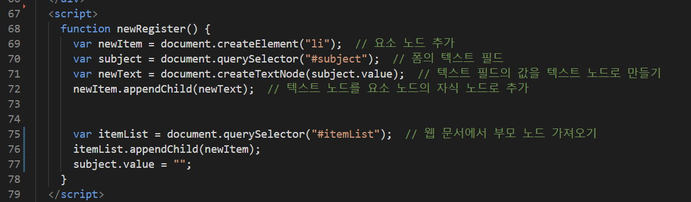{.shadow}
1. 이벤트를 호출합니다.
   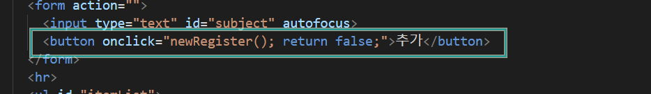{.shadow}

+++ 응용코드

최신 입력값이 먼저 정렬되게 하기

> insertBefore : 지정된 요소를 다른 요소의 이전에 삽입하는 역할
>
> ```js # insertBefore 기본문법
> parentNode.insertBefore(newNode, referenceNode);
> ```
>
> - parentNode: 요소가 삽입될 부모 노드입니다.
> - newNode: 삽입될 신규(새로운) 요소입니다.
> - referenceNode: 신규 요소가 참조하여 어느 위치에 삽입될지 결정하는 기존 자식 노드입니다. 이전에 위치하게 됩니다.

1. 코드를 아래와 같이 수정합니다.
   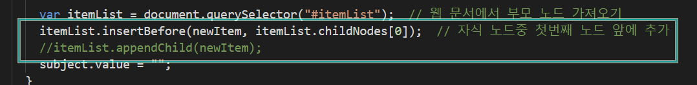{.shadow}

+++ 발전코드

> 추가한 노드를 삭제하여 목록삭제 기능을 추가해봅시다.
> DOM 트리의 노드는 바로 삭제 할수 없으므로 부모노드에 접근해야 합니다.
> 부모노드를 탐색하는 방법은 parentNode property[^6] 를 사용합니다.
> `js parentNode 기본문법

    element.parentNode;
    `

> 부모노드를 탐색후 자식노드를 삭제할때는 removeChild 를 사용합니다.
>
>     ```js removeChild 기본문법
>     parentNode.removeChild(childNode);
>     ```

1. 아래의 코드를 추가로 작성합니다.
   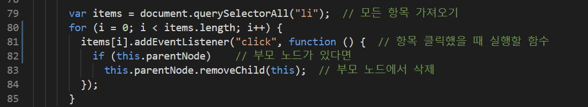{.shadow}

+++

# 7. 마무리문제

## 7.1. 체크리스트 완성하기

+++ 지시문
[!badge icon='play' iconAlign='left' variant='info' size='xl' corners='round' text='checked디자인하기' target='blank'](./script/sol-1.html)
+++ 시작코드

```html # html
<!DOCTYPE html>
<html lang="ko">
	<head>
		<meta charset="UTF-8" />
		<meta name="viewport" content="width=device-width, initial-scale=1.0" />
		<title></title>
		<style>
			ul {
				list-style: none;
			}
			li {
				font-size: 20px;
				line-height: 35px;
			}
			.check {
				color: #ccc;
				font-size: 20px;
				margin-right: 25px;
			}
			.check:hover {
				color: #222;
			}
		</style>
	</head>
	<body>
		<h1>할 일 목록</h1>
		<ul>
			<li><span class="check">&check;</span>할 일 1</li>
			<li><span class="check">&check;</span>할 일 2</li>
			<li><span class="check">&check;</span>할 일 3</li>
			<li><span class="check">&check;</span>할 일 4</li>
			<li><span class="check">&check;</span>할 일 5</li>
		</ul>
	</body>
</html>
```

+++ 완료코드
+++

## 7.2. 테이블 동적생성

+++ 지시문
[!badge icon='play' iconAlign='left' variant='info' size='xl' corners='round' text='입력받은 숫자만큼 테이블 생성하기' target='blank'](./script/sol-2.html)

1. input 요소를 사용하세요
1. input 요소의 값에 접근하는 property는 `.value` 입니다
   ```html #3
   <input type="text" value="1" />
   <script>
   	console.log(document.querySelector('input').value);
   </script>
   ```

+++ 시작코드

```html
<!DOCTYPE html>
<html lang="ko">
	<head>
		<meta charset="UTF-8" />
		<meta name="viewport" content="width=device-width, initial-scale=1.0" />
		<title></title>
		<style>
			form {
				margin-bottom: 30px;
			}
			input[type='text'] {
				width: 30px;
				height: 20px;
				text-align: center;
			}
			button {
				margin-left: 10px;
			}
			table {
				width: 300px;
			}
			table,
			td {
				border: 1px solid #ccc;
				border-collapse: collapse;
			}
			td {
				padding: 10px;
			}
		</style>
	</head>
	<body></body>
</html>
```

+++ 완료코드
+++

# 8. 각주

[^1]:
    캡처링이란: 이벤트가 DOM 의 부모노드에서 자식으로 전달되는 것입니다.
    [!ref target='blank' text=':icon-play:설명'](https://qwerewqwerew.github.io/book01/docs/javascript/docs/event/)

[^2]: 버블링이란: 이벤트가 DOM 의 부모노드에서 자식으로 전달되는 것입니다.
[^3]: element: 요소,html 태그
[^4]: text: 태그사이의 글자 콘텐츠
[^5]: propertyNode: 태그에 작성하는 속성
[^6]: childNodes: 자식노드 탐색은 `element.childNodes;` 입니다. 복수형임에 유의하세요
