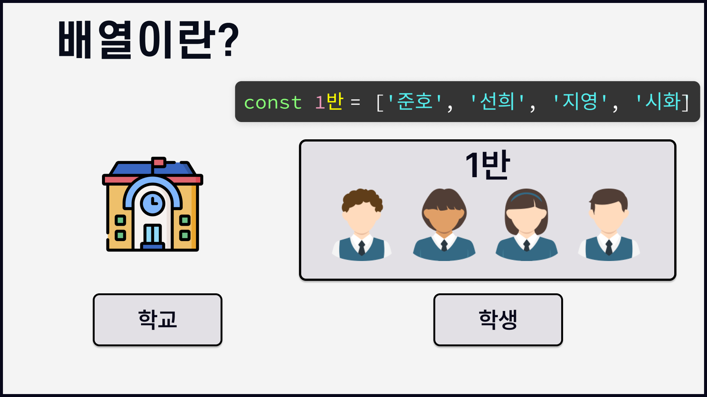

- [1. 배열](#1-배열)
  - [1.1. 개요](#11-개요)
    - [1.1.1. 배열의 생성](#111-배열의-생성)
    - [1.1.2. 배열에 사용하는 메서드](#112-배열에-사용하는-메서드)
      - [1.1.2.1. 배열병합](#1121-배열병합)
      - [1.1.2.2. 다양한 배열 메서드](#1122-다양한-배열-메서드)
        - [1.1.2.2.1. splice()](#11221-splice)
        - [1.1.2.2.2. slice()](#11222-slice)
    - [1.1.3. 전개연산자 spread operator](#113-전개연산자-spread-operator)

# 1. 배열

## 1.1. 개요

> 자바스크립트에서의 배열은 객체 입니다.
>
> 배열은 여러 값을 한공간에 저장할때 쓰입니다.
>
> 배열은 한 반에 속한 여러 학생을 생각하면 됩니다.
>
> 
>
> 이때 우리는 **학급을 배열**, **학생을 요소 혹은 원소** 라고 부릅니다.
>
> 학교에서는 한반에 속한 여러 학생들의 관리하기 위해 학생들에게 번호를 부여합니다.
>
> 이름으로 관리할 경우 동명이인이 있기도 하고 번호에 비해 효율성이 떨어지기 때문이지요.
>
> 이때 **학생에게 부여되는 일련의 번호를 배열에서는 인덱스 번호**라고 합니다.
>
> 배열의 선언은 **`[ ]`**{.red} 값의 구분은 **`,`**{.red} 으로 합니다.
>
> 배열의 인덱스 번호는 **`0`**{.red} 부터 시작합니다.
>
> 배열의 값(요소)은 문자,숫자,객체,함수 모든 자료형이 들어갈수 있습니다.

**배열은 값의 집합이다**{.red}

### 1.1.1. 배열의 생성

1.  array literal 의 사용
    1.  `[]`{.red}
2.  array object 의 사용
    1.  `Array()`{.red}

```js #
//배열생성1
let srt = [];
str = '안녕하세요';
document.write(str + '');
document.write(str[2] + '');
document.write(str[str.length - 1] + '');

const array = [273, 'String', true, function () {}, {}, [273, 103]];
console.log(array);

//배열생성2
var arr = [];
arr[0] = 'zero';
arr[1] = 'one';
arr[2] = 'tow';
console.log(arr);
var arr1 = [, , ,];

//배열생성3
var arr2 = new Array();

arr[0] = 'zero';
arr[1] = 'one';
arr[2] = 'tow';

//배열생성4
var arr3 = new Array('zero', 'one', 'two');

//배열생성5
var arr4 = new Array(3);
console.log(arr4);
```

### 1.1.2. 배열에 사용하는 메서드

#### 1.1.2.1. 배열병합

+++ 지시문
[:icon-play:](./array-3.html)

- [!badge variant='primary' size='l' text='코드1'] `concat()`{.red}
  - 배열끼리 합치는 메서드
- [!badge variant='primary' size='l' text='코드2'] `join()`{.red} :
  - 배열내 요소를 합치는 메서드
- [!badge variant='primary' size='l' text='코드3'] `push()`{.red} , `unshift()`{.red}
  - 새로운 요소를 추가하는 메서드
- [!badge variant='primary' size='l' text='코드4'] `pop()`{.red}, `shift()`{.red}
  - 배열에서 요소를 꺼내는 메서드.
    **기존의 배열의 값이 변경됩니다.**

+++ 코드1

- `concat()`{.red} : 배열끼리 합치는 메서드
  - 서로 다른 배열 2개를 합쳐서 새로운 배열을 반환합니다.
  - 어느 배열을 먼저 작성하는냐에 따라 기준이 달라지며 반환되는 배열의 순서도 달라집니다.

```js # concat()
const nums = [1, 2, 3];
const chars = ['a', 'b', 'c', 'd'];

// 두 개의 배열 합치기
const numsChars = nums.concat(chars);
const charsNums = chars.concat(nums);
document.write(`nums+chars: ${numsChars} <br> chars+nums:${charsNums} <hr> }`);
```

+++ 코드2

- `join()`{.red} : 배열내 요소를 합치는 메서드
  - 배열 요소를 연결해 하나의 문자열로 만듭니다.
  - 이떄 각 요소사이에 원하는 구분자를 넣을수도 있는데 별도로 지정하지 않을경우 쉼표로 구분합니다.

:icon-rocket: 상수 nums와 chars의 초기화는 코드 1의 반복으로 생략합니다.

```js # join()
const string1 = nums.join();
document.write(`구분자 없이 : ${string1}<br>`);
const string2 = chars.join('/');
document.write(`/ 구분자 지정 : ${string2}<hr>`);
```

+++ 코드3

- `push()`{.red} : 새로운 length 값 반환 - 배열끝에 추가
- `unshift()`{.red} : 새로운 length 값 반환 - 배열앞에 추가
  - 배열에 새로운 요소를 추가하려면 push() 나 unshift()를 사용합니다.
  - **두 메서드를 사용하면 원래 배열의 값이 변경된다는 점에 유의해야 합니다.**

상수 nums와 chars 는 코드 1의 반복으로 생략합니다.

```js # push(), unshift()
// 요소 추가 - 새로운 length 값 반환
const ret1 = nums.push(4, 5); // 배열 끝에 추가
document.write(`length: ${ret1} | 새로 태어난배열 nums :  ${nums} <br>`);
const ret2 = nums.unshift(0); // 배열 앞에 추가
document.write(`length: ${ret2} | 새로 태어난배열 nums :  ${nums} <hr>`);
```

+++ 코드4

- `pop()`{.red}
  - 배열 뒤에서 요소를 꺼낼때
- `shift()`{.red}
  - 배열 앞에서 요소를 꺼낼때

_기존의 배열의 값이 변경됩니다._

상수 nums와 chars 는 코드 1의 반복으로 생략합니다.

```js # pop(),shift()
// 요소 추출 - 꺼낸 요소 반환
const popped1 = chars.pop(); // 마지막 요소 꺼냄
document.write(`꺼낸 요소 : ${popped1}  | 배열 : ${chars} <br>`);
const popped2 = chars.shift(); // 첫번째 요소 꺼냄
document.write(`꺼낸 요소 : ${popped2}  | 배열 : ${chars} <hr>`);
```

+++

#### 1.1.2.2. 다양한 배열 메서드

##### 1.1.2.2.1. splice()

+++ 지시문
[:icon-play:](./array-4.html)

- [!badge variant='primary' size='l' text='코드1'] `splice()`{.red}
  - 원하는 위치에 요소를 추가, 삭제하는 메서드 입니다
  - 함수에 인수를 몇개 넣는가에 따라 기능이 달라집니다.
  - [:link:MDN](https://developer.mozilla.org/ko/docs/Web/JavaScript/Reference/Global_Objects/Array/splice)

+++ 코드1

```js # splice()
const numbers = [1, 2, 3, 4, 5];
const newNumbers = numbers.splice(2);
document.write(`반환된 배열 : ${newNumbers} <br> 변경된 배열 : ${numbers} <hr>`);
```

- 인수가 1개인 경우
  - `numbers.splice(2);` : 괄호안의 2는 배열의 인덱스 값을 가리킵니다.해당 코드는 인덱스값이 2인 요소부터 마지막 요소까지 모두 삭제 합니다.
  - 반환된 배열은 인덱스 번호 2~마지막까지의 값이 반환되며
  - 변경된 배열은 인덱스 번호 0~1 에 해당하는 값이 반환됩니다.
  - **splice 메서드는 배열의 중간에 요소를 추가/삭제 할수 있습니다.**

+++ 코드2

```js # splice()
const study = ['html', 'css', 'web', 'jquery'];
const newStudy = study.splice(2, 1);
document.write(`반환된 배열 : ${newStudy} <br> 변경된 배열 : ${study} <hr>`);
```

- 인수가 2개인 경우
  - 인수가 2개일경우 첫번째 인수는 인덱스 값이고 두번째 인수는 삭제할 요소의 갯수입니다.
  - `study.splice(2, 1);` : 인덱스가 2인 web 부터 1개의 요소를 삭제합니다..
  - 반환된 배열은 인덱스 번호 2이며 1개인 web입니다.
  - 변경된 배열은 인덱스 번호 0~1 에 해당하는 값이 반환됩니다.
  - **splice 메서드는 배열의 중간에 요소를 추가/삭제 할수 있습니다.**

+++ 코드3

```js # splice()
const newStudy2 = study.splice(2, 1, 'js');
document.write(`반환된 배열 : ${newStudy2} <br> 변경된 배열 : ${study} <hr>`);
```

- 인수가 3개 이상일 경우
  - 인수가 3개 이상일 경우 첫번째 인수는 배열에서 삭제할 시작위치를 나타내고 두번째 인수는 삭제할 갯수를 알려줍니다. 그리고 세번째 인수부터는 삭제한 위치에 새로 추가할 요소를 지정합니다.
  - `const newStudy2 = study.splice(2, 1, 'js');` : 인덱스 값이 2인 jquery 1개를 삭제하고 js를 추가합니다.
  - jquery 자리에 js를 확인할수 있습니다.

+++

##### 1.1.2.2.2. slice()

+++ 지시문
[:icon-play:](./array-5.html)
기존배열을 변경하지 않으면서 요소를 꺼냅니다.

+++ 코드

```js # This is Tab 1
const colors = ['red', 'green', 'blue', 'white', 'black'];
const colors2 = colors.slice(2); //인덱스 2부터 끝까지
document.write(`${colors2} <br>`);
const colors3 = colors.slice(2, 4); // 인덱스 2,3
document.write(colors3);
```

- `pop()`, `shift()` 처럼 요소에서 값을 꺼내지만 원본 배열을 변경하지 않습니다.

+++

### 1.1.3. 전개연산자 spread operator

- [!badge variant='primary' size='l' text='기본형'] `...`{.red}
  - 전개연산자는 메서드가 아니며 배열이나 객체와 같은 iterable한 데이터를 편리하게 다룰 수 있도록 도와주는 문법입니다.
  - 배열이나 객체의 값을 펼쳐서 꺼내어 주는 operator 입니다.

```js #
const arr = [1, 2, 3];
console.log(...arr); // 1 2 3
```

```js #
const arr1 = [1, 2, 3];
const arr2 = [4, 5, 6];
const arr3 = [...arr1, ...arr2];
const arr4 = [arr1, arr2];
console.log(arr3); // [1, 2, 3, 4, 5, 6]
console.log(arr4);
```
