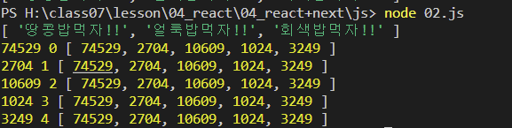

## 1. map 함수

# <!-- omit in toc -->   배열이 갖고있는 합수. 콜백함수에서 리턴된 값을 기반으로 새 배열 생성함

JavaScript에서 'map' 함수는 배열의 각 요소를 순회하면서, 각 요소에 대해 콜백 함수를 호출하고 그 반환값들을 모아서 새로운 배열을 만드는 함수입니다. 'map' 함수를 이용하면 코드의 중복을 줄이고 가독성을 높일 수 있습니다.

### 사용법

```
const numbers = [1, 2, 3, 4, 5];
const doubledNumbers = numbers.map(number => number * 2);
console.log(doubledNumbers); // [2, 4, 6, 8, 10]
```

### 참고자료

- [MDN Web Docs: Array.prototype.map()](https://developer.mozilla.org/ko/docs/Web/JavaScript/Reference/Global_Objects/Array/map)

---


```jsx
/*기존의 배열요소를 기반으로 새로운 배열요소를 만들어 리턴*/
let cats = ['땅콩', '얼룩', '회색'];
cats = cats.map(function (value, index) {
	return value + '밥먹자!!';
});
console.log(cats);
```

```jsx
/**
 * 모든수를 제곱하라
 */
// 배열선언
let numbers = [273, 52, 103, 32, 57];

// 배열의 모든 값을 제곱하여 numbers에 할당
numbers = numbers.map(function (value, index, array) {
	return value * value;
});

// numbers의 요소를 console.log 에 순회한다
numbers.forEach(console.log);
```

- 결과
  
