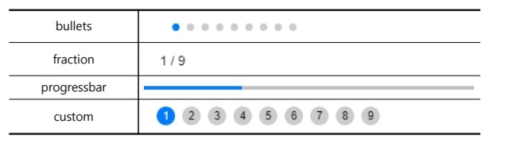

### 목차 <!-- omit in toc -->

1. [1. swiper](#1-swiper)
2. [2. 설치](#2-설치)
   1. [2.1. cdn](#21-cdn)
   2. [2.2. npm](#22-npm)
3. [3. 실행](#3-실행)
4. [4. 주요욥션](#4-주요욥션)
5. [5. 주요메서드](#5-주요메서드)
   1. [페이지네이션 종류](#페이지네이션-종류)
6. [6. centered large 예제](#6-centered-large-예제)
   1. [6.1. html](#61-html)
   2. [6.2. js](#62-js)
   3. [6.3. css](#63-css)

## 1. swiper

[!ref target='blank' text=':icon-link:swiper'](https://swiperjs.com/)

:::box
GreenSock Engaging the Internet GASP은 애니메이션을 쉽게 적용할 수 있는 라이브러리로 J-Query 보다 20배 이상 빠른 성능을 갖고 있다고 소개하고 있다.
gsap.to() 메소드를 이용해 자연스러운 움직임을 만들 수 있다
:::

## 2. 설치

### 2.1. cdn

```html
<link rel="stylesheet" href="https://cdn.jsdelivr.net/npm/swiper@11/swiper-bundle.min.css" />

<script src="https://cdn.jsdelivr.net/npm/swiper@11/swiper-bundle.min.js"></script>
```

### 2.2. npm

```bash
npm install swiper
```

## 3. 실행

> swiper 라이브러리를 적용하려면 html 구조를 아래와 같이 작성해야 한다.
> 슬라이드는 두단계로 래핑해야 한다.
> 컨트롤 요소는 슬라이드를 감싼 부모와 형제요소로 마크업 한다.

```html
<!-- Slider main container -->
<div class="swiper">
	<!-- Additional required wrapper -->
	<div class="swiper-wrapper">
		<!-- Slides -->
		<div class="swiper-slide">Slide 1</div>
		<div class="swiper-slide">Slide 2</div>
		<div class="swiper-slide">Slide 3</div>
		...
	</div>
	<!-- If we need pagination -->
	<div class="swiper-pagination"></div>

	<!-- If we need navigation buttons -->
	<div class="swiper-button-prev"></div>
	<div class="swiper-button-next"></div>

	<!-- If we need scrollbar -->
	<div class="swiper-scrollbar"></div>
</div>
```

```css
.swiper {
	width: 600px;
	height: 300px;
}
```

```js
const swiper = new Swiper('.swiper', {
	// 스와이퍼 방향 및 반복 여부
	direction: 'vertical',
	loop: true,
	// 페이지네이션 설정
	pagination: {
		el: '.swiper-pagination',
	},
	// 네비게이션 화살표 설정
	navigation: {
		nextEl: '.swiper-button-next',
		prevEl: '.swiper-button-prev',
	},
	// 스크롤바 설정
	scrollbar: {
		el: '.swiper-scrollbar',
	},
});
```

## 4. 주요욥션

| 옵션             | 설명                                                                                                                                                                                             |
| ---------------- | ------------------------------------------------------------------------------------------------------------------------------------------------------------------------------------------------ |
| `initialSlide`   | 초기 활성 슬라이드의 인덱스를 설정합니다. 기본값은 0입니다.                                                                                                                                      |
| `speed`          | 전환 속도(밀리초)를 설정합니다. 기본값은 300입니다.                                                                                                                                              |
| `spaceBetween`   | 슬라이드 사이의 간격(픽셀)을 설정합니다. 기본값은 0입니다.                                                                                                                                       |
| `slidesPerView`  | 한 번에 보여질 슬라이드 수를 설정합니다. 'auto'로 설정하면 슬라이드의 너비에 따라 자동으로 결정됩니다.                                                                                           |
| `centeredSlides` | 활성 슬라이드가 항상 중앙에 오도록 할지 여부를 결정합니다. 기본값은 false입니다.                                                                                                                 |
| `loop`           | 무한 롤링을 할지 여부를 결정합니다 (첫 번째 슬라이드에서 이전 버튼을 누르면 마지막 슬라이드로, 마지막 슬라이드에서 다음 버튼을 누르면 첫 번째 슬라이드로). 기본값은 false입니다.                 |
| `autoplay`       | 자동 재생 관련 설정을 합니다. `{ delay: 2500 }`와 같이 객체를 전달하면 2.5초 간격으로 자동 재생됩니다. `disableOnInteraction: false`를 추가하면 사용자의 스와이프 후에도 자동 재생이 계속됩니다. |
| `navigation`     | 이전/다음 버튼 사용 설정을 합니다. `{nextEl: '.swiper-button-next', prevEl: '.swiper-button-prev'}`와 같이 객체를 전달하면 지정된 엘리먼트가 네비게이션 버튼으로 작동합니다.                     |
| `pagination`     | 페이지네이션 설정을 합니다. `{el: '.swiper-pagination', clickable: true}`와 같은 형태로 객체를 전달하면 지정된 엘리먼트가 페이지네이션 역할을 하며, 클릭 가능합니다.                             |
| `scrollbar`      | 스크롤바 설정을 합니다.`{el: '.swiper-scrollbar', draggable: true}` 와 같은 형태로 객체를 전달하면 지정된 엘리먼트가 드래그 가능한 스크롤바로 작동합니다.                                        |
| `effect`         | 'slide', 'fade', 'cube', 'coverflow' 또는 'flip' 중 하나의 효과를 선택할 수 있습니다.'slide'가 기본값입니다.                                                                                     |
| `breakpoints`    | 화면 크기에 따라 서로 다른 설정을 적용하기 위한 옵션입니다. 객체 형태로 전달하며, 각 속성의 이름은 화면의 최소 너비(px)이고 값은 해당 너비에서 적용될 설정들의 객체입니다.                       |

## 5. 주요메서드

| 메서드                                          | 설명                                                                                                                                                                                                                 |
| ----------------------------------------------- | -------------------------------------------------------------------------------------------------------------------------------------------------------------------------------------------------------------------- |
| `swiper.slideNext()`                            | 다음 슬라이드로 이동합니다.                                                                                                                                                                                          |
| `swiper.slidePrev()`                            | 이전 슬라이드로 이동합니다.                                                                                                                                                                                          |
| `swiper.slideTo(index)`                         | 지정한 인덱스의 슬라이드로 이동합니다. 인덱스는 0부터 시작합니다.                                                                                                                                                    |
| `swiper.update()`                               | Swiper를 강제로 업데이트합니다. 일반적으로 크기 변경, 슬라이드 추가/삭제 등 후에 사용됩니다.                                                                                                                         |
| `swiper.destroy(deleteInstance, cleanupStyles)` | Swiper 인스턴스를 제거하고 필요에 따라 초기화할 때 추가된 모든 스타일을 제거할 수 있습니다. 첫 번째 매개변수가 true면 Swiper 인스턴스를 삭제하고 두 번째 매개변수가 true면 초기화시 추가된 모든 스타일을 제거합니다. |

### 페이지네이션 종류



## 6. centered large 예제

[!ref target='blank' text=':icon-play:미리보기'](./files/swiper.html)

### 6.1. html

```html
<div class="swiper-container">
	<div class="swiper-wrapper">
		<div class="swiper-slide"></div>
		<div class="swiper-slide"></div>
		<div class="swiper-slide"></div>
		<div class="swiper-slide"></div>
		<div class="swiper-slide"></div>
		<div class="swiper-slide"></div>
		<div class="swiper-slide"></div>
		<div class="swiper-slide"></div>
	</div>
	<!-- Add Pagination -->
	<div class="swiper-button-prev"></div>
	<div class="swiper-button-next"></div>
</div>
<!-- Swiper CSS -->
<link rel="stylesheet" href="https://unpkg.com/swiper/swiper-bundle.min.css" />

<!-- Swiper JS -->
<script src="//unpkg.com/swiper/swiper-bundle.min.js"></script>
```

### 6.2. js

```js
var swiper = new Swiper('.swiper-container', {
	slidesPerView: 3,
	centeredSlides: true,
	spaceBetween: 0,
	loop: true,
	allowTouchMove: false,
	navigation: {
		nextEl: '.swiper-button-next',
		prevEl: '.swiper-button-prev',
	},
	loopAdditionalSlides: 5,
});
```

### 6.3. css

```css
.swiper-container {
	padding: 100px 0;
}
.swiper-container .swiper-slide {
	transition: all 0.4s ease-in-out;
}
.swiper-container .swiper-slide img {
	width: 100%;
	display: block;
	transition: all 0.4s ease-in-out;
}
.swiper-container .swiper-slide.swiper-slide-active {
	z-index: 100;
}
.swiper-container .swiper-slide.swiper-slide-active img {
	transform: scale(1.7, 1.7);
}
```
