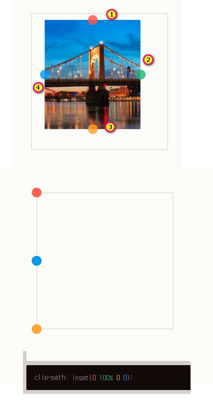

### 목차 <!-- omit in toc -->

- [1. 스크롤 효과를 만들어보자](#1-스크롤-효과를-만들어보자)
	- [1.1. 1단계-섹션1](#11-1단계-섹션1)
		- [1.1.1. 좌우이동 - css 메서드 활용](#111-좌우이동---css-메서드-활용)
	- [1.2. 2단계-섹션2](#12-2단계-섹션2)
		- [1.2.1. 상하이동 시간차-animate() 메서드 활용](#121-상하이동-시간차-animate-메서드-활용)
	- [1.3. 3단계-섹션3](#13-3단계-섹션3)
		- [1.3.1. 리빌효과-addClass() 메서드 활용](#131-리빌효과-addclass-메서드-활용)
	- [1.4. 4단계-섹션4](#14-4단계-섹션4)
		- [1.4.1. PIP스크롤](#141-pip스크롤)
	- [5단계-섹션5](#5단계-섹션5)
		- [가로방향의 스크롤을 만들어보자](#가로방향의-스크롤을-만들어보자)

## 1. 스크롤 효과를 만들어보자

### 1.1. 1단계-섹션1

#### 1.1.1. 좌우이동 - css 메서드 활용

+++ 예제

[!ref target='blank' text=':icon-play:미리보기'](./14/step1/play.html)

!!!

이 코드는 잠재적인 버그가 있다. 작성후 어떤 버그가 발생할수 있을지 예상해보자

!!!

+++ HTML

```html # html
<!DOCTYPE html>
<html lang="ko">
	<head>
		<meta charset="UTF-8" />
		<meta name="viewport" content="width=device-width, initial-scale=1.0" />
		<title>Document</title>
		<link rel="stylesheet" href="./css/jq-01.css" />
		<script src="https://code.jquery.com/jquery-3.7.1.min.js"></script>
		<script src="./js/jq-01.js" defer></script>
	</head>

	<body>
		<section class="section1">
			<h2>section1</h2>
			<div class="container">
				<div class="box box1 bg2"></div>
				<div class="box box2 bg3"></div>
			</div>
		</section>
		<section class="section2">
			<h2>section2</h2>
			<div class="box box1 bg4"></div>
			<div class="box box2 bg5"></div>
		</section>
		<section class="section3">
			<h2>section3</h2>
			<div class="box box1 bg2"></div>
			<div class="box box2 bg1"></div>
		</section>
		<section class="section4">
			<h2>section4</h2>
			<div class="box box1 bg2"></div>
			<div class="box box2 bg1"></div>
		</section>
		<section class="section5">
			<h2>section5</h2>
			<div class="box box1 bg2"></div>
			<div class="box box2 bg3"></div>
		</section>
	</body>
</html>
```

+++ CSS

```css # css
* {
	margin: 0;
	padding: 0;
	box-sizing: border-box;
}
:root {
	--bg1: #285dfb;
	--bg2: #537dfb;
	--bg3: #7e9efc;
	--bg4: #a9befd;
	--bg5: #d4dffe;
}
.bg1 {
	background-color: var(--bg1);
	color: var(--bg5);
}
.bg2 {
	background-color: var(--bg2);
	color: var(--bg4);
}
.bg3 {
	background-color: var(--bg3);
	color: var(--bg3);
}
.bg4 {
	background-color: var(--bg4);
	color: var(--bg2);
}
.bg5 {
	background-color: var(--bg5);
	color: var(--bg1);
}
section {
	overflow: hidden;
	text-align: center;
	width: 100%;
	height: 100vh;
}

section h2 {
	padding: 12vw 6vw;
}
```

```css # 애니메이트 효과 css
.box {
	display: inline-block; /* clamp (최소,기본,최대)최소, 최대가 명확한 경우 사용가능 */
	width: clamp(100px, 30%, 100%);
	height: 300px;
	transition: all 2s;
}
.box1 {
	transform: translateX(-200%);
}
.box2 {
	transform: translateX(200%);
}
.box.in {
	transform: translateX(-200%);
}
```

+++ JS

```js # jQuery
$(window).on('scroll', () => {
	let winSCT;
	const sections = $('section');
	winSCT = $(window).scrollTop();
	sections.each(function (idx, o) {
		$(o).addClass(`bg${idx + 1}`);
		const tg = $(this);
		const tgtop = tg.offset().top;
		if (winSCT > tgtop) {
			tg.find('.box').css('transform', 'translateX(0%)');
		} else if (winSCT > tgtop) {
			tg.find('.box').css('transform', 'translateX(0%)');
		} else if (winSCT > tgtop) {
			tg.find('.box').css('transform', 'translateX(0%)');
		}
	});
});
```

!!!

첫번째 섹션에 도달시 애니메이트가 실행된다. 반복문 내에서 순회하는 this 의 거리를 비교하고 있으므로 조건 추가시 다음 섹션의 거리를 비교하여 애니메이트가 실행된다.

!!!

+++

### 1.2. 2단계-섹션2

#### 1.2.1. 상하이동 시간차-animate() 메서드 활용

+++ 예제

[!badge icon='play' iconAlign='left' variant='info' size='xl' corners='round' text='미리보기' target='blank'](./14/step2/play.html)

+++ HTML

```html # html
<section class="section2">
	<h2>section2</h2>
	<div class="gallery">
		<div class="box bg3"></div>
		<div class="box bg4"></div>
		<div class="box bg5"></div>
	</div>
</section>
```

!!!

section2의 구조를 수정한다.

!!!

+++ CSS

```css # css
.section2 .gallery {
	margin-top: 10vw;
	position: relative;
	display: flex;
}

.section2 .gallery .box {
	width: 200px;
	height: 300px;
	position: absolute;
	opacity: 0;
	top: 100%;
}
.bg3 {
	left: 20%;
}
.bg4 {
	left: 45%;
}
.bg5 {
	right: 20%;
}
```

!!!

css를 추가한다.

!!!

+++ JQ

```js # jQuery
const sections = $('section');
let speed = Math.floor(sections.outerHeight() * 0.2);
let topArr = [];
let winSCT;

sections.each((idx, section) => {
	$(section).addClass(`bg${idx + 1}`);
	const sectionTop = $(section).offset().top;
	topArr.push(sectionTop);
});

$(window).on('scroll', () => {
	winSCT = $(window).scrollTop();
	if (winSCT > topArr[0] winSCT < topArr[1] - speed) {
		sections.eq(0).find('.box').css('transform', 'translateX(0%)');
	}
	if (winSCT > topArr[1] winSCT < topArr[2]) {
		sections.eq(1).find('.bg3').stop().delay(100).animate({ top: 0, opacity: 1 }, 500, 'swing');
		sections.eq(1).find('.bg4').stop().delay(200).animate({ top: -100, opacity: 1 }, 800, 'swing');
		sections.eq(1).find('.bg5').stop().delay(300).animate({ top: -200, opacity: 1 }, 1100, 'swing');
	}
});
```

!!! 1단계의 코드는 크게 4가지의 버그가 발생할수 있다.

1. 중복된 조건: if (winSCT > tgtop)같은 조건을 세번 반복 하여 비교하고 있다. 같은 조건이 성립되면 .box 요소의 스타일 또한 여러번 설정될 수 있다.
   1. 섹션별 offsetTop 값을 배열로 저장하여 이벤트 핸들러에 전달한다.
2. 부적절한 비교 연산자: 모든 else if 문의 조건이 winSCT > tgtop으로 설정되어 있으므로 첫 번째 if 문과 동일한 조건이다. 결국 두 번째와 세 번째 else if 문은 실행되지 않는다.
   1. 배열의 인덱스 번호를 활용하여 조건을 명확하게 지정한다.
3. 변수 범위(scope): winSCT, sections, tg, 그리고 tgtop 변수는 모두 함수 내부에서 선언되었다. 각 섹션 반복문마다 새로운 변수 인스턴스가 생성되므로 원하는 결과를 얻을 수 없을 수 있습니다.
   1. 전역변수로 수정한다.
4. 중첩된 스크롤 이벤트 핸들러: 이벤트 핸들러 함수를 최상위 레벨로 작성하게 될경우 추후 하위에 다른 이벤트핸들러를 포함하게 되어 예기치 못한 동작을 초래할수 있다.
   1. 반복문과 이벤트 핸들러를 분리한다.

!!!

+++

### 1.3. 3단계-섹션3

#### 1.3.1. 리빌효과-addClass() 메서드 활용

> 마스크효과를 구현해보자

+++ 예제

[!ref target='blank' text=':icon-play:미리보기'](./14/step3/play.html)

+++ HTML

```html # html
<section class="section3">
	<div class="item">
		<h2>section3</h2>
		<figure>
			
			<figcaption>yum yum</figcaption>
		</figure>
	</div>
	<div class="item">
		<p>Lorem ipsum dolor sit amet consectetur adipisicing elit. Saepe est nostrum amet eligendi quas fugit libero cumque deserunt voluptate placeat dolorum culpa praesentium reiciendis, aliquid ad illum laborum, harum ratione.</p>
	</div>
</section>
```

+++ CSS

```css # css
.section3 {
	display: flex;
	color: #333;
	gap: 2rem;
}

.section3 .item:nth-child(1) {
	flex-basis: 60%;
}

.section3 .item:nth-child(2) {
	flex-basis: 40%;
	align-self: center;
}

.section3 figure {
	position: relative;
	box-shadow: -1rem 1rem 3rem -2rem rgba(0, 0, 0, 0.5);
}

.section3 figure:before {
	position: absolute;
	top: 0;
	right: 0;
	bottom: 0;
	left: 0;
	background: var(--bg1);
	transition: clip-path 0.8s cubic-bezier(0.18, 0.89, 0.32, 1.28);
}

.section3 figure img {
	width: 100%;
	display: block;
	clip-path: inset(0 100% 0 0);
	/* duration 0.6 delay 0.3 */
	transition: clip-path 0.6s 0.3s cubic-bezier(0.18, 0.89, 0.32, 1.28);
}

.section3 figure figcaption {
	position: absolute;
	top: 20px;
	right: 20px;
	padding: 10px;
	font-weight: bold;
	text-transform: uppercase;
	color: #fff;
	background: var(--bg1);
	mix-blend-mode: difference;
	transition: clip-path 0.3s 0.9s cubic-bezier(0.18, 0.89, 0.32, 1.28);
}

.section3 figure::before,
.section3 figure figcaption {
	clip-path: inset(0 0 0 100%);
}

.section3.is-animated figure::before,
.section3.is-animated figure img,
.section3.is-animated figure figcaption {
	clip-path: inset(0);
}
```

!!!

1. `clip-path: inset(0 100% 0 0);` inset() 함수를 사용하여 요소의 보이는 부분을 설정. inset() 함수는 사각형 형태의 클리핑 영역을 만들며, 인수는 각각 상단, 오른쪽, 하단, 왼쪽 변에서 얼마나 안쪽으로 들어가는지를 나타냄. 결과적으로 상단에서는 내부로 들어가지 않고(0), 오른쪽에서는 요소 너비 전체만큼 내부로 들어간다(100%).
   - 
2. 참조링크 [!ref target='blank' text=':icon-link:클립패스생성기'](https://bennettfeely.com/clippy/)
3. 참조링크 [!ref target='blank' text=':icon-link:MDN'](https://developer.mozilla.org/en-US/docs/Web/CSS/clip-path)
4. `.section3` 에 `.is-animated` 클래스가 추가되면 clip-path의 좌표를 변경한다.

!!!

+++ JQ

```js # javascript
...생략
if (winSCT > topArr[2] && winSCT < topArr[3]-speed) {
	sections.eq(2).addClass('is-animated');
}
```

!!!

조건문을 추가한다.

!!!

+++

### 1.4. 4단계-섹션4

#### 1.4.1. PIP스크롤

> 화면안의 화면이 스크롤 되는 효과를 만들어보자

+++ 예제

!!!

아래의 이미지 파일을 다운로드 한다

!!!

[!badge target='blank' variant='primary' size='l' text='이미지파일' icon='file'](./14/step4/image.zip)

[!ref target='blank' text=':icon-play:미리보기'](./14/step4/play.html)

+++ HTML

```html # html
<section class="section4">
	<h2>section4</h2>
	<div class="container">
		<div class="item left pa">
			<div class="mockup pc">
				<div class="mask"></div>
				
			</div>
			<div class="mockup mobile">
				<div class="mask"></div>
				
			</div>
		</div>
		<div class="item right bg1 pa"></div>
	</div>
</section>
```

+++ CSS

```css # css
.section4 .container {
	display: flex;
	position: relative;
}
.pa {
	position: absolute;
	top: 0;
}

.item {
	height: 30vw;
}
.left {
	width: 60vw;
	transition: left 1s ease-in-out;
	left: -100%;
}
.right {
	width: 40vw;
	right: 0;
}
.is-animated .left {
	left: 0;
}
.left .mockup img,
.left .mockup .mask {
	position: absolute;
	top: 0;
	left: 0;
}
.left .mockup.pc {
	margin-left: clamp(5%, 100px, 10%);
	position: relative;
	width: 60%;
	height: 100%;
}

.left .mockup.pc .mask {
	z-index: 3;
	width: 32.3vw;
	height: 61.8%;
	overflow: hidden;
	top: 6%;
	left: 5.2%;
}
.left .mockup.pc img.screen {
	z-index: 1;
	width: 100%;
}
.left .mockup.pc img.device {
	z-index: 1;
	width: 100%;
}
/* mobile */
.left .mockup.mobile {
	position: relative;
	top: -76%;
	left: 58%;
	width: 20%;
	height: 60%;
	z-index: 99;
}

.left .mockup.mobile .mask {
	z-index: 999;
	width: 10.5vw;
	height: 100%;
	overflow: hidden;
	top: 10.8%;
	left: 7%;
	border-radius: 16px 16px 0 0;
}
.left .mockup.mobile img.screen {
	z-index: 1;
	width: 100%;
}
.left .mockup.mobile img.device {
	z-index: 1;
	width: 100%;
}
```

+++ JQ

```js # javascript
$(() => {
	const sections = $('section');
	let speed = Math.floor(sections.outerHeight() * 0.3);
	let topArr = [];
	let winSCT;

	sections.each((idx, section) => {
		$(section).addClass(`bg${idx + 1}`);
		const sectionTop = $(section).offset().top;
		topArr.push(sectionTop);
	});

	/* 스크롤함수 */
	$(window).on('scroll', () => {
		winSCT = $(window).scrollTop();
		if (winSCT > topArr[0] && winSCT < topArr[1] - speed) {
			sections.eq(0).find('.box').css('transform', 'translateX(0%)');
		}

		if (winSCT > topArr[1] && winSCT < topArr[2] - speed) {
			sections.eq(1).find('.bg3').stop().delay(100).animate({ top: 0, opacity: 1 }, 500, 'swing');
			sections.eq(1).find('.bg4').stop().delay(200).animate({ top: -100, opacity: 1 }, 800, 'swing');
			sections.eq(1).find('.bg5').stop().delay(300).animate({ top: -200, opacity: 1 }, 1100, 'swing');
		}

		if (winSCT > topArr[2] && winSCT < topArr[3] - speed) {
			console.log(winSCT > topArr[2] && winSCT < topArr[3]);
			sections.eq(2).addClass('is-animated');
		}
		if (winSCT > topArr[3] && winSCT < topArr[4]) {
			sections.eq(3).addClass('is-animated');
		}
	});
	pipScroll();
	function pipScroll() {
		const section = sections.eq(3);
		const devices = ['.mockup.pc', '.mockup.mobile'];

		$.each(devices, function (i, deviceEl) {
			const device = section.find(deviceEl);
			const screen = device.find('.mask>img');
			const mask = device.find('.mask');
			const heightDifference = screen.innerHeight() - mask.innerHeight();
			console.log(device.innerHeight());
			console.log(screen.innerHeight());

			device.on({
				mouseenter: function () {
					if (section.hasClass('is-animated')) {
						screen.stop().animate({ top: -heightDifference }, 1000);
					}
				},
				mouseleave: function () {
					if (section.hasClass('is-animated')) {
						screen.stop().animate({ top: 0 }, 1000);
					}
				},
			});
		});
	}
}); //jQuery
```

+++

### 5단계-섹션5

#### 가로방향의 스크롤을 만들어보자

+++ 예제

[!ref target='blank' text=':icon-play:미리보기'](./14/step5/play.html)

+++ HTML

```html # html

```

+++ CSS

```css # css

```

+++ JS

```js # javascript

```

+++
