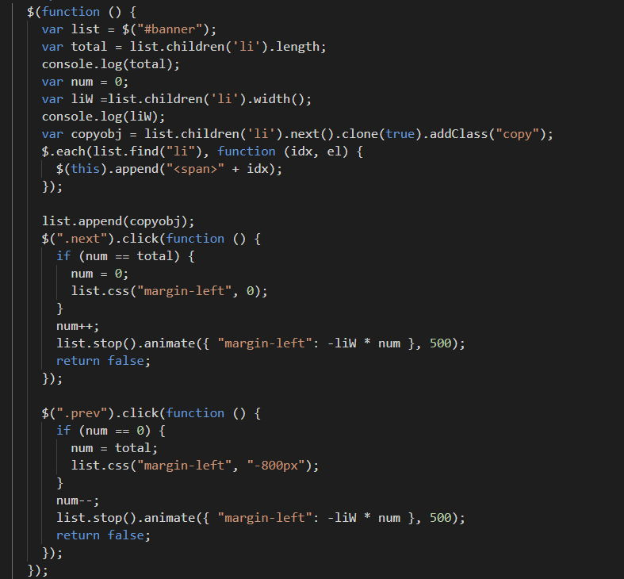
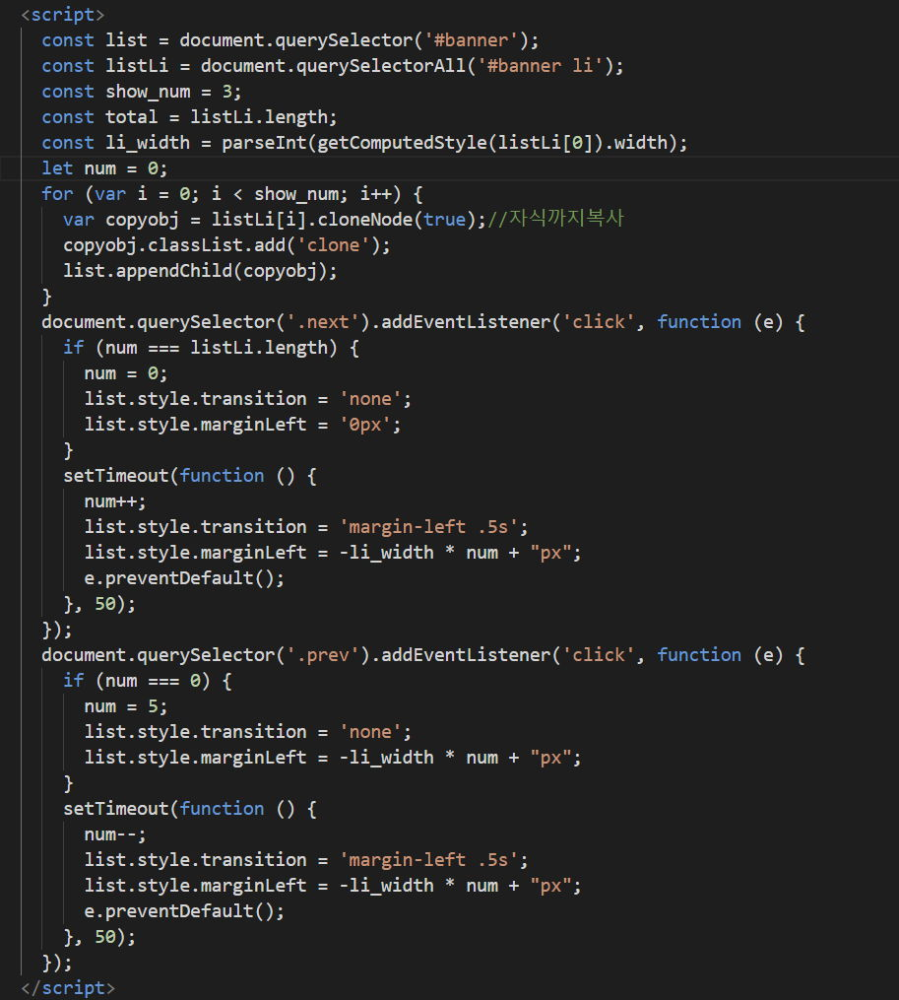

# 롤링 슬라이드 배너 <!-- omit in toc -->

### 목차 <!-- omit in toc -->

> 롤링 슬라이드 배너를 구현해보자

+++ 지시문

[!badge icon='download' iconAlign='left' variant='primary' size='xl' corners='round' text='파일다운로드' target='blank'](./files/roll/images.zip)

[!badge icon='play' iconAlign='left' variant='info' size='l' corners='round' text='롤링배너 미리보기' target='blank'](./files/rollq.html)

+++ HTML

> `<head>` 태그 사이에 `<link rel="stylesheet" href="https://fonts.googleapis.com/css2?family=Material+Symbols+Outlined:opsz,wght,FILL,GRAD@20..48,100..700,0..1,-50..200" />` 를 추가한다.

> `</body>` 위에 `<script src='https://code.jquery.com/jquery-3.7.1.min.js'></script>` 를 추가한다.

```html #
<h1>롤링 슬라이드 배너 만들기</h1>
<div id="banner_wrap">
	<div id="frame">
		<ul id="banner">
			<li>
				<a href="#"></a>
			</li>
			<li>
				<a href="#"></a>
			</li>
			<li>
				<a href="#"></a>
			</li>
			<li>
				<a href="#"></a>
			</li>
			<li>
				<a href="#"></a>
			</li>
			<li>
				<a href="#"></a>
			</li>
			<li>
				<a href="#"></a>``
			</li>
		</ul>
	</div>
	<p>
		<a href="#" class="prev">
			<span class="material-symbols-outlined"> arrow_circle_left </span>
		</a>
		<a href="#" class="next">
			<span class="material-symbols-outlined"> arrow_circle_right </span>
		</a>
	</p>
</div>
```

+++CSS

```css #
* {
	margin: 0;
	padding: 0;
	list-style: none;
	box-sizing: border-box;
}

ul {
	display: flex;
}

h1 {
	text-align: center;
}

li {
	flex: 0 0 80px;
}

a {
	display: block;
}

img {
	width: 100%;
}

#banner_wrap {
	width: 300px;
	padding: 10px 20px;
	margin: auto;
	background: #dfdfdf;
}

#banner {
	width: calc(80px * 7);
	background: #ff000055;
	height: 80px;
}

#frame {
	width: calc(80px * 3);
	height: 80px;
	position: relative;
	background: #10b3ffa1;
	overflow: hidden;
	margin: 10px auto;
}
```

+++ JS

### 제이쿼리 <!-- omit in toc -->


+++ JS

### 자바스크립트 <!-- omit in toc -->


+++
