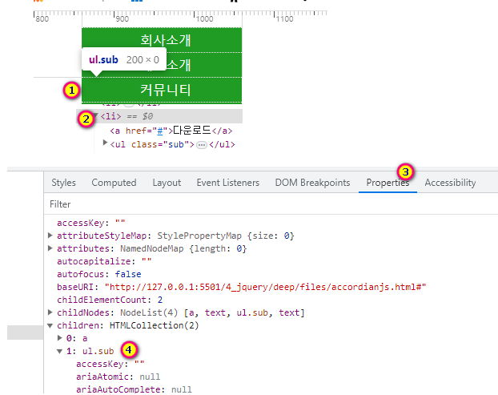

# 아코디언메뉴 <!-- omit in toc -->

### 목차 <!-- omit in toc -->
- [1. 아코디언메뉴](#1-아코디언메뉴)
	- [1.1. 제이쿼리](#11-제이쿼리)
	- [1.2. 자바스크립트](#12-자바스크립트)

# 1. 아코디언메뉴

가변높이의 아코디언 메뉴 만들어보자

## 1.1. 제이쿼리

+++ 지시문
[!badge icon='play' iconAlign='left' variant='info' size='xl' corners='round' text='아코디언' target='blank'](./files/accordian.html)
투뎁스의 높이를 스크립트에서 가변적으로 조작하는 아코디언 메뉴를 만들어봅시다.
+++ HTML

```html #
<!DOCTYPE html>
<html lang="ko">
	<head>
		<meta charset="UTF-8" />
		<title>Document</title>
	</head>

	<body>
		<ul class="gnb">
			<li>
				<a href="#">회사소개</a>
				<ul class="sub">
					<li><a href="#">submenu1</a></li>
					<li><a href="#">submenu2</a></li>
					<li><a href="#">submenu3</a></li>
					<li><a href="#">submenu4</a></li>
					<li><a href="#">submenu5</a></li>
				</ul>
			</li>
			<li>
				<a href="#">제품소개</a>
				<ul class="sub">
					<li><a href="#">submenu1</a></li>
					<li><a href="#">submenu2</a></li>
					<li><a href="#">submenu3</a></li>
					<li><a href="#">submenu4</a></li>
					<li><a href="#">submenu5</a></li>
					<li><a href="#">submenu6</a></li>
					<li><a href="#">submenu7</a></li>
				</ul>
			</li>
			<li>
				<a href="#">커뮤니티</a>
				<ul class="sub">
					<li><a href="#">submenu1</a></li>
					<li><a href="#">submenu2</a></li>
					<li><a href="#">submenu3</a></li>
				</ul>
			</li>
			<li>
				<a href="#">다운로드</a>
				<ul class="sub">
					<li><a href="#">submenu1</a></li>
					<li><a href="#">submenu2</a></li>
				</ul>
			</li>
		</ul>
		<script src="https://code.jquery.com/jquery-3.7.1.min.js"></script>
	</body>
</html>
```

+++ CSS

```css #
* {
	margin: 0;
	padding: 0;
}

html {
	font-size: 62.5%;
}

body {
	font-size: 1.6rem;
}

a {
	text-decoration: none;
}

ul,
li {
	list-style: none;
}

.gnb {
	width: 20rem;
	margin: 2rem auto 0;
	text-align: center;
	text-indent: 1rem;
}

.gnb > li > a {
	display: block;
	background: #390;
	cursor: pointer;
	line-height: 3rem;
	border-top: 0.1rem dotted #fff;
	color: #fff;
}

.gnb .sub li {
	line-height: 3rem;
	background: #cf9;
	padding: 1rem;
}

.gnb .sub li a {
	display: block;
	width: 100%;
	height: 100%;
	color: #222;
}

.gnb .sub li:hover {
	background: #cf0;
}

.sub {
	height: 0;
	transition: height 0.5s;
	overflow: hidden;
}
```

+++ JQ

```js
$(() => {
	$('.gnb>li').click(function () {
		let tg = $(this);
		let subH = $('.sub>li').innerHeight();
		let subLen = tg.find('li>a').length;
		let subTH = subH * subLen;
		$('.sub').removeClass('on').outerHeight(0);
		tg.find('.sub').addClass('on').outerHeight(subTH);
	});
});
```

+++

## 1.2. 자바스크립트

+++ 지시문
[!badge icon='play' iconAlign='left' variant='info' size='xl' corners='round' text='아코디언' target='blank'](./files/accordianjs.html)
투뎁스의 높이를 스크립트에서 가변적으로 조작하는 아코디언 메뉴를 만들어봅시다.
+++ HTML

```html #
<!DOCTYPE html>
<html lang="ko">
	<head>
		<meta charset="UTF-8" />
		<title>Document</title>
	</head>

	<body>
		<ul class="gnb">
			<li>
				<a href="#">회사소개</a>
				<ul class="sub">
					<li><a href="#">submenu1</a></li>
					<li><a href="#">submenu2</a></li>
					<li><a href="#">submenu3</a></li>
					<li><a href="#">submenu4</a></li>
					<li><a href="#">submenu5</a></li>
				</ul>
			</li>
			<li>
				<a href="#">제품소개</a>
				<ul class="sub">
					<li><a href="#">submenu1</a></li>
					<li><a href="#">submenu2</a></li>
					<li><a href="#">submenu3</a></li>
					<li><a href="#">submenu4</a></li>
					<li><a href="#">submenu5</a></li>
					<li><a href="#">submenu6</a></li>
					<li><a href="#">submenu7</a></li>
				</ul>
			</li>
			<li>
				<a href="#">커뮤니티</a>
				<ul class="sub">
					<li><a href="#">submenu1</a></li>
					<li><a href="#">submenu2</a></li>
					<li><a href="#">submenu3</a></li>
				</ul>
			</li>
			<li>
				<a href="#">다운로드</a>
				<ul class="sub">
					<li><a href="#">submenu1</a></li>
					<li><a href="#">submenu2</a></li>
				</ul>
			</li>
		</ul>
		<script src="https://code.jquery.com/jquery-3.7.1.min.js"></script>
	</body>
</html>
```

+++ CSS

```css #
* {
	margin: 0;
	padding: 0;
}

html {
	font-size: 62.5%;
}

body {
	font-size: 1.6rem;
}

a {
	text-decoration: none;
}

ul,
li {
	list-style: none;
}

.gnb {
	width: 20rem;
	margin: 2rem auto 0;
	text-align: center;
	text-indent: 1rem;
}

.gnb > li > a {
	display: block;
	background: #390;
	cursor: pointer;
	line-height: 3rem;
	border-top: 0.1rem dotted #fff;
	color: #fff;
}

.gnb .sub li {
	line-height: 3rem;
	background: #cf9;
	padding: 1rem;
}

.gnb .sub li a {
	display: block;
	width: 100%;
	height: 100%;
	color: #222;
}

.gnb .sub li:hover {
	background: #cf0;
}

.sub {
	height: 0;
	transition: height 0.5s;
	overflow: hidden;
}
```

+++ JQ

```js
$(() => {
	$('.gnb>li').click(function () {
		let tg = $(this);
		let subH = $('.sub>li').innerHeight();
		let subLen = tg.find('li>a').length;
		let subTH = subH * subLen;
		$('.sub').removeClass('on').outerHeight(0);
		tg.find('.sub').addClass('on').outerHeight(subTH);
	});
});
```

+++ JS

```js
const depth1 = document.querySelectorAll('.gnb>li');
const sub = document.querySelectorAll('.sub');
depth1.forEach((el, idx) => {
	el.addEventListener('click', function () {
		let tg = this;
		let subH = document.querySelector('.sub>li').clientHeight;
		let subLen = tg.children[1].childElementCount;
		let subHT = subH * subLen;
		console.log(subHT);
		tg.querySelector('.sub').classList.remove('on');
		subOff();
		tg.querySelector('.sub').style.height = subHT + 'px';
	});
});
function subOff() {
	sub.forEach((el) => {
		el.classList.remove('on');
		el.style.height = 0;
	});
}
```


+++
