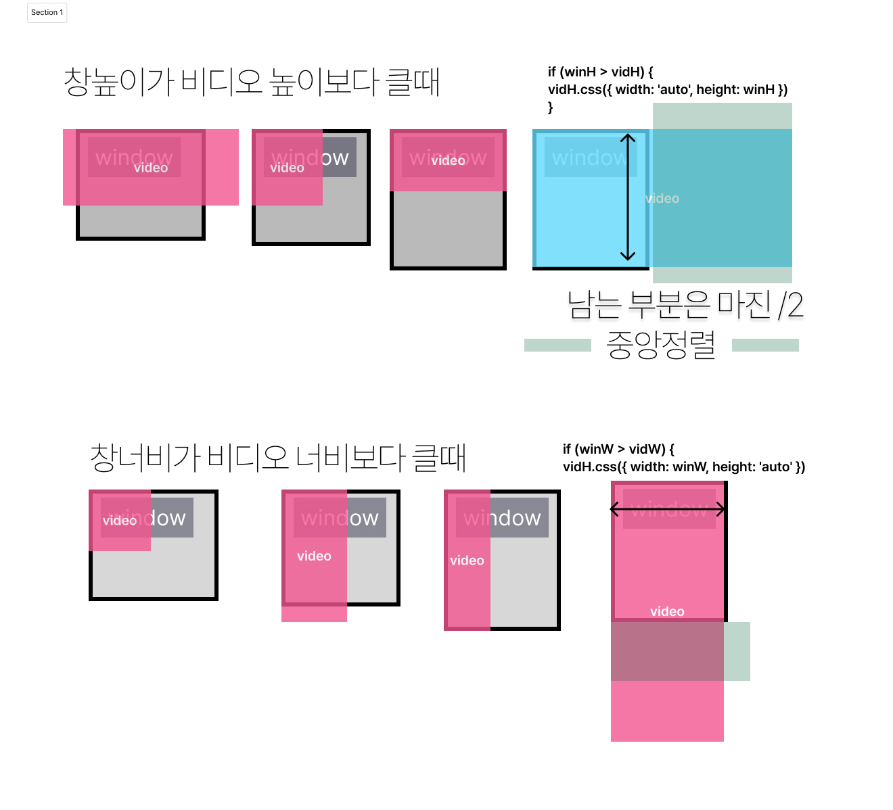

# 풀사이즈 미디어 <!-- omit in toc -->
### 목차 <!-- omit in toc -->

- [1. 가변크기의 풀사이즈 미디어](#1-가변크기의-풀사이즈-미디어)
	- [1.1. html 작성](#11-html-작성)
	- [1.2. css 작성](#12-css-작성)
	- [1.3. 제이쿼리로 작성](#13-제이쿼리로-작성)
	- [1.4. 자바스크립트로 작성](#14-자바스크립트로-작성)

# 1. 가변크기의 풀사이즈 미디어

가변크기의 풀사이즈 미디어를 구현해보자

[!ref target='blank' text=':icon-download:파일다운로드'](./files/imgs.zip)

## 1.1. html 작성

```html # html
<div id="wrap">
	<div class="main-video">
		<video autoplay muted playsinline loop poster="imgs/images.jpg" id="mainVideo">
			<source src="./imgs/main.mp4" />
		</video>
	</div>
</div>
<script src="https://code.jquery.com/jquery-3.6.0.min.js"></script>
```

## 1.2. css 작성

```css # css
* {
	margin: 0;
	padding: 0;
}

ul,
li {
	list-style: none;
}

/* 메인비디오 */
.main-video {
	position: relative;
	width: 100%;
	height: 100vh;
	overflow: hidden;
}

.main-video video {
	width: 100%;
	height: auto;
	margin-left: 0;
	position: absolute;
}
```

:::comment_box
아래는 창의 크기와 미디어 파일의 크기가 다를 경우를 그림으로 그린것이다.


:::

## 1.3. 제이쿼리로 작성

[!ref target='blank' text=':icon-play:미리보기'](./files/full_media.html)

### STEP1 <!-- omit in toc -->

> $(function() {})은 jQuery에서 사용되는 단축 구문으로, 문서가 준비되었을 때 함수를 실행하는 역할을 하며 $(document).ready() 메서드와 동일한 역할을 수행한다.
> 사용자가 강제 새로고침을 발생시켰을때 함수를 실행하기 위해 추가한다

```js # jQuery
$(function () {
	// 페이지 로드 및 리로드 시 실행할 함수
});
```

### STEP2 <!-- omit in toc -->

> 변수초기화
> 반복 사용할 값들을 변수로 저장한다.

```js # jQuery
$(function () {
	const win = $(window);
	let winH = win.innerHeight(); //창의높이
	let winW = win.innerWidth(); //창너비
	const vid = $('#mainVideo');
	let vidH = vid.innerHeight(); //비디오높이
	let vidW = vid.innerWidth(); //비디오너비
	const vidWrap = vid.parent('.main-video'); //비디오를 감싸고 있는 부모요소
});
```

### STEP3 <!-- omit in toc -->

> 함수작성
>
> 윈도우 크기를 가져와서 비디오크기를 반응형으로 만드는 함수를 작성한다

<details markdown='block'>
<summary>
🐨 제이쿼리로 크기 얻기
</summary>
<pre>
  $("el").height() : 내부높이
  $("el").innerHeight() : 내부높이 + padding
  $("el").outerHeight() : 내부높이 + padding + border
  $("el").outerHeight(true) : 내부높이 + padding + border + margin
</pre>
</details>

```js # jQuery
function videoResizeFn() {
	// 창의 크기는 가변적이므로 값을 재할당한다
	winH = win.innerHeight();
	winW = win.innerWidth();
	vidH = vid.innerHeight();
	vidW = vid.innerWidth();

	//1. 비디오박스높이=창높이 : 기본으로 창높이로 설정 너비 100%
	//	vidWrap
	vidWrap.css({ width: 100 + '%', height: winH });
	//2. 비디오 가로크기와 세로크기를 비디오박스(창크기) 보다 작으면 비디오박스와 같거나 크게 설정한다.
	if (winH > vidH) {
		//창높이가 비디오 높이보다 크면
		vid.css({ width: 'auto', height: winH }); //비디오의 높이를 창높이에 맞춘다
		vid.css({ left: '50%', top: '50%', transform: 'translate(-50%,-50%)' });
	}
	if (winW > vidW) {
		//창너비보다 비디오너비보다 크면
		vid.css({ width: winW, height: 'auto' }); //비디오의 너비를 창너비에 맞춘다
		vid.css({ left: '50%', top: '50%', transform: 'translate(-50%,-50%)' });
	}
}
```

### STEP4 <!-- omit in toc -->

> 함수호출
> 윈도우 크기 변경시와 리로드시 호출한다.

```js
$(window).resize(function () {
	videoResizeFn();
});
videoResizeFn();
```

## 1.4. 자바스크립트로 작성

[!ref target='blank' text=':icon-play:미리보기'](./files/full_media-js.html)

### STEP1 <!-- omit in toc -->

> 변수초기화

```js
const win = window;
let winH = win.innerHeight; //창의높이
let winW = win.innerWidth; //창너비
const vid = document.querySelector('#mainVideo');
let vidH = vid.clientHeight; //비디오높이
let vidW = vid.clientWidth; //비디오너비
const vidWrap = vid.parentNode;
```

### STEP2 <!-- omit in toc -->

> 함수작성

<details markdown='block'>
<summary>
🐨 자바스크립트로 크기얻기
</summary>
<pre>
window.innerWidth	스크롤 바를 포함하지 않는 창 너비
window.innerHeight	스크롤 바를 포함하지 않은 창 높이
window.outerWidth	스크롤 바를 포함, 창의 너비
window.outerHeight	스크롤 바를 포함한 창의 높이
el.clientHeight	padding을 포함한 높이
el.scrollHeight	padding을 포함한 화면 상에 표시되지 않은 콘텐츠를 포함한 높이
el.offsetHeight	border, padding, 스크롤 바를 포함한 높이
</pre>
</details>

```js
function videoResizeFn() {
	// 변경되는 거라 위의 변수를 재지정
	winH = win.innerHeight;
	winW = win.innerWidth;
	vidH = vid.clientHeight;
	vidW = vid.clientWidth;
	console.log(winH, winW, vidH, vidW);
	//1. 비디오박스높이=창높이 : 기본으로 창높이로 설정 너비 100%
	//	vidWrap
	vidWrap.style.width = winW;
	vidWrap.style.height = winH;

	//2. 비디오 가로크기와 세로크기를 비디오박스(창크기) 보다 작으면 비디오박스와 같거나 크게 설정한다.
	if (winH > vidH) {
		vid.style.width = 'auto';
		vid.style.height = winH;
		vid.style.left = `50%`;
		vid.style.top = `50%`;
		vid.style.transform = `translate(-50%,-50%)`;
	}

	if (winW > vidW) {
		vid.style.width = winW;
		vid.style.height = 'auto';
		vid.style.left = `50%`;
		vid.style.top = `50%`;
		vid.style.transform = `translate(-50%,-50%)`;
	}
}
```

### STEP3 <!-- omit in toc -->

> 함수호출
> 윈도우 리로드 시와 리사이즈시에 함수호출

```js
addEventListener('load', videoResizeFn);
addEventListener('resize', videoResizeFn);
```
