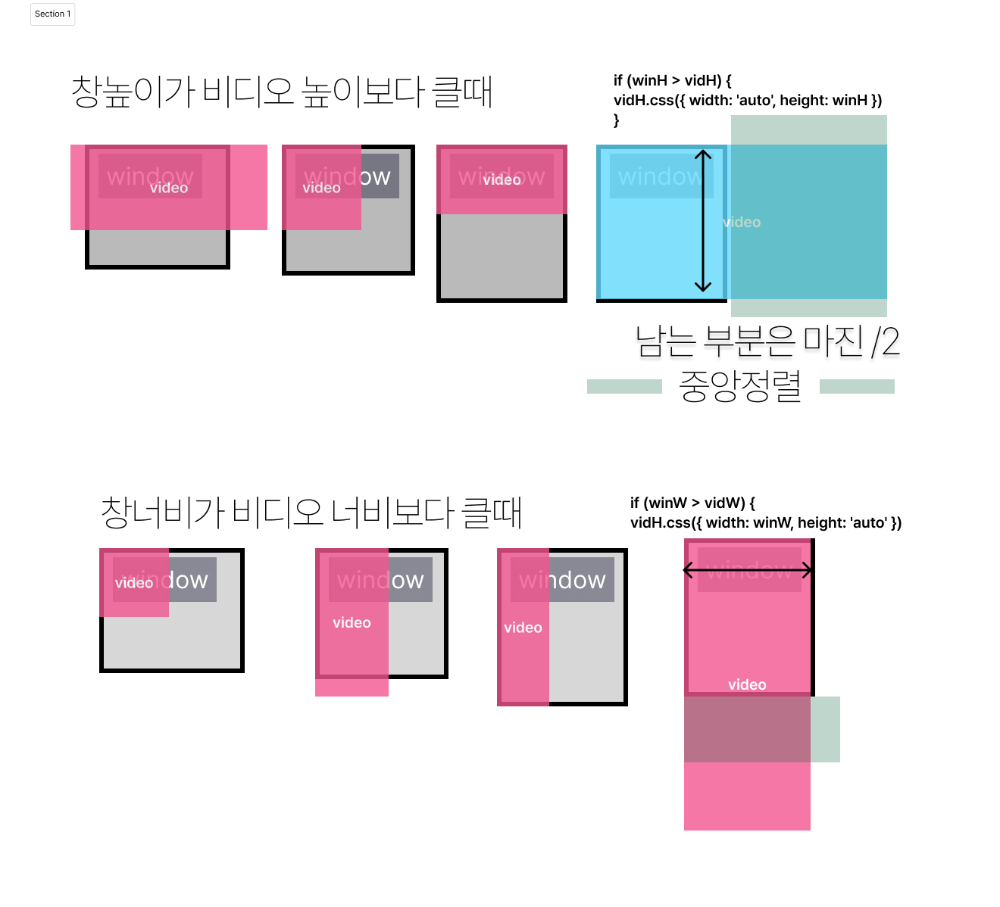

# 풀사이즈 미디어 <!-- omit in toc -->

### 목차 <!-- omit in toc -->

# 1. 가변크기의 풀사이즈 미디어

가변크기의 풀사이즈 미디어를 구현해보자

[!ref target='blank' text=':icon-download:파일다운로드'](./files/imgs.zip)

[!ref target='blank' text=':icon-play:미리보기'](./files/full_media.html)

<details markdown='block'>
<summary>
🐨 제이쿼리로 크기 얻기
</summary>
<pre>
  jquery.height() : 내부높이
  jquery.innerHeight() : 내부높이 + padding
  jquery.outerHeight() : 내부높이 + padding + border
  jquery.outerHeight(true) : 내부높이 + padding + border + margin
</pre>
</details>
<details markdown='block'>
<summary>
🐨 자바스크립트로 크기얻기
</summary>
<pre>
window.innerWidth	스크롤 바를 포함하지 않는 창 너비
window.innerHeight	스크롤 바를 포함하지 않은 창 높이
window.outerWidth	스크롤 바를 포함, 창의 너비
window.outerHeight	스크롤 바를 포함한 창의 높이
clientHeight	padding을 포함한 높이
scrollHeight	padding을 포함한 화면 상에 표시되지 않은 콘텐츠를 포함한 높이
offsetHeight	border, padding, 스크롤 바를 포함한 높이
</pre>
</details>

```html # html
<div id="wrap">
	<div class="main-video">
		<video autoplay muted playsinline loop poster="imgs/images.jpg" id="mainVideo">
			<source src="./imgs/main.mp4" />
		</video>
	</div>
</div>
<script src="https://code.jquery.com/jquery-3.6.0.min.js"></script>
```

```css # css
* {
	margin: 0;
	padding: 0;
}

ul,
li {
	list-style: none;
}

/* 메인비디오 */
.main-video {
	position: relative;
	width: 100%;
	height: 100vh;
	overflow: hidden;
}

.main-video video {
	width: 100%;
	height: auto;
	margin-left: 0;
	position: absolute;
}
```

```js # jQuery
let winH = $(window).innerHeight(); //창의높이
let winW = $(window).innerWidth(); //창너비
let vidH = $('#mainVideo').innerHeight(); //비디오높이
let vidW = $('#mainVideo').innerWidth(); //비디오너비

setInterval(videoResizeFn, 100);

$(window).resize(function () {
	videoResizeFn();
});

function videoResizeFn() {
	//윈도우 크기 가져와서 비디오크기 반응형으로 만드는 함수 // 변경되는 거라 위의 변수를 재지정
	winH = $(window).innerHeight(); //969
	winW = $(window).innerWidth();
	vidH = $('#mainVideo').innerHeight(); //1080
	vidW = $('#mainVideo').innerWidth();

	//1. 비디오박스높이=창높이 : 기본으로 창높이로 설정 너비 100%
	//	비디오 뷰박스(Video ViewBox)
	$('.main-video').css({ width: 100 + '%', height: winH });

	//2. 비디오 가로크기와 세로크기를 비디오박스(창크기) 보다 작으면 비디오박스와 같거나 크게 설정한다.
	if (winH > vidH) {
		//창높이가 비디오 높이보다 크면
		$('#mainVideo').css({ width: 'auto', height: winH }); //비디오의 높이를 창높이에 맞춘다
	}

	if (winW > vidW) {
		//창너비보다 비디오너비보다 크면
		$('#mainVideo').css({ width: winW, height: 'auto' }); //비디오의 너비를 창너비에 맞춘다
	}

	//3. (비디오높이-창높이)/2= -마진탑값   : 비디오 수직 가운데 정렬
	//   (비디오너비-창너비)/2= -마진레프트값 : 비디오 수평 가운데 정렬
	$('#mainVideo').css({ marginTop: (winH - vidH) / 2, marginLeft: (winW - vidW) / 2 }); //-55.5=(969-1080)/2
}
```


