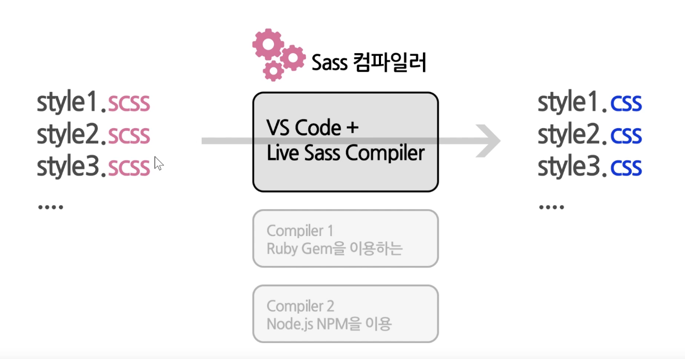
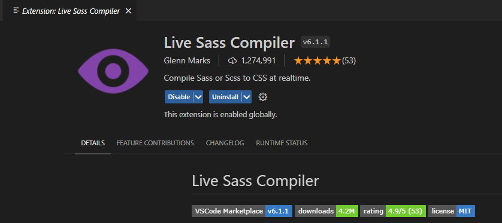
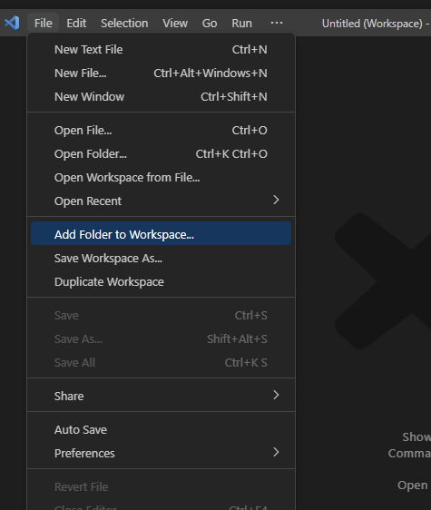
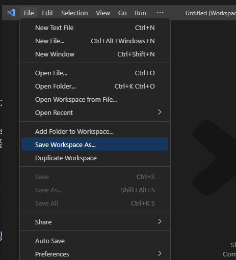
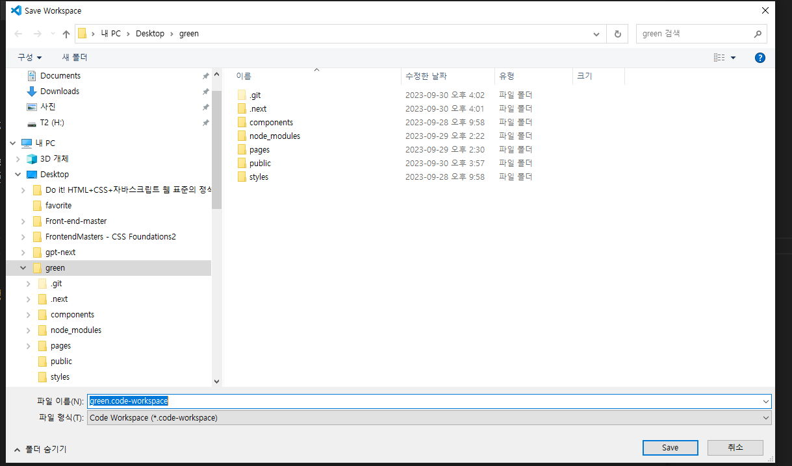
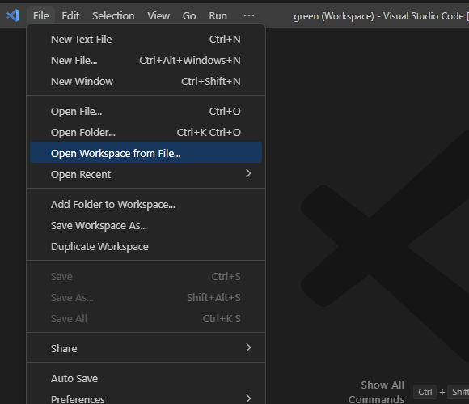
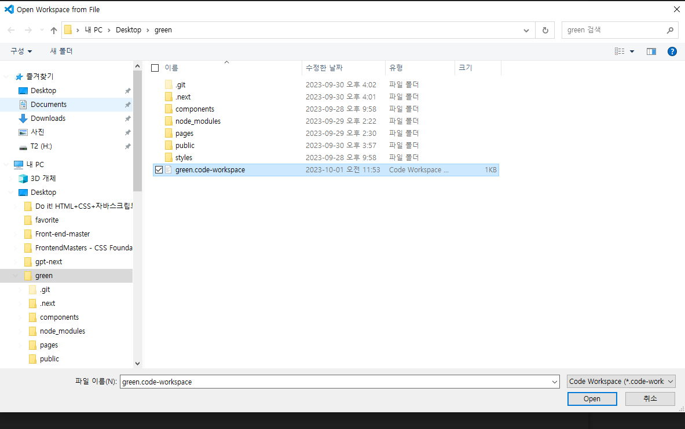
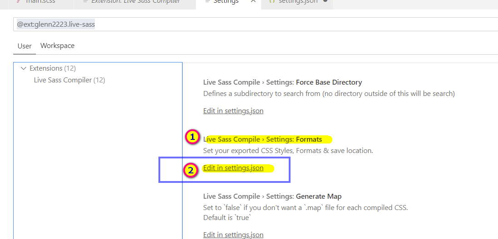
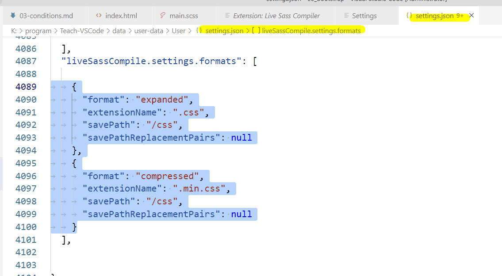

# 1 SCSS <!-- omit in toc -->

### 목차 <!-- omit in toc -->

- [1. 사이트](#1-사이트)
- [2. 개요](#2-개요)
- [3. 개발](#3-개발)
  - [3.1. scss 환경설정의 개요](#31-scss-환경설정의-개요)
  - [3.2. 워크스페이스 설정하기](#32-워크스페이스-설정하기)
    - [3.2.1. 워크스페이스에 livescss 환경설정](#321-워크스페이스에-livescss-환경설정)

# 1. 사이트

[!ref target='blank' text=':icon-link:scss공식사이트'](https://sass-lang.com/)
[!ref target='blank' text=':icon-link:scss튜토리얼'](https://www.tutorialspoint.com/sass/index.htm/)

# 2. 개요

> 
>
> css 파일을 조금 더 구조적으로 작성할 수 있는 언어
>
> **css 전처리기**라고도 불림
>
> **css 전처리기** 언어의 종류는 sass(scss), less, stylus 등이 있다.
>
> 웹에서 바로 해석할수 없으므로 번역기(컴파일러) 가 필요하다

---

# 3. 개발

## 3.1. scss 환경설정의 개요

1. 컴파일해주는 놈이 livescss 익스텐션
   1. vscode 에서 `ctrl+shift+x` 를 누른후 `livescss` 를 검색하여 아래의 확장 프로그램을 설치한다
      
2. scss 웹에서 해석이 안되므로 코드 작성후 css컴파일을 해야한다.
3. livescss는 해석한 파일(css)을 환경설정에서 세팅한 경로의 폴더에 저장해준다.
4. livescss는 해석할때 워크스페이스 단위로 번역한다.
   1. 즉 livescss는 워크스페이스 내의 환경설정에서 세팅한 경로로 css 파일을 저장하게 된다.
5. 환경설정 파일은 워크스페이스 내에 .vscode/settings.json 에 저장된다.

---

## 3.2. 워크스페이스 설정하기

> 워크스페이스란 하나의 프로젝트 파일을 저장하는 폴더를 의미한다.
> 프로젝트 작업시 관련 리소스 파일들은 항상 상위 폴더를 생성하여 저장하는 습관을 들이도록 하자.

1. pc에 프로젝트 단위의 폴더를 만든다

2. VSCode 실행하여 워크스페이스 생성
3. 아래의 이미지와 같은 메뉴를 선택하여 워크스페이스로 지정할 폴더를 클릭한다.
   1. <small>워크스페이스로 저장할 폴더를 선택</small>
      
   2. <small>워크스페이스 설정 파일을 저장</small>
      
   3. <small> 워크스페이스 설정파일의 저장 경로를 선택한다.</small>
      
4. 저장한 워크스페이스 열기
   1. <small>워크스페이스 파일 선택</small>
      
      
5. 추후 작업시 4 단계를 반복한다.

### 3.2.1. 워크스페이스에 livescss 환경설정

> 이번에는 scss 의 컴파일을 도와주는 확장프로그램의 환경을 설정해보자.
> 컴파일 완료시 저장되는 파일의 경로와 파일의 이름을 세팅해야 한다.

1. `ctrl + shift + x` 를 눌러 익스텐션을 연후 아래 이미지의 표시된 곳을 순서대로 클릭한다.
   1. 
2. 우측 설정 창에서 그림의 메뉴를 찾아 순서대로 클릭한다.
   1. 
3. 파일이 열리면 아래의 코드를 복사하여 붙여 넣는다.
   1. 

```json #
{
	"liveSassCompile.settings.formats": [
		// This is Default.
		{
			"format": "expanded", //확장형
			"extensionName": ".css", //확장자
			"savePath": "~/../css" //경로 ~은 상대경로를 의미
		},
		{
			"format": "compressed", //압축형
			"extensionName": ".min.css", //확장자
			"savePath": "~/../dist/css" //경로 ~은 상대경로를 의미
		}
	]
}
```
