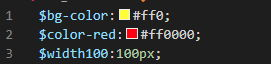
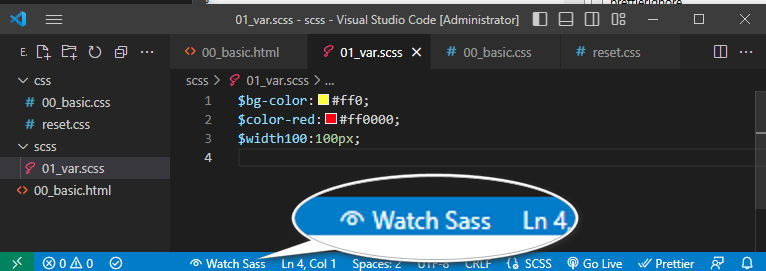
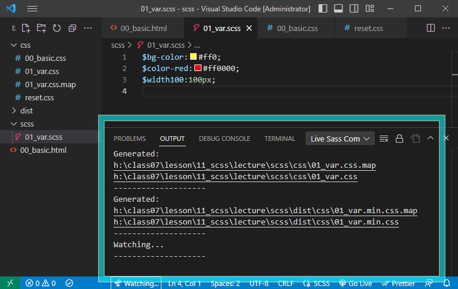
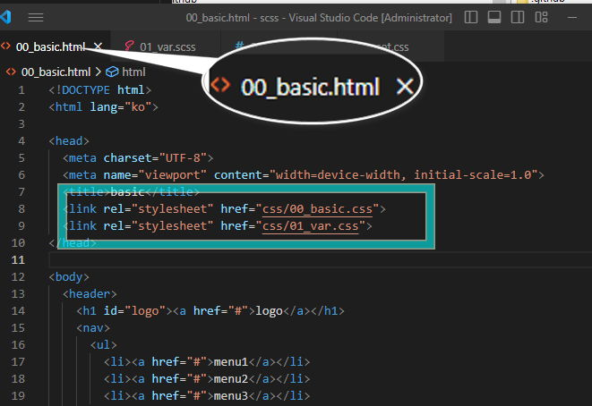

# 2 SCSS <!-- omit in toc -->

### 목차 <!-- omit in toc -->

- [1. Basic](#1-basic)
	- [1.1. 시작코드](#11-시작코드)
	- [1.2. 변수-\[var\]](#12-변수-var)
		- [1.2.1. 변수의 선언](#121-변수의-선언)
		- [1.2.2. 변수의 활용](#122-변수의-활용)

# 1. Basic

## 1.1. 시작코드

+++ 지시문
[!badge icon='play' iconAlign='left' variant='info' size='xl' corners='round' text='scss시작파일' target='blank'](./files/chap/00.html)
탭의 시작코드를 복사하여 준비한다..

+++ HTML

```html # 00_basic.html
<!DOCTYPE html>
<html lang="ko">
	<head>
		<meta charset="UTF-8" />
		<meta name="viewport" content="width=device-width, initial-scale=1.0" />
		<title>basic</title>
		<link rel="stylesheet" href="css/00_basic.css" />
	</head>

	<body>
		<header>
			<h1 id="logo"><a href="#">logo</a></h1>
			<nav>
				<ul>
					<li>
						<a href="#">menu1</a>
						<ul>
							<li><a href="#">menu2-1</a></li>
							<li><a href="#">menu2-1</a></li>
							<li><a href="#">menu2-1</a></li>
						</ul>
					</li>
					<li>
						<a href="#">menu2</a>
						<ul>
							<li><a href="#">menu2-2</a></li>
							<li><a href="#">menu2-2</a></li>
							<li><a href="#">menu2-2</a></li>
						</ul>
					</li>
					<li>
						<a href="#">menu3</a>
						<ul>
							<li><a href="#">menu2-3</a></li>
							<li><a href="#">menu2-3</a></li>
							<li><a href="#">menu2-3</a></li>
						</ul>
					</li>
				</ul>
			</nav>
			<button><a href="#">login</a></button>
		</header>
		  <main>
    <section>
      <h2>section1</h2>
      <div class="section1-box">
        <div class="section1-item">
          <span class="section1-title">title</span>
          <span class="section1-para">paragraph</span>
        </div>
        <div class="section1-item"> <span class="section1-title">title</span>
          <span class="section1-para">paragraph</span>
        </div>
        <div class="section1-item"> <span class="section1-title">title</span>
          <span class="section1-para">paragraph</span>
        </div>
    </section>
  </main>
	</body>
</html>
```

+++ CSS

```css # 00_basic.css
@charset "utf-8";
@import url(./reset.css);
body {
	background: ivory;
}

header {
	display: flex;
	padding: 2vw 4vw;
	box-shadow: 0 0 4px rgba(0, 0, 0, 0.5);
}

header h1 {
	flex: 1 1 30%;
}

header nav {
	flex: 1 1 50%;
}

header button {
	flex: 1 1 10%;
}

header ul {
	display: flex;
	width: 80%;
}

header ul li {
	flex: 1 1 30%;
}

header ul ul {
	display: block;
}

main {
	padding: 2vw 4vw;
}

.section1-box {
	background: #c9c9c9;
	max-width: 500px;
	margin: auto;
	display: flex;
	border-radius: 8px;
	border: 4px solid #d5d5d5;
	box-shadow: 0 0 4px rgba(0, 0, 0, 0.5);
}

.section1-box > .section1-item {
	width: 30%;
	display: flex;
	flex-direction: column;
	padding: 1vw;
	box-shadow: 0 0 4px rgba(0, 0, 0, 0.5);
	border: 4px solid #6361e7;
}

.section1-box > .section1-item > .section1-title {
	color: #333;
	font-size: 32px;
}
.section1-box > .section1-item > .section1-para {
	color: #333;
	font-size: 24px;
}
```

```css # reset.css
/* http://meyerweb.com/eric/tools/css/reset/
   v2.0 | 20110126
   License: none (public domain)
*/

html,
body,
div,
span,
applet,
object,
iframe,
h1,
h2,
h3,
h4,
h5,
h6,
p,
blockquote,
pre,
a,
abbr,
acronym,
address,
big,
cite,
code,
del,
dfn,
em,
img,
ins,
kbd,
q,
s,
samp,
small,
strike,
strong,
sub,
sup,
tt,
var,
b,
u,
i,
center,
dl,
dt,
dd,
ol,
ul,
li,
fieldset,
form,
label,
legend,
table,
caption,
tbody,
tfoot,
thead,
tr,
th,
td,
article,
aside,
canvas,
details,
embed,
figure,
figcaption,
footer,
header,
hgroup,
menu,
nav,
output,
ruby,
section,
summary,
time,
mark,
audio,
video {
	margin: 0;
	padding: 0;
	border: 0;
	font-size: 100%;
	font: inherit;
	vertical-align: baseline;
}
/* HTML5 display-role reset for older browsers */
article,
aside,
details,
figcaption,
figure,
footer,
header,
hgroup,
menu,
nav,
section {
	display: block;
}
body {
	line-height: 1;
}
ol,
ul {
	list-style: none;
}
blockquote,
q {
	quotes: none;
}
blockquote:before,
blockquote:after,
q:before,
q:after {
	content: '';
	content: none;
}
table {
	border-collapse: collapse;
	border-spacing: 0;
}
a {
	text-decoration: none;
	color: #333;
}
```

+++

## 1.2. 변수-[var]

[!ref target='blank' text=':icon-link:공식문서-변수'](https://sass-lang.com/documentation/variables/)

> 변수를 만들 때는 $ 기호를 사용하여 스타일을 적용할 값(색상, 폰트 사이즈, 이미지url)을 저장한다.
>
> ```js
> //$변수 : 값
> $bgColor : #FFF
>
> ```

### 1.2.1. 변수의 선언

1. scss 폴더를 생생후 하위에 01_var.scss 파일을 생성한다
2. 아래의 코드를 작성한다.
   
3. 컴파일 하기 - vscode 하단의 watch sass 를 클릭한다.
   
4. output 확인 - 이미지 처럼 파일 생성 결과가 출력되면 성공
   
5. html문서에 링크하기
   1. 00_basic.html 문서를 열고 `<head>` 태그 사이에 css 폴더에 생성된 01_var.css 파일을 연결한다.
      

### 1.2.2. 변수의 활용

> 이제 html 문서에 선언한 변수를 활용해보자
>
> - scss 는 연산이 가능하다.
> - 연산하는 값의 단위가 동일하지 않으면 에러가 발생할수 있다.
> - 목적에 따라 calc 를 사용할 경우도 있다.

```scss
header ul li {
	flex: 1 1 30%;
	width: $width100 * 3;
	font-size: calc($width100 - 50px);
}
body {
	background: $bg-color;
}
.box > .item > .para {
	color: #333;
	font-size: 24px;
	color: $color-red;
}
```
