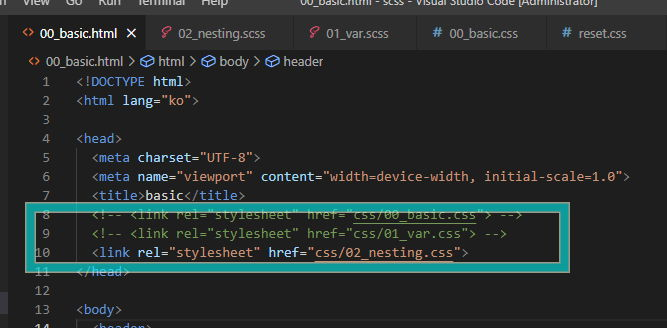

# 3 Nasting <!-- omit in toc -->

### 목차 <!-- omit in toc -->

# 1. Nesting

[!ref target='blank' text=':icon-link:공식문서-nesting'](https://sass-lang.com/guide/#nesting)

## 1.1. 주석

> 사스에서 주석은 아래와 같이 작성한다.

```scss
// 사스주석은 안보임
/*css주석은 컴파일에 보임*/
//네스팅: 둥지, 포함한,중첩되는 의미 : 포함관계를 적용한 작성법
```

## 1.2. 작성

> Nesting(중첩)을 사용하면, html의 시각적 계층 방식과 동일하게 CSS를 중첩하여 작성할 수 있다.
> CSS코드가 구조화 되어 가독성이 높아지며 유지 보수하기 편리해진다.

1. 00_basic.css 의 내용을 복사하여 네스팅으로 작성한다.
2. 00_basic.html 내용을 아래와 같이 수정한다.
   

[!badge variant='primary' size='l' text='02_nesting.scss' icon='file']

```scss
@charset "utf-8";
@import url(./reset.css);

body {
	background: ivory;
}

header {
	display: flex;
	padding: 2vw 4vw;
	box-shadow: 0 0 4px rgba(0, 0, 0, 0.5);
	//하위선택자
	a {
		color: red;
	}
	//하위선택자
	& a {
		color: blue;
	}

	h1 {
		flex: 1 1 30%;
		//자식선택자
		& > a {
			color: green;
			font-size: 2rem;
		}
	}

	nav {
		flex: 1 1 50%;
	}

	button {
		flex: 1 1 10%;
    //중첩에서 탈출하기 css문서에서 확인
		@at-root a {
			color: orange;
		}
	}

	ul {
		display: flex;
		width: 80%;
		//`&`는 상위에 있는 부모선택자를 가르킴
		& li {
			flex: 1 1 30%;
		}

		& ul {
			display: block;
		}
	}
}

main {
	padding: 2vw 4vw;
}
//.section1 이 중복 될경우 아래와 같이 중첩할수
.section1 {
	&-box {
		background: #c9c9c9;
		max-width: 500px;
		margin: auto;
		display: flex;
		border-radius: 8px;
		border: 4px solid #d5d5d5;
		box-shadow: 0 0 4px rgba(0, 0, 0, 0.5);
	}

	&-box > &-item {
		width: 30%;
		display: flex;
		flex-direction: column;
		padding: 1vw;
		box-shadow: 0 0 4px rgba(0, 0, 0, 0.5);
		border: 4px solid #6361e7;
	}

	&-box > &-item > &-title {
		color: #333;
		font-size: 32px;
	}
	&-box > &-item > &-para {
		color: #333;
		font-size: 24px;
	}
}
```
