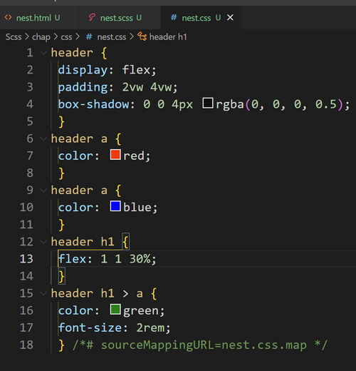

# 3 Nesting <!-- omit in toc -->

### 목차 <!-- omit in toc -->
- [1. 개요](#1-개요)
- [2. 작성](#2-작성)
	- [2.1. \&](#21-)
	- [2.2. @at-root](#22-at-root)
	- [2.3. 속성중첩](#23-속성중첩)
- [3. 문제1](#3-문제1)
- [4. 문제2](#4-문제2)


## 1. 개요

[!ref target='blank' text=':icon-link:공식문서-nesting'](https://sass-lang.com/guide/#nesting)


!!!
네스팅(nesting): 둥지, 포함한,중첩되는 의미

**포함관계를 적용한 작성법**

 Nesting(중첩)을 사용하면, html의 시각적 계층 방식과 동일하게 CSS를 중첩하여 작성할 수 있다.

 CSS코드가 구조화 되어 가독성이 높아지며 유지 보수하기 편리해진다.

!!!


## 2. 작성

[!button variant='primary' icon='play' text='실행화면' target='blank'](https://qwerewqwerew.github.io/source/Scss/final/nest.html)

### 2.1. &
!!!
**`&` 은 상위선택자를 의미한다.**
!!!


1. scss/nest.scss 파일을 생성후 아래의 코드를 작성한다.

```scss  #5-10,14-17 scss/nest.scss
header {
	display: flex;
	padding: 2vw 4vw;
	box-shadow: 0 0 4px rgba(0, 0, 0, 0.5);
	a {
	color: red;
	}
	& a {
		color: blue;
	}
	h1 {
		flex: 1 1 30%;
		& > a {
			color: green;
			font-size: 2rem;
		}
	}
}

```


3. 아래와 같이 컴파일 된것을 확인한다.
   

### 2.2. @at-root

[!button variant='primary' icon='play' text='실행화면' target='blank'](https://qwerewqwerew.github.io/source/Scss/final/nest.html)

!!!
@at-root 키워드를 사용하면 중첩에서 벗어날 수 있다.

중첩에서 벗어나고 싶은 선택자 앞에 @at-root 를 작성한다.

중첩된 선택자에게만 사용할 수 있다.

!!!

```scss #1,3-5,8-10 scss/nest.scss
header {
	...
		* {
		border: 2px solid;
		}
		h1 {
		flex: 1 1 30%;
		@at-root & *,& {
				border: none;
			}
		& > a {
			color: green;
			font-size: 2rem;

		}
	}

	nav {
		flex: 1 1 50%;
	}
	button {
		flex: 1 1 10%;
		a:hover {
			color: red;
		}
		&:hover a {
			background: pink;
		}
	}
	ul {
		display: flex;
		width: 80%;
		& li {
			flex: 1 1 30%;
		}

		& ul {
			display: block;
		}
	}
} //header
```


### 2.3. 속성중첩

font-, margin- 같은 접두사가 같은 속성은 nesting 으로 작성할수 있다.

```scss #4-9 scss/nest.scss
header {
	... 생략
	* {
	border: {
		width: 2px;
		style: solid;
		color: #0d9716;
		left-width: 0;
		radius: 10%;
	}
}
a {
	color: red;
	}
...
};
```

## 3. 문제1

> `main`에 `padding` 속성을 추가해보자
>
>  padding-top: 200px;
>  padding-right: 500px;
>  padding-bottom: 200px;
>  padding-left: 500px;
>
>
<details markdown='block'>
	<summary>
 🐨
	</summary>
<pre>
main {
	padding: {
		top: 100px * 2;
		right: 100px * 5;
		bottom: 100px * 2;
		left: 100px * 5;
	}
}
</pre>

</details>


## 4. 문제2

> `.section1`의 css 를 nesting 으로 변경해보자

<details markdown='block'>
	<summary>
 🐨
	</summary>
<pre>
.section1 {
	&-box {
		background: #c9c9c9;
		max-width: 500px;
		margin: auto;
		display: flex;
		border-radius: 8px;
		border: 4px solid #d5d5d5;
		box-shadow: 0 0 4px rgba(0, 0, 0, 0.5);
	}

	&-box > &-item {
		width: 30%;
		display: flex;
		flex-direction: column;
		padding: 1vw;
		box-shadow: 0 0 4px rgba(0, 0, 0, 0.5);
		border: 4px solid #6361e7;
	}

	&-box > &-item > &-title {
		color: #333;
		font-size: 32px;
	}
	&-box > &-item > &-para {
		color: #333;
		font-size: 24px;
	}
} //.section1
<pre>
</details>