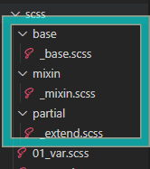

# 6-Partials <!-- omit in toc -->

- [1. Partials](#1-partials)
  - [1.1. 개요](#11-개요)
  - [1.2. 작성](#12-작성)
    - [1.2.1. base.scss](#121-basescss)
    - [1.2.2. \_mixin.scss](#122-_mixinscss)
    - [1.2.2. \_extend.scss](#122-_extendscss)
    - [1.2.2. \\06\_partial.scss](#122-06_partialscss)

### 목차 <!-- omit in toc -->

# 1. Partials

[!ref target='blank' text=':icon-link:scss partials'](https://sass-lang.com/guide/#partials)

## 1.1. 개요

> 자주 사용되는 scss 코드를 모아둔 파일로 파일 이름은 언더스코어( \_ ) 로 시작한다.
>
> **.scss 파일명을 언더스코어( \_ )로 시작하면 Sass 컴파일러는 해당 컴파일 하지 않는다.**

## 1.2. 작성

1. 아래 이미지의 경로와 같이 폴더와 파일을 생성한다. 이때 파일명 앞에 `_`를 붙여야 한다.
   
2. basic.html 문서를 ` <link rel="stylesheet" href="css/06_partial.css">` 로 수정한다.

### 1.2.1. base.scss

[!badge variant='primary' size='l' text='base/_base.scss' icon='file']

```scss #
@charset "utf-8";
@import url(./reset.css);
$bg-color: #ff0;
$color-red: #ff0000;
$col1: 8rem;
$gu1: 20rem;
$per20: 20%;

body {
	background: #f5f5ee;
}
```

화면은 변경되나 css 폴더에 base/base 파일은 생성되지 않는다

### 1.2.2. \_mixin.scss

[!badge variant='primary' size='l' text='base/_mixin.scss' icon='file']

```scss #
@mixin fontSizeBgColor($fontSize, $bgColor, $color: #333) {
	color: $color;
	font-size: $fontSize;
	background-color: $bgColor;
}
@mixin hover($color, $deco: none) {
	color: $color;
	text-decoration: $deco;
}
@mixin flexDirectJustiAlign($direct: row, $justify: flex-end, $align: stretch) {
	display: flex;
	flex-direction: $direct;
	justify-content: $justify;
	align-items: $align;
}
```

### 1.2.2. \_extend.scss

[!badge variant='primary' size='l' text='base/_extend.scss' icon='file']

```scss #
%colorSize {
	color: #ac5040;
	font-size: 24px;
}

%boxshadow {
	box-shadow: 0 0 4px rgba(0, 0, 0, 0.5);
}
%padding {
	padding: 2vw 4vw;
}
```

### 1.2.2. \06_partial.scss

[!badge variant='primary' size='l' text='base/06_partial.scss' icon='file']

```scss #
@import 'base/base';
@import 'mixin/mixin';
@import 'partial/extend';
header {
	@extend %padding;
	@include flexDirectJustiAlign(row, space-between, center);
	h1 {
		@include fontSizeBgColor(2rem, #6ffaff, #0c08ff);
	}
	nav ul {
		@include flexDirectJustiAlign(row, space-between, center);
		& > li {
			width: $col1;
		}
	}
}
main {
	@extend %padding;
}
.section1 {
	&-box {
		@include flexDirectJustiAlign();
	}
}
```
