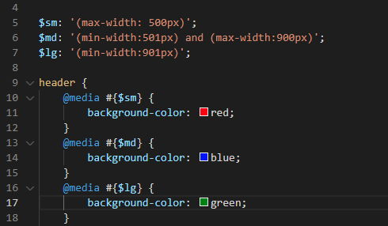

# 8-MediaQuery <!-- omit in toc -->

### 목차 <!-- omit in toc -->

## 1. 미디어쿼리 작성

[!ref target='blank' text=':icon-play:미리보기'](./final/00_basic.html)

### 1.1. scss

#### 1.1.1. 시작코드

```scss #
@import 'base/base';
@import 'mixin/mixin';
@import 'partial/extend';
header {
	@extend %padding;
	@include flexDirectJustiAlign(row, space-between, center);
	h1 {
		@include fontSizeBgColor(2rem, #6ffaff, #0c08ff);
	}
	nav ul {
		@include flexDirectJustiAlign(row, space-between, center);
		& > li {
			width: $col1;
		}
	}
}
main {
	@extend %padding;
	.section1 {
		&-box {
			@extend %boxshadow;
			width: $col1 * 10;
			margin: auto;
			@include flexDirectJustiAlign();
		}
		&-item {
			flex: 1 1 0;
			@include flexDirectJustiAlign(column);
			@include fontSizeBgColor(2rem, #d8d8d8, $color-red);
			@extend %padding;
			span:nth-child(1) {
				@extend %colorSize;
			}
		}
	}
}
```

#### 1.1.2. 변수 사용하기



```scss #
$sm: '(max-width: 500px)';
$md: '(min-width:501px) and (max-width:900px)';
$lg: '(min-width:901px)';

header {
	@media #{$sm} {
		background-color: red;
		padding: 1vw;
	}
	@media #{$md} {
		background-color: blue;
	}
	@media #{$lg} {
		background-color: green;
	}
	@extend %padding;
	@include flexDirectJustiAlign(row, space-between, center);
	h1 {
		@include fontSizeBgColor(2rem, #6ffaff, #0c08ff);
	}
	nav ul {
		@include flexDirectJustiAlign(row, space-between, center);
		& > li {
			width: $col1;
			@media #{$sm} {
				width: $col1 / 2;
			}
		}
	}
}
```

#### 1.1.3. 중첩

```scss
main {
	@extend %padding;
	.section1 {
		&-box {
			@extend %boxshadow;
			width: $col1 * 10;
			margin: auto;
			@include flexDirectJustiAlign();
			@media #{$lg} {
				width: $col1 * 7;
			}
			@media #{$md} {
				width: $col1 * 5;
			}
			@media #{$sm} {
				width: 100%;
				line-height: 1.7;
				@include flexDirectJustiAlign(column, center, stretch);
			}
		}
		&-item {
			flex: 1 1 0;
			@include flexDirectJustiAlign(column);
			@include fontSizeBgColor(2rem, #d8d8d8, $color-red);
			@extend %padding;
			span:nth-child(1) {
				@extend %colorSize;
			}
		}
	}
}
```

# 2. 프로젝트 진행

[!ref target='blank' text=':icon-play:미리보기'](./final/02_Loram/Lorem/index.html)
[!ref target='blank' text=':icon-play:미리보기'](./final/03_landing-page/index.html)

[!badge variant='primary' size='xl' text='다운로드' icon='download'](./final/02_Loram/Lorem/images.zip)
