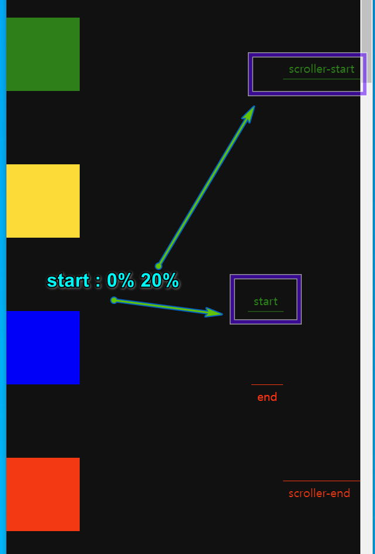
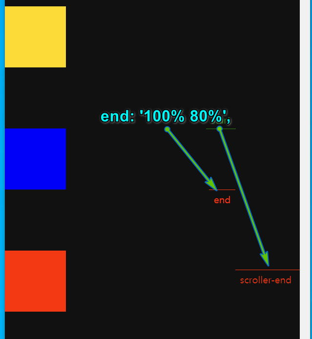

### 목차 <!-- omit in toc -->

## 1. gsap

[!ref target='blank' text=':icon-link:gsap공식사이트'](https://gsap.com/)
[!ref target='blank' text=':icon-link:gsap치트시트'](https://greensock.com/cheatsheet/)
[!ref target='blank' text=':icon-link:gsap의 모든 기능이 있는 cdn 링크'](https://cdnjs.com/libraries/gsap)

:::box
웹 브라우저에서 애니메이션을 구현하기 위한 자바스크립트 라이브러리
기존 CSS나 순수 자바스크립트보다 탁월한 퍼포먼스를 발휘할 수 있도록 최적화 된 애니메이션 전용 라이브러리이며, HTML5와 Flash 두 개의 플랫폼에서 사용할 수 있다.
GreenSock Engaging the Internet GASP은 애니메이션을 쉽게 적용할 수 있는 라이브러리로 J-Query 보다 20배 이상 빠른 성능을 갖고 있다고 소개하고 있다.

- gsap.to() 메소드를 이용해 자연스러운 움직임을 만들 수 있다

- 다양한 종류의 애니메이션을 제공하며 필요에 따라 플러그인 형태로 추가하여 사용할수 있다. (일부유료)

- 기본 기능만을 사용할때는 **gsap.js** 혹은 **gsap.min.js 을 사용한다.**

- 문법은 **camelCase 를 사용한다. ex) background-color (x), backgroundColor (O)**
- left 및 top과 같은 위치 속성을 애니메이션화할 때 이동하려는 요소에 CSS position 속성을 적용해야한다.

:::

---

## 2. 설치

### 2.1. cdn

```html
<script src="https://cdnjs.cloudflare.com/ajax/libs/gsap/3.12.5/gsap.min.js"></script>
```

### 2.2. npm

```bash
npm install gsap
```

### 2.3. Tween

> 애니메이션 작업을 수행한다. 타겟(애니메이션을 적용하려는 개체), 지속 시간 및 애니메이션을 적용하려는 속성을 입력하면 간단히 애니메이션을 완성해준다.
> 트윈을 생성하는 매서드는 3종류가 있다.
>
> - gsap.to()
> - gsap.from()
> - gsap.fromTo()

#### 2.3.1. gsap.to()

> 가장 널리 사용되는 트윈 메서드 이다.
> gsap.to에는 2가지 필수값이 필요하다. 대상(**targets**)과 속성(**vars)**이다.

- **targets :** 애니메이션을 적용할 개체입니다. 원시 객체, 객체의 배열, 또는 ".myClass" 와 같은 선택자 텍스트
- **vars :** 애니메이션을 적용할 속성/값 쌍(예를 들어, opacity: 0.5, rotation: 45)과 duratiom, onComplete와 같은 기타 선택적 [특수 속성](https://greensock.com/docs/v3/GSAP/Tween/vars)이 있는 개체

##### 2.3.1.1. [예제] 이동하기

> 아이디 logo 이름을 가진 요소(Element)를 x축으로 1초 동안 100px 이동
> [!ref target='blank' text=':icon-play:미리보기'](https://qwerewqwerew.github.io/source/js/deep/gsap/1.html)

||| :icon-code: html

```html
<div id="logo">logo</div>
<script src="https://cdnjs.cloudflare.com/ajax/libs/gsap/3.12.5/gsap.min.js"></script>
```

||| :icon-code: js

```js
gsap.to('##logo', { duration: 1, x: 100 });
```

|||

### 2.4. css transform과 gsap 속성 비교

| gsap             | css                            |
| ---------------- | ------------------------------ |
| `x: 100`         | `transform: translateX(100px)` |
| `y: 100`         | `transform: translateY(100px)` |
| `rotation: 360`  | `transform: rotate(360deg)`    |
| `rotationX: 360` | `transform: rotateX(360deg)`   |
| `rotationY: 360` | `transform: rotateY(360deg)`   |
| `skewX: 45`      | `transform: skewX(45px)`       |
| `skewY: 45`      | `transform: skewY(100px)`      |
| `scale:  2`      | `transform: scale(2,2)`        |
| `scaleX: 2`      | `transform: scaleX(2)`         |
| `scaleY: 2`      | `transform: scaleY(2)`         |
| `xPercent: -50`  | `transform: translateX(-50%)`  |
| `yPercent: -50`  | `transform: translateY(-50%)`  |

### 2.5. 기타속성

| 속성        | 설명                                                |
| ----------- | --------------------------------------------------- |
| delay       | 애니메이션 시작 전 지연 시간 지정                   |
| repeat      | 반복횟수 지정, -1(무한반복)                         |
| repeatDelay | 반복 전 지연 시간 지정                              |
| yoyo        | true, 반복할 때 뒤로 되돌리기                       |
| onComplete  | 애니메이션이 끝났을 때 호출할 콜백함수 지정         |
| onUpdate    | 애니메이션이 업데이트될 때마다 호출한 콜백함수 지정 |
| ease        | 가속도 (power1, elastic, bounce,...)                |
| stagger     | 타겟과 요소 애니메이션을 위한 시작 시간 지정        |

## 3. 예제

### 3.1. Tween

==- [!badge variant='info' size='s' text='01'] 이동

> css로 transform: translateX(200px) 과 같은 효과를 주며 duration은 미작성시 0.5초 이다

[!ref target='blank' text=':icon-play:미리보기'](https://qwerewqwerew.github.io/source/js/deep/gsap/gsap01.html)

```html #
<head>
	<style>
		.box {
			margin: 15px;
		}
		.box1 {
			width: 100px;
			height: 100px;
			background: orange;
		}
		.box2 {
			width: 200px;
			height: 100px;
			background: greenyellow;
		}
		.box3 {
			width: 100px;
			height: 200px;
			background: tomato;
		}
	</style>
</head>

<body>
	<div class="box box1"></div>
	<div class="box box2"></div>
	<div class="box box3"></div>

	<script src="https://cdnjs.cloudflare.com/ajax/libs/gsap/3.6.0/gsap.min.js"></script>
	<script>
		gsap.to('.box', {
			x: 200,
		});
	</script>
</body>
```

==- [!badge variant='info' size='s' text='02'] 이동+회전

[!ref target='blank' text=':icon-play:미리보기'](https://qwerewqwerew.github.io/source/js/deep/gsap/gsap02.html)

기본구조는 01과 같다.스크립트만 수정한다.

```js #
gsap.to('.box1', { duration: 3, x: 200, opacity: 0.2, ease: 'steps(10)', delay: 2 });
gsap.to('.box2', { duration: 3, x: 200, rotate: 720, scale: 1.3 });
gsap.to('.box3', { duration: 3, x: 200, ease: 'elastic', backgroundColor: 'red', width: 300, fontSize: 60 });
```

---

<mark>from 으로 변경하면 에니메이션이 반전되어 실행된다.</mark>

[!ref target='blank' text=':icon-play:미리보기'](https://qwerewqwerew.github.io/source/js/deep/gsap/gsap02a.html)

```js
gsap.from('.box1', { duration: 3, x: 200, opacity: 0.2, ease: 'steps(10)', delay: 2 });
gsap.from('.box2', { duration: 3, x: 200, rotate: 720, scale: 1.3 });
gsap.from('.box3', { duration: 3, x: 200, ease: 'elastic', backgroundColor: 'red', width: 300, fontSize: 60 });
```

==- [!badge variant='info' size='s' text='03'] 이동+투명도 조절

> "h2" 요소에 1초 동안 투명도를 30%로 애니메이션 적용하고 ".orange" 요소는 2초 동안 x축으로 300pixel 이동하고 ".grey"는 Y축으로 300px 이동. “.green” 요 소는 3초 동안 360도 회전하고 크기를 50%로 축소하는 애니메이션 을 적용한다

[!ref target='blank' text=':icon-play:미리보기'](https://qwerewqwerew.github.io/source/js/deep/gsap/2.html)

```html
<h2 class="title">gsap.to() Basic Usage</h2>
<div class="box orange"></div>
<div class="box grey"></div>
<div class="box green"></div>
```

```css
body {
	margin: 10px;
}
.box {
	width: 100px;
	height: 100px;
}
.orange {
	background: orange;
}
.grey {
	background: grey;
}
.green {
	background: green;
}
```

```js
gsap.to('h2.title', { duration: 1, opacity: 0.3 });
gsap.to('.orange', { duration: 2, x: 300 });
gsap.to('.grey', { duration: 2, y: 300 });
gsap.to('.green', { duration: 3, rotation: 360, scale: 0.5 });
```

===

### 3.2. easing

!!!
easing 은 가속도를 설정할수 있는 속성이다.
사용할수 있는 값은 아래와 같다.
none, power1, power2, power3, power4, back, elastic, bounce, rough, slow, steps, circ, expo, sine
[!ref target='blank' text=':icon-link:공식문서'](https://gsap.com/docs/v3/Eases)
!!!

==- [!badge variant='info' size='s' text='04'] 가속도

[!button variant='primary' icon='play' text='실행화면' target='blank'](https://qwerewqwerew.github.io/source/js/deep/gsap/04.html)

```html #
<section id="title">
	<div class="box box1">none</div>
	<div class="box box2">power1</div>
	<div class="box box3">power2</div>
	<div class="box box4">power3</div>
	<div class="box box5">power4</div>
	<div class="box box6">back</div>
	<div class="box box7">elastic</div>
	<div class="box box8">bounce</div>
	<div class="box box9">rough</div>
	<div class="box box10">slow</div>
	<div class="box box11">steps</div>
	<div class="box box12">circ</div>
	<div class="box box13">expo</div>
	<div class="box box14">sine</div>
</section>
```

```css #
* {
	margin: 0;
	padding: 0;
	box-sizing: border-box;
}

##title {
	width: 700px;
	margin: 100px auto;
}

.box {
	background-color: purple;
	width: 50px;
	height: 50px;
	border-radius: 50%;
	text-align: center;
	line-height: 50px;
	font-size: 12px;
}
```

```js #
gsap.to('.box1', { x: 600, ease: 'none', duration: 5 });
gsap.to('.box2', { x: 600, ease: 'power1', duration: 5 });
gsap.to('.box3', { x: 600, ease: 'power2', duration: 5 });
gsap.to('.box4', { x: 600, ease: 'power3', duration: 5 });
gsap.to('.box5', { x: 600, ease: 'power4', duration: 5 });
gsap.to('.box6', { x: 600, ease: 'back', duration: 5 });
gsap.to('.box7', { x: 600, ease: 'elastic', duration: 5 });
gsap.to('.box8', { x: 600, ease: 'bounce', duration: 5 });
gsap.to('.box9', { x: 600, ease: 'rough', duration: 5 });
gsap.to('.box10', { x: 600, ease: 'slow', duration: 5 });
gsap.to('.box11', { x: 600, ease: 'steps(5)', duration: 5 });
gsap.to('.box12', { x: 600, ease: 'circ', duration: 5 });
gsap.to('.box13', { x: 600, ease: 'expo', duration: 5 });
gsap.to('.box14', { x: 600, ease: 'sine', duration: 5 });
```

===

### 3.3. gsap.timeline()

> 타임라인 메서드는 애니메이션의 시간을 지정할수 있어 다양한 모션 구현시 편리하다.
>
> [!ref target='blank' text=':icon-link:공식문서'](<https://gsap.com/docs/v3/GSAP/gsap.timeline()>)

==- [!badge variant='info' size='s' text='04'] timeline

[!button variant='primary' icon='play' text='실행화면' target='blank'](https://qwerewqwerew.github.io/source/js/deep/gsap/09.html)

```html #
<div class="one"></div>
<div class="two"></div>
<div class="three"></div>
<div class="four"></div>
```

```css #
* {
	margin: 0;
	padding: 0;
	box-sizing: border-box;
}

body {
	overflow: hidden;
}

div {
	width: 100px;
	height: 100px;
}

.one {
	background: red;
}

.two {
	background: green;
}

.three {
	background: blue;
}

.four {
	background: pink;
}
```

```js #
let tl = gsap.timeline();
//total duration:
tl.to('.one', { duration: 2, x: 500 })
	//2초 동안 x축으로 500px

	.to('.two', { duration: 3, x: 500 }, 1)
	// 1초 후 3초동안 x축으로 500px(1은 absolute값)

	.to('.three', { duration: 1, x: 500 }, '<')
	//1초 후 1초동안 x축으로 500px(<은 이전 target의 timeline을 따라감)

	.to('.four', { duration: 1, x: 500 }, '<0.5');
//1.5초후 1초동은 x축으로 500px(<0.5를 추가하면 이전 target보다 0.5초 뒤 실행
```

==- [!badge variant='info' size='s' text='05'] parallax
!!!
timeline 을 활용하여 다른 클래스의 요소들에 시차애니메이션을 적용한다.

변수 t1을 선언하고 기본값으로 1초를 delay로 할당한다.

!!!

[!button variant='primary' icon='play' text='실행화면' target='blank'](https://qwerewqwerew.github.io/source/js/deep/gsap/05.html)

```html #
<section id="title">
	<div class="container">
		<h1 class="animation1">JavaScript GSAP Library Animation</h1>
		<p class="animation1">Lorem ipsum dolor sit amet, consectetur adipisicing elit. Tempore, dolore.</p>
		<a class="animation1" href="#">Button</a>
	</div>
</section>
<section>
	<div class="box box1"></div>
	<div class="box box2"></div>
</section>
<section id="thumbnail">
	
</section>
```

```css #
* {
	margin: 0;
	padding: 0;
	box-sizing: border-box;
}

body {
	overflow: hidden;
}

#title {
	width: 700px;
	margin: 100px auto;
}

.container {
	padding: 20px;
}

h1 {
	margin-bottom: 20px;
}

p {
	margin-bottom: 15px;
}

a {
	display: block;
	width: 100px;
	padding: 10px;
	background-color: blueviolet;
	text-decoration: none;
	color: white;
	text-align: center;
	border-radius: 10px;
}

#thumbnail {
	width: 420px;
	height: 300px;
	position: absolute;
	right: 0;
	bottom: 0;
}
.box {
	width: 100px;
	height: 100px;
}

.box1 {
	background-color: red;
}

.box2 {
	background-color: blue;
}
```

```js #
let t1 = gsap.timeline({ defaults: { duration: 1 } });
//defaults라는 특수 속성은 모든 하위 트윈과 타임라인에서 값을 상속할 수 있다.
//애니메이션을 1초동안 진행하는 기본값 설정

t1.from('h1', { y: -50, opacity: 0 })
	.from('p', { y: -50, opacity: 0 }, '-=0.5') // 타임라인 종료 0.5초 전 (오버랩)
	.from('a', { y: -50, opacity: 0 }, '+=1') // 타임라인 종료 1초 후 (갭)
	.from('img', { y: 200, opacity: 0 }, '3'); // 타임라인 시작으로부터 3초 후 (절대적)
	.from('.box1', { x: 200, opacity: 0 }, "<") // 이전 트윈 타임라인 시작지점
	.to('.box2', { rotate: 360, x:800, opacity: 1}, ">") // 이전 트윈 타임라인 종료지점
```

==- [!badge variant='info' size='s' text='06'] 클릭시 반대로 진행

[!button variant='primary' icon='play' text='실행화면' target='blank'](https://qwerewqwerew.github.io/source/js/deep/gsap/06.html)

문서의 구조와 스타일은 이전과 동일

```js #
let t1 = gsap.timeline({ defaults: { duration: 1 } });

t1.from('h1', { y: -50, opacity: 0 })
	.from('p', { y: -50, opacity: 0 }, '-=0.5') // 타임라인 종료 0.5초 전 (오버랩)
	.from('a', { y: -50, opacity: 0 }, '-=0.5') // 타임라인 종료 0.5초 전 (오버랩)
	.from('img', { y: 200, opacity: 0 }, '-=0.5')
	.from('.box1', { x: 200, opacity: 0 }, '<') // 이전 트윈 타임라인 시작지점
	.to('.box2', { rotate: 360, x: 800, opacity: 1 }, '>'); // 이전 트윈 타임라인 종료지점

document.getElementById('cta').addEventListener('click', (e) => {
	e.preventDefault();
	t1.reversed() ? t1.play() : t1.reverse();
	//타임라인의 진행상태가 반전 되었을경우 시작하고 아닐경우 반전
});
```

<mark>애니메이션의 핸들링이 궁금하다면?</mark>

==- 핸들링예제
[!button variant='primary' icon='play' text='실행화면' target='blank'](https://qwerewqwerew.github.io/source/js/deep/gsap/handling.html)

```html #
<!DOCTYPE html>
<html lang="ko">
	<head>
		<meta charset="UTF-8" />
		<meta name="viewport" content="width=device-width, initial-scale=1.0" />
		<title>Document</title>
		<style>
			.box {
				width: 100px;
				height: 100px;
			}

			.box1 {
				background-color: red;
			}
		</style>
	</head>

	<body>
		<div class="box box1"></div>
		<div class="nav">
			<button id="play">시작</button>
			<button id="pause">정지</button>
			<button id="resume">재개</button>
			<button id="reverse">반전</button>
			<button id="restart">재시작</button>
		</div>
		<script src="https://cdnjs.cloudflare.com/ajax/libs/gsap/3.8.0/gsap.min.js"></script>
		<script>
			const tween = gsap.to(".box1", { duration: 8, x: 400, width: 400, paused: true, });

			document.querySelector("#play").onclick = function () { return tween.play(); };
			document.querySelector("#pause").onclick = function () { return tween.pause(); };
			document.querySelector("#resume").onclick = function () { return tween.resume(); };
			document.querySelector("#reverse").onclick = function () { return tween.reverse(); };
			document.querySelector("#restart").onclick = function () { return tween.restart(); }.

			//resume 애니메이션 멈춘곳 부터 재생을 다시 시작
		</script>
	</body>
</html>
```

===

### 3.4. scrollTrigger

> 스크롤트리거는 gsap 의 플러그인 으로 추가설치 해야한다.
>
> [!button variant='ghost' icon='link' text='api문서' target='blank'](https://gsap.com/docs/v3/Plugins/ScrollTrigger/)
>
> [!button variant='ghost' icon='link' text='코드펜예제' target='blank'](https://codepen.io/collection/AEbkkJ)

#### 3.4.1. 주요속성

| 속성          | 설명                                                                                                                                                                                                                                                                                                                                                                                                          |
| ------------- | ------------------------------------------------------------------------------------------------------------------------------------------------------------------------------------------------------------------------------------------------------------------------------------------------------------------------------------------------------------------------------------------------------------- |
| trigger       | 애니메이션이 시작되거나 끝나는 지점을 감지하는 요소이다.                                                                                                                                                                                                                                                                                                                                                      |
| start         | 애니메이션 트리거가 시작되는 스크롤 위치이다. 형식은 "시작점 끝점"이다.                                                                                                                                                                                                                                                                                                                                       |
| end           | 애니메이션 트리거가 끝나는 스크롤 위치이다. 형식은 "시작점 끝점"이다.                                                                                                                                                                                                                                                                                                                                         |
| scrub         | 스크롤 위치에 따라 애니메이션이 연동되어 재생되는지 여부이다. `true`로 설정하면 스크롤에 따라 애니메이션이 재생된다.                                                                                                                                                                                                                                                                                          |
| pin           | 특정 요소를 스크롤 동안 고정시키는 기능이다. `true`로 설정하면, 지정된 요소가 고정된다.                                                                                                                                                                                                                                                                                                                       |
| markers       | 시작점, 끝점, 그리고 트리거 요소의 위치를 화면에 표시하는 개발 도구이다. `true`로 설정하면 마커가 표시된다.                                                                                                                                                                                                                                                                                                   |
| toggleActions | 트리거 지점마다 애니메이션의 실행제어 <br>• onEnter: scroll-start ~ scroll-end 사이 <br>• onLeave : scroll-end 부분을 넘어갈 때 <br>• onEnterBack : scroll-start ~ scroll-end 사이 재 진입시<br>• onLeaveBack : scroll-end부분 재 퇴장시 <br> • 액션값: `play`, `pause`, `resume`, `reset`, `restart`, `complete`, `reverse`(중지된 곳부터 재생), `none`; <br> • 기본값 : `toggleActions:play none none none` |
| id            | ScrollTrigger 인스턴스에 고유 식별자를 부여한다. 여러 ScrollTrigger를 관리할 때 유용하다.                                                                                                                                                                                                                                                                                                                     |
| onEnter       | 스크롤이 트리거 시작 지점을 지날 때 실행할 콜백 함수이다.                                                                                                                                                                                                                                                                                                                                                     |
| onLeave       | 스크롤이 트리거 끝 지점을 벗어날 때 실행할 콜백 함수이다.                                                                                                                                                                                                                                                                                                                                                     |
| onEnterBack   | 스크롤이 트리거 끝 지점에서 시작 지점으로 돌아올 때 실행할 콜백 함수이다.                                                                                                                                                                                                                                                                                                                                     |
| onLeaveBack   | 스크롤이 트리거 시작 지점을 다시 벗어날 때 실행할 콜백 함수이다.                                                                                                                                                                                                                                                                                                                                              |
| pinSpacing    | `pin`이 활성화된 요소의 공간을 어떻게 처리할지 정의한다. "margin" 또는 "padding" 값을 사용할 수 있다.                                                                                                                                                                                                                                                                                                         |

#### 3.4.2. 주요메서드

| 메서드 | 설명                                                                                                  |
| ------ | ----------------------------------------------------------------------------------------------------- |
| create | 새로운 ScrollTrigger 인스턴스를 생성한다. 인스턴스는 개별 애니메이션의 스크롤 트리거 설정을 관리한다. |
| kill   | ScrollTrigger 인스턴스를 제거한다. 인스턴스에 의해 생성된 변경사항들도 함께 제거된다                  |

```html # CDN
<script src="https://cdn.jsdelivr.net/npm/gsap@3.12.5/dist/gsap.min.js"></script>
<script src="https://cdn.jsdelivr.net/npm/gsap@3.12.5/dist/ScrollTrigger.min.js"></script>
```

#### 예제

==- [!badge variant='info' size='s' text='07'] 스크롤트리거 기본

[!button variant='primary' icon='play' text='실행화면' target='blank'](https://qwerewqwerew.github.io/source/js/deep/gsap/scrollTrigger)

```html #
<section></section>
<section>
	<div class="box"></div>
</section>
<section></section>
```

```css #
.box {
	width: 200px;
	height: 200px;
	background: pink;
}

section {
	height: 100vh;
}
```

- 섹션별 배경색 추가

```js #
const bg = document.querySelectorAll('section');
const colors = {
	r: 255,
	g: 255,
	b: 255,
};

bg.forEach((o, i) => {
	o.style.backgroundColor = `rgb(${colors.r - i * 100},${colors.g - i * 50},${colors.b - i * 50})`;
});
```

- 스크롤트리거 작성
- `gsap.registerPlugin(ScrollTrigger);` 를 추가해야 한다.

```js #
gsap.registerPlugin(ScrollTrigger);
gsap.to('.box', {
	scrollTrigger: '.box',
	x: '50vw',
});
```

==- [!badge variant='info' size='s' text='08'] 스크롤트리거 속성추가

[!button variant='primary' icon='play' text='실행화면' target='blank'](https://qwerewqwerew.github.io/source/js/deep/gsap/scrollTrigger\02.html) {.mt30}

- html

```html #
<div class="box box-1"></div>
<div class="box box-2"></div>
<div class="box box-3"></div>
<div class="box box-4"></div>
```

- css

```css #
body {
	min-height: 500vh;
	margin: 0;
	background-color: #111;
}

.box {
	width: 100px;
	height: 100px;
	box-sizing: border-box;
	margin-top: 100px;
	margin-bottom: 100px;
}

.box-1 {
	background-color: green;
}

.box-2 {
	background-color: gold;
}

.box-3 {
	background-color: blue;
}

.box-4 {
	background-color: red;
}
```

- js

```js #
gsap.registerPlugin(ScrollTrigger);
gsap.to('.box-3', {
	scrollTrigger: {
		trigger: '.box-3', //객체기준범위
		start: '0% 20%', //시작 지점
		end: '100% 80%', //끝 지점
		// end: "+=500"//시작 부분부터 500px까지 스크롤 한 후종료
		scrub: 1, //부드러운 스크러빙
		markers: true, //개발가이드선
	},
	x: 300,
	rotation: 360,
});
```

:::comment_box

1. `start`
   
   - 첫번째 값은 요소의 시작점, 두번째 값은 윈도우의 시작점을 설정
2. `end`
   
   - 첫번째 값은 요소의 끝점, 두번째 값은 윈도우의 끝점을 설정
   - `end: "+=500"` 시작 부분부터 500px까지 스크롤 한 후 종료
3. `scrub`
   - 스크롤시 애니메이트 여부
   - false : 기본값
   - true : 애니메이션이 스크롤 속도에 맞춰 부드럽게 따라옴
   - 숫자 : 스크롤과 애니메이션 사이의 지연시간 지정 (0.5는 스크롤 정지후 애니메이션이 완전히 끝나기까지 0.5초의 지연을 의미)
4. `markers`
   - 개발시 가이드선 표시여부

!!!
gsap.to 메서드에 scrollTrigger 를 추가함.
.box-3은 요소가 보여질때 x축으로 300이동하고 360도 회전한다.
!!!
:::

==- [!badge variant='info' size='s' text='09'] 섹션별 애니메이트
[!button variant='primary' icon='play' text='실행화면' target='blank'](https://qwerewqwerew.github.io/source/js/deep/gsap/scrollTrigger/02.html) {.mt30}

- html

```html #
<section class="panel blue">
	<h1>Basic Tweening</h1>
</section>
<section class="panel orange">
	<p>This element will spin.</p>
</section>
<section class="panel red">
	<p>This background color will change</p>
</section>
<section class="panel blue yoyo">
	<p>Yoyo Text!</p>
</section>
```

- css

```css #
section {
	height: 100vh;
	width: 100%;
	position: relative;
	display: flex;
	justify-content: center;
	align-items: center;
}

.panel p {
	position: absolute;
	font-size: 32px;
}

.blue {
	background-color: blue;
}

.orange {
	background-color: orange;
}

.red {
	background-color: #cf3535;
}
```

- js

```js #
gsap.registerPlugin(ScrollTrigger);
//기본값 설정
ScrollTrigger.defaults({
	//애니메이션의 반복 실행 제어 onEnter, onLeave, onEnterBack, onLeaveBack
	toggleActions: 'restart pause resume pause', //재시작 일시정지 중지된 곳부터 재시작 일시정지
	toggleClass: 'active',
});

gsap.to('.orange p', {
	scrollTrigger: '.orange',
	duration: 2,
	rotation: 360,
});

gsap.to('.red', {
	scrollTrigger: {
		trigger: '.red',
		toggleActions: 'restart pause reverse pause',
	},
	duration: 1,
	//backgroundColor: '#FFA500',
	backgroundImage: 'linear-gradient(90deg, rgba(2,0,36,1) 0%, rgba(9,9,121,1) 35%, rgba(0,212,255,1)',
	ease: 'none',
});

gsap.to('.yoyo p', {
	scrollTrigger: '.yoyo',
	scale: 2,
	repeat: -1,
	yoyo: true,
	ease: 'power2',
});
```

===

### 3.5. 가로방향 스크롤

> gsap을 이용하여 횡스크롤을 제작해보자

==- Step 1

[!button variant='primary' icon='play' text='실행화면' target='blank'](https://qwerewqwerew.github.io/source/js/deep/gsap/07-horizontal.html) {.mt30}

1. cdn 추가

```html #
<script src="https://cdn.jsdelivr.net/npm/gsap@3.12.5/dist/gsap.min.js"></script>

<script src="https://cdn.jsdelivr.net/npm/gsap@3.12.5/dist/ScrollTrigger.min.js"></script>
```

2. 구조작성
   ````html #
   <div class="wrapper">
   	<div class="factsContainer">
   		<h2>안녕하세요</h2>
   		<div class="factsContainer_sm">
   			<div class="fact">
   				<h3>신입 프론트엔드 김망고이다:</h3>
   				
   				<h3>일머리 좋은 신입 프론트엔드입니다</h3>
   			</div>
   			<div class="fact">
   				<h3>좋아하는 음식</h3>
   				
   				<h3>떡순이</h3>
   			</div>
   			<div class="fact">
   				<h3>자신있는 기술스택</h3>
   				
   				<h3>자바스크립트🤙</h3>
   			</div>
   			<div class="fact">
   				<h3>앞으로 공부하려고 하는 기술스택</h3>
   				
   				<h3>앵귤러, 노드JS, 타입스크립트</h3>
   			</div>
   			<div class="fact">
   				<h3>좋아하는 가수</h3>
   				
   				<h3>뉴진스 민지</h3>
   			</div>
   			<div class="fact">
   				<h3>좋아하는 것</h3>
   				
   				<h3>강아지</h3>
   			</div>
   		</div>
   	</div>
   	<div class="socialContainer">
   		<h2>저를 안뽑으시면 내일도 제생각이 나실꺼에요</h2>
   	</div>
   </div>
   ```
   ````

==- Step 2

```css #
* {
	margin: 0;
	padding: 0;
}

.wrapper {
	background: #1d373f;
	overflow-x: hidden;
}

.factsContainer {
	min-height: 100vh;
	padding: 0em 2em;
	text-align: center;
	line-height: 10vh;
}

.factsContainer h2 {
	font-size: 1.8em;
	transform: scale(0);
	padding: 2em 0em;
	margin-bottom: 15vh;
	color: #f0c368;
}

.factsContainer_sm,
.factsContainer_sm1 {
	display: flex;
	width: 300vw;
}

.fact {
	display: flex;
	flex-direction: column;
	height: 40vh;
	flex: 1;
	justify-content: space-between;
	padding: 1em;
	align-items: center;
	color: #f0c368;
}

.fact img {
	width: 25vw;
	height: 100vh;
	margin: 1em;
}

.socialContainer {
	width: 100vw;
	height: 100vh;
	color: white;
	font-size: 5em;
}
```

-== STEP3

```js #
//애니메이션 해야할 대상이 많으므로 전체 타임라인에 부모요소를 추가한다
let scroll_tl = gsap.timeline({
	scrollTrigger: {
		trigger: '.factsContainer',
		markers: true,
		start: 'top top', //시작점 설정 윗방향기준 뷰포드 중앙에서 시작
		end: '+=300', //300px 떨어진거리에서 끝
		scrub: true,
	},
});
let facts = document.querySelectorAll('.fact');
let factW = document.querySelector('.factsContainer_sm').clientWidth;
console.log(factW);
scroll_tl.to('.factsContainer h2', {
	scale: 1.5,
	duration: 1,
	ease: 'slow',
});
scroll_tl.to(facts, {
	xPercent: -85 * (facts.length - 1), //x이동거리
	scrollTrigger: {
		trigger: '.factsContainer_sm',
		start: 'center center',
		pin: true,
		scrub: 1,
		snap: 1 / (facts.length - 1),
		// base vertical scrolling on how wide the container is so it feels more natural.
		// end: () => `+=${smallFactsContainer.offsetWidth}`
		end: () => `+=${factW}`,
	},
});
gsap.config({ trialWarn: false });
```

:::comment_box
📢 **코드설명**

- **let scroll_tl**=애니메이션 해야할 대상이 많으므로 전체 타임라인에 부모요소를 추가한다.
- **start = 스크롤의 시작방향과 지점 설정**

- end: 끝점 설정

:::

===
