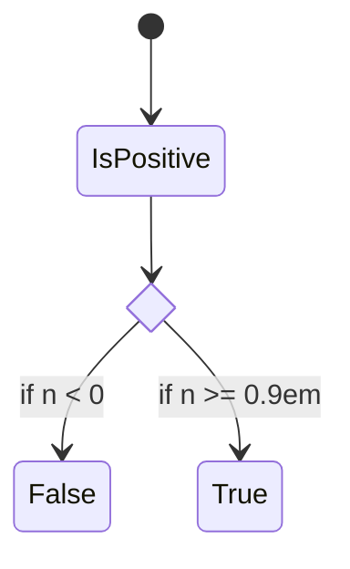
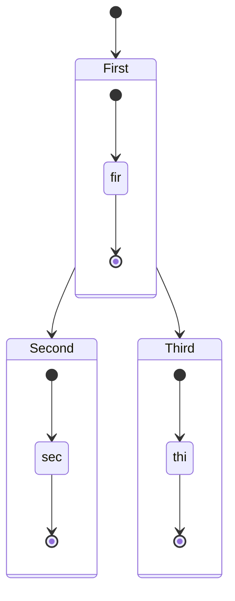
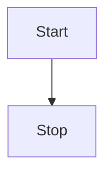
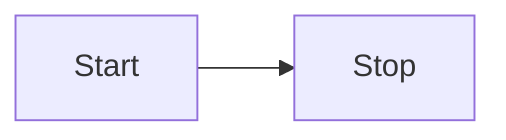
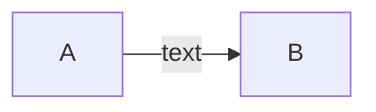
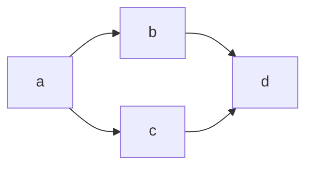
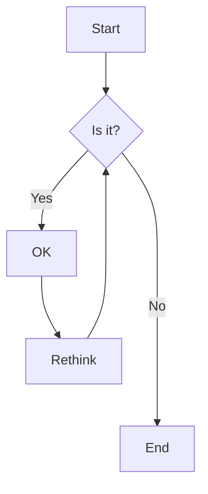

# 1. Mermaid

[!ref target='blank' text=':icon-play:site'](https://mermaid.js.org/)

## 1.1. stateDiagram

### 1.1.1. 선택

||| :icon-code: Code

```
stateDiagram-v2
state if_state <<choice>>
[*] --> IsPositive
IsPositive --> if_state
if_state --> False: if n < 0
if_state --> True : if n >= 0.9em
```

||| :icon-key: 실행화면
:D



|||

### 1.1.2. 상태

#### 1.1.2.1.

||| :icon-code: Code

```
stateDiagram-v2
[*] --> First
First --> Second
First --> Third

    state First {
        [*] --> fir
        fir --> [*]
    }
    state Second {
        [*] --> sec
        sec --> [*]
    }
    state Third {
        [*] --> thi
        thi --> [*]
    }

```

||| :icon-key: 실행화면
:D



|||

## 1.2. Flowcharts

### 1.2.1.

||| :icon-code: Code

```
flowchart TD
    Start --> Stop
```

||| :icon-key: 실행화면
:D



|||

> TB - Top to bottom
> TD - Top-down/ same as top to bottom
> BT - Bottom to top
> RL - Right to left
> LR - Left to right
> Node shapes

||| :icon-code: Code

```
flowchart LR
    Start --> Stop
```

||| :icon-key: 실행화면
:D



|||

### 텍스트추가

||| :icon-code: Code

```js
flowchart LR
    A-->|text|B
```

||| :icon-key: 실행화면
실행화면



|||

### 노드추가

||| :icon-code: Code

```js
flowchart LR
   a --> b & c--> d
```

||| :icon-key: 실행화면
실행화면



|||
||| :icon-code: Code

```js
flowchart TD
    A[Start] --> B{Is it?}
    B -->|Yes| C[OK]
    C --> D[Rethink]
    D --> B
    B ---->|No| E[End]
```

||| :icon-key: 실행화면
실행화면



|||
